# Distribuir Power BI contenido a usuarios invitados externos mediante Azure Active Directory B2B

**Resumen:** Este documento técnico describe cómo distribuir contenido a los usuarios ajenos a la organización mediante la integración de Azure Active Directory negocio a negocio (Azure AD B2B).

**Escritores:** Lukasz Pawlowski, Kasper de Jonge

**Revisores técnicos:** Adam Wilson, Sheng Liu, Qian Liang, Sergei Gundorov, Jacob Grimm, Adam Saxton, Maya Shenhav, Nimrod Shalit, Elisabeth Olson

> [!NOTE]
> Para guardar o imprimir estas notas del producto, haga clic en **Imprimir** en el explorador y después en **Guardar como PDF**.

## Introducción

Power BI ofrece a las organizaciones una vista de 360 grados de su negocio y permite a todos los usuarios de estas organizaciones tomar decisiones inteligentes con los datos. Muchas de estas organizaciones tienen relaciones sólidas y de confianza con asociados, clientes y contratistas externos. Estas organizaciones deben proporcionar acceso seguro a Power BI paneles e informes a los usuarios de estos asociados externos.

Power BI se integra con [Azure Active Directory Business-to-Business (Azure ad B2B)](https://docs.microsoft.com/azure/active-directory/b2b/what-is-b2b) para permitir una distribución segura del contenido de Power BI a usuarios invitados ajenos a la organización, a la vez que mantiene el control y la administración del acceso a los datos internos.

En estas notas del producto se explican todos los detalles que necesita para comprender la integración de Power BI con Azure Active Directory B2B. Trataremos el caso de uso más común, la configuración, las licencias y la seguridad de nivel de fila.

> [!NOTE]
> En estas notas del producto, se hace referencia a Azure Active Directory como Azure AD y Azure Active Directory negocio a negocio como Azure AD B2B.

## Situación

Contoso es un fabricante de automóviles y trabaja con muchos proveedores distintos que le proporcionan todos los componentes, materiales y servicios necesarios para ejecutar sus operaciones de fabricación. Contoso desea simplificar la logística de la cadena de suministro y planear el uso de Power BI para supervisar las métricas de rendimiento clave de su cadena de suministro. Contoso desea compartir con el análisis de los asociados de la cadena de suministro externa de una manera segura y administrable.

Contoso puede habilitar las siguientes experiencias para los usuarios externos mediante Power BI y Azure AD B2B.

### Uso compartido por elemento ad hoc

Contoso trabaja con un proveedor que crea radiadores para los automóviles de contoso. A menudo, necesitan optimizar la confiabilidad de los radiadores usando datos de todos los automóviles de contoso. Un analista de Contoso usa Power BI para compartir un informe de confiabilidad de Radiator con un ingeniero en el proveedor. El ingeniero recibe un correo electrónico con un vínculo para ver el informe.

Tal y como se ha descrito anteriormente, el uso compartido ad hoc lo realizan los usuarios empresariales según sea necesario. El vínculo que envía Power BI al usuario externo es un vínculo Azure AD invitación de B2B. Cuando el usuario externo Abra el vínculo, se le pedirá que se una a la organización de Azure AD de Contoso como usuario invitado. Una vez aceptada la invitación, el vínculo abre el informe o panel específico. El Azure Active Directory administrador delega el permiso para invitar a usuarios externos a la organización y elige lo que pueden hacer los usuarios una vez que aceptan la invitación, tal como se describe en la sección gobernanza de este documento. El analista de Contoso puede invitar al usuario invitado solo porque el administrador de Azure AD permitió esa acción y el administrador de Power BI permitió a los usuarios invitar a los invitados a ver el contenido en la configuración del inquilino de Power BI.

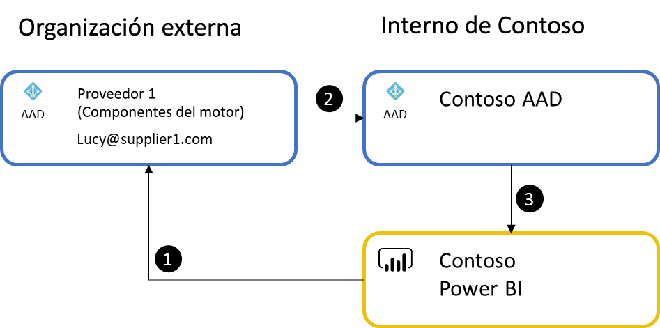

1. El proceso comienza con un usuario interno de Contoso que comparte un panel o un informe con un usuario externo. Si el usuario externo todavía no es invitado en la Azure AD de Contoso, se le invitará. Se envía un correo electrónico a su dirección de correo electrónico que incluye una invitación a la Azure AD de Contoso
2. El destinatario acepta la invitación al Azure AD de Contoso y se agrega como un usuario invitado en el Azure AD de contoso.
3. A continuación, el destinatario se redirige al panel, el informe o la aplicación Power BI, que son de solo lectura para el usuario.

El proceso se considera ad hoc, ya que los usuarios empresariales de Contoso realizan la acción invite según sea necesario para sus fines empresariales. Cada elemento compartido es un vínculo único al que puede tener acceso el usuario externo para ver el contenido.

Una vez que se ha invitado al usuario externo a tener acceso a los recursos de Contoso, se puede crear una cuenta de instantáneas para ellos en Contoso Azure AD y no es necesario que vuelvan a ser invitados.  La primera vez que intentan acceder a un recurso de Contoso, como un panel de Power BI, pasan por un proceso de consentimiento, que canjea la invitación.  Si no completan el consentimiento, no podrán acceder a ninguno de los contenidos de contoso.  Si tienen problemas para canjear su invitación a través del vínculo original proporcionado, un administrador de Azure AD puede volver a enviar un vínculo de invitación específico para que lo canjeen.

### Uso compartido por elemento planeado

Contoso trabaja con un subcontratista para realizar análisis de confiabilidad de radiadores. El subcontratista tiene un equipo de 10 personas que necesitan acceder a los datos en el entorno de Power BI de contoso. El administrador de Azure AD de Contoso está implicado en invitar a todos los usuarios y gestionar cualquier adición o cambio a medida que el personal en el subcontratista cambie. El administrador de Azure AD crea un grupo de seguridad para todos los empleados del subcontratista. Con el grupo de seguridad, los empleados de Contoso pueden administrar fácilmente el acceso a los informes y garantizar que todo el personal del subcontratista necesario tenga acceso a todos los informes, paneles y aplicaciones Power BI necesarios. Además, el administrador de Azure AD puede evitar que participe en el proceso de invitación seleccionando delegar derechos de invitación a un empleado de confianza en Contoso o en el subcontratista para garantizar la administración oportuna del personal.

Algunas organizaciones requieren más control sobre cuándo se agregan usuarios externos, invitan a muchos usuarios de una organización externa o a muchas organizaciones externas. En estos casos, el uso compartido planeado se puede usar para administrar la escala de uso compartido, aplicar directivas organizativas e incluso delegar derechos a usuarios de confianza para invitar a usuarios externos y administrarlos. Azure AD B2B es compatible con los invitados planeados que se van a enviar directamente [desde el Azure portal un administrador de ti](https://docs.microsoft.com/azure/active-directory/b2b/add-users-administrator), o a través [de POWERSHELL mediante la API del administrador de invitaciones](https://docs.microsoft.com/azure/active-directory/b2b/customize-invitation-api) , donde se puede invitar a un conjunto de usuarios en una acción. Mediante el enfoque de invitados planeados, la organización puede controlar quién puede invitar a los usuarios e implementar procesos de aprobación. Funciones avanzadas de Azure AD como los grupos dinámicos pueden facilitar el mantenimiento automático de la pertenencia a grupos de seguridad.

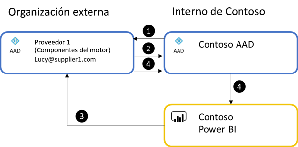

1. El proceso estrellas con un administrador de ti que invita al usuario invitado, ya sea manualmente o a través de la API proporcionada por Azure Active Directory
2. El usuario acepta la invitación a la organización.
3. Una vez que el usuario ha aceptado la invitación, un usuario de Power BI puede compartir un informe o un panel con el usuario externo o con un grupo de seguridad en el que se encuentran. Al igual que con el uso compartido normal en Power BI el usuario externo recibe un correo electrónico con el vínculo al elemento.
4. Cuando el usuario externo tiene acceso al vínculo, su autenticación en su directorio se pasa a la Azure AD de Contoso y se usa para obtener acceso al contenido del Power BI.

### Uso compartido ad hoc o planeado de aplicaciones Power BI

Contoso tiene un conjunto de informes y paneles que deben compartir con uno o más proveedores. Para asegurarse de que todos los usuarios externos necesarios tienen acceso a este contenido, se empaqueta como una aplicación Power BI. Los usuarios externos se agregan directamente a la lista de acceso de la aplicación o a través de grupos de seguridad. Alguien en Contoso envía la dirección URL de la aplicación a todos los usuarios externos, por ejemplo, en un correo electrónico. Cuando los usuarios externos abran el vínculo, verán todo el contenido en una sola experiencia fácil de navegar.

El uso de una aplicación Power BI facilita a contoso la creación de un portal BI para sus proveedores. Una lista de acceso única controla el acceso a todo el contenido necesario, lo que reduce el tiempo de comprobación y el establecimiento de los permisos de nivel de elemento. Azure AD B2B mantiene el acceso de seguridad mediante la identidad nativa del proveedor, por lo que los usuarios no necesitan credenciales de inicio de sesión adicionales. Si usa invitados planeados con grupos de seguridad, se simplifica la administración del acceso a la aplicación a medida que el personal gira dentro o fuera del proyecto. Pertenencia a grupos de seguridad manualmente o mediante el uso de [grupos dinámicos](https://docs.microsoft.com/azure/active-directory/b2b/use-dynamic-groups), de modo que todos los usuarios externos de un proveedor se agreguen automáticamente al grupo de seguridad adecuado.

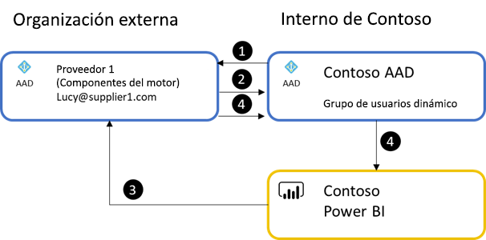

1. El proceso lo inicia el usuario que está invitado a la organización de Azure AD de Contoso a través de la Azure Portal o de PowerShell
2. El usuario puede agregarse a un grupo de usuarios en Azure AD. Se puede usar un grupo de usuarios estático o dinámico, pero los grupos dinámicos ayudan a reducir el trabajo manual.
3. A los usuarios externos se les concede acceso a la aplicación Power BI a través del grupo de usuarios. La dirección URL de la aplicación debe enviarse directamente al usuario externo o colocarse en un sitio al que tengan acceso. Power BI hace todo lo posible por enviar un correo electrónico con el vínculo de la aplicación a los usuarios externos, pero al usar grupos de usuarios cuya pertenencia puede cambiar, Power BI no puede enviar a todos los usuarios externos administrados a través de grupos de usuarios.
4. Cuando el usuario externo obtiene acceso a la dirección URL de la aplicación de Power BI, se autentica con el Azure AD de Contoso, se instala la aplicación para el usuario y el usuario puede ver todos los informes y paneles contenidos en la aplicación.

Las aplicaciones también tienen una característica única que permite a los autores de aplicaciones instalar la aplicación automáticamente para el usuario, por lo que está disponible cuando el usuario inicia sesión. Esta característica solo se instala automáticamente para los usuarios externos que ya forman parte de la organización de Contoso en el momento en que la aplicación se publica o se actualiza. Por lo tanto, se recomienda usar con el enfoque de invitados planeados y depende de que la aplicación se publique o se actualice una vez que los usuarios se agreguen al Azure AD de contoso. Los usuarios externos siempre pueden instalar la aplicación mediante el vínculo de la aplicación.

### Comentar y suscribirse a contenido entre organizaciones

A medida que contoso sigue trabajando con sus subcontratistas o proveedores, los ingenieros externos deben trabajar en estrecha colaboración con los analistas de contoso. Power BI proporciona varias características de colaboración que ayudan a los usuarios a comunicarse sobre el contenido que pueden consumir. Los comentarios de los paneles (y los comentarios del informe pronto) permiten a los usuarios discutir los puntos de datos que ven y se comunican con los autores de informes para hacer preguntas.

Actualmente, los usuarios invitados externos pueden participar en los comentarios manteniendo los comentarios y leyendo las respuestas. Sin embargo, a diferencia de los usuarios internos, los usuarios invitados no se pueden @mentioned y no reciben notificaciones de que han recibido un comentario. Los usuarios invitados no pueden usar la característica de suscripciones en Power BI en el momento de la escritura. En una próxima versión, esas restricciones se levantarán y el usuario invitado recibirá un correo electrónico cuando un comentario los @mentions o cuando se entregue una suscripción a su correo electrónico que contenga un vínculo al contenido de Power BI.

### Acceder al contenido en el Power BI aplicaciones móviles

En una próxima versión, cuando los usuarios de Contoso comparten informes o paneles con sus homólogos invitados externos, Power BI enviará un correo electrónico para notificar al invitado. Cuando el usuario invitado Abra el vínculo al informe o panel en su dispositivo móvil, el contenido se abrirá en el Power BI aplicaciones móviles nativas de su dispositivo, si están instaladas. El usuario invitado podrá navegar entre el contenido compartido con ellos en el inquilino externo y volver a su propio contenido desde su inquilino de inicio.

> [!NOTE]
> El usuario invitado no puede abrir la aplicación móvil de Power BI y desplazarse inmediatamente hasta el inquilino externo, debe comenzar con un vínculo a un elemento en el inquilino externo. Las soluciones alternativas comunes se describen en la sección [distribución de vínculos a contenido en la Power BI de la organización primaria](#distributing-links-to-content-in-the-parent-organizations-power-bi) más adelante en este documento.

### Edición y administración entre organizaciones de contenido de Power BI

Contoso y sus proveedores y subcontratistas funcionan cada vez más juntos. A menudo, un analista del subcontratista necesita otras métricas o visualizaciones de datos que se van a agregar a un informe que contoso ha compartido con ellos. Los datos deben residir en el inquilino de Power BI de Contoso, pero los usuarios externos deben poder editarlo, crear contenido nuevo e incluso distribuirlo a los usuarios adecuados.

Power BI proporciona una opción que permite **a los usuarios externos invitados editar y administrar el contenido** de la organización. De forma predeterminada, los usuarios externos tienen una experiencia orientada al consumo de solo lectura. Sin embargo, esta nueva configuración permite al administrador de Power BI elegir qué usuarios externos pueden editar y administrar contenido dentro de su propia organización. Una vez permitido, el usuario externo puede editar informes, paneles, publicar o actualizar aplicaciones, trabajar en áreas de trabajo y conectarse a los datos para los que tienen permiso de uso.

Este escenario se describe en detalle en la sección permitir que los usuarios externos editen y administren contenido dentro de Power BI más adelante en este documento.

## Relaciones organizativas mediante Power BI y Azure AD B2B

Cuando todos los usuarios de Power BI son internos a la organización, no es necesario usar Azure AD B2B. Sin embargo, una vez que dos o más organizaciones desean colaborar en datos e información, la compatibilidad de Power BI con Azure AD B2B hace que sea más fácil y rentable hacerlo.

A continuación se encuentran normalmente estructuras organizativas que son adecuadas para Azure AD colaboración entre organizaciones de estilo B2B en Power BI. Azure AD B2B funciona bien en la mayoría de los casos, pero en algunas situaciones se merece la pena tener en cuenta los enfoques alternativos comunes que se abordan al final de este documento.

### Caso 1: colaboración directa entre organizaciones

La relación de Contoso con su proveedor de radiadores es un ejemplo de colaboración directa entre organizaciones. Dado que hay relativamente pocos usuarios en Contoso y su proveedor que necesitan acceder a la información de confiabilidad de Radiator, el Azure AD uso del uso compartido externo basado en B2B es ideal. Es fácil de usar y simplificar la administración. Este es también un patrón común en los servicios de consultoría en los que un consultor puede necesitar compilar contenido para una organización.

Normalmente, este uso compartido se produce inicialmente mediante ad hoc por uso compartido de elementos. Sin embargo, a medida que los equipos crecen o profundizan en las relaciones, el enfoque de uso compartido por elemento planeado se convierte en el método preferido para reducir la sobrecarga de administración. Además, el uso compartido ad hoc o planificado de las aplicaciones Power BI, que se comentan y se suscriben al contenido entre las organizaciones, el acceso al contenido de las aplicaciones móviles puede entrar en juego y la edición y administración entre organizaciones de contenido de Power BI. Lo importante es que si los usuarios de ambas organizaciones tienen Power BI Pro licencias en sus organizaciones respectivas, pueden usar esas licencias de Pro en los entornos de Power BI. Esto proporciona una concesión de licencias ventajosa, ya que es posible que la organización que invita no necesite pagar por una licencia de Power BI Pro para los usuarios externos. Esto se describe con más detalle en la sección de licencias más adelante en este documento.

### Caso 2: principal y sus subsidiarias o filiales

Algunas estructuras de la organización son más complejas, incluidas las subsidiarias, las empresas afiliadas o las relaciones entre proveedores de servicios administrados. Estas organizaciones tienen una organización primaria, como una empresa holding, pero las organizaciones subyacentes funcionan de forma semiautónoma, en ocasiones en diferentes requisitos regionales. Esto conduce a cada organización que tiene su propio entorno de Azure AD y distintos inquilinos de Power BI.

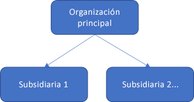

En esta estructura, la organización primaria normalmente necesita distribuir información estandarizada a sus subsidiarias. Normalmente, este uso compartido se realiza mediante el uso compartido ad hoc o planificado del enfoque de Power BI aplicaciones, como se muestra en la siguiente imagen, ya que permite la distribución de contenido autoritativo normalizado a audiencias generales. En la práctica, se usa una combinación de todos los escenarios mencionados anteriormente en este documento.

Esto sigue el proceso siguiente:

1. Los usuarios de cada filial están invitados a Azure AD de Contoso
2. A continuación, se publica la aplicación Power BI para conceder a estos usuarios acceso a los datos necesarios.
3. Por último, los usuarios abren la aplicación a través de un vínculo que se les ha dado para ver los informes.

En esta estructura se enfrentan varios desafíos importantes:

- Cómo distribuir vínculos a contenido en la Power BI de la organización primaria
- Cómo permitir que los usuarios subsidiarios tengan acceso a orígenes de datos hospedados por la organización primaria

#### Distribución de vínculos a contenido en la Power BI de la organización primaria

Normalmente se usan tres enfoques para distribuir vínculos al contenido. El primero y el más básico es enviar el vínculo a la aplicación a los usuarios necesarios o colocarlo en un sitio de SharePoint Online desde el que se pueda abrir. Los usuarios pueden marcar el vínculo en sus exploradores para obtener un acceso más rápido a los datos que necesitan.

El segundo enfoque se basa en la edición y administración entre organizaciones de la capacidad de contenido de Power BI. La organización primaria permite a los usuarios de las subsidiarias tener acceso a sus Power BI y controla a qué pueden acceder a través del permiso. Esto proporciona acceso a Power BI Página principal donde el usuario de la subsidiaria ve una lista completa de contenido compartido en el inquilino de la organización primaria. A continuación, se proporciona la dirección URL del entorno de Power BI de las organizaciones principales a los usuarios de las subsidiarias.

El enfoque final usa una aplicación Power BI creada en el inquilino de Power BI para cada filial. La aplicación Power BI incluye un panel con [iconos configurados con la opción de vínculo externo](https://docs.microsoft.com/power-bi/service-dashboard-edit-tile#hyperlink). Cuando el usuario presiona el icono, se le lleva al informe, panel o aplicación adecuado en la Power BI de la organización primaria. Este enfoque tiene la ventaja adicional de que la aplicación se puede instalar automáticamente para todos los usuarios de la subsidiaria y está disponible para ellas cada vez que inician sesión en su propio entorno de Power BI. Una ventaja adicional de este enfoque es que funciona bien con las aplicaciones móviles Power BI que pueden abrir el vínculo de forma nativa. También puede combinarlo con el segundo enfoque para facilitar el cambio entre Power BI entornos.

#### Permitir a los usuarios subsidiarios acceder a los orígenes de datos hospedados por la organización primaria

A menudo, los analistas de una subsidiaria necesitan crear sus propios análisis con los datos proporcionados por la organización primaria. En este caso, se usan normalmente orígenes de datos en la nube para abordar el desafío.

El primer enfoque aprovecha [Azure Analysis Services](https://docs.microsoft.com/azure/analysis-services/analysis-services-overview) para crear un almacén de datos de nivel empresarial que atienda a las necesidades de los analistas en el padre y sus subsidiarias, tal como se muestra en la siguiente imagen. Contoso puede hospedar los datos y usar funciones como la seguridad de nivel de fila para asegurarse de que los usuarios de cada filial solo puedan acceder a sus datos. Los analistas de cada organización pueden acceder al almacenamiento de datos a través de Power BI Desktop y publicar el análisis resultante en sus inquilinos de Power BI respectivos.

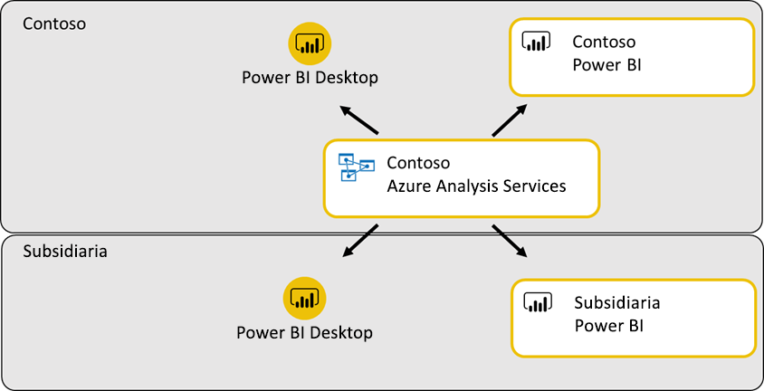

El segundo enfoque aprovecha [Azure SQL Database](https://azure.microsoft.com/services/sql-database/) para crear un almacenamiento de datos relacional que proporcione acceso a los datos. Esto funciona de forma similar al enfoque Azure Analysis Services, aunque algunas funcionalidades como la seguridad de nivel de fila pueden ser más difíciles de implementar y mantener en todas las subsidiarias.

También se pueden realizar enfoques más sofisticados; sin embargo, lo anterior es el más común.

### Caso 3: entorno compartido entre asociados

Contoso puede entrar en una asociación con un competidor para crear conjuntamente un automóvil en una línea de montaje compartida, pero para distribuir el vehículo en distintas marcas o en regiones diferentes. Esto requiere una gran colaboración y la propiedad de los datos, la inteligencia y el análisis de las distintas organizaciones. Esta estructura también es común en el sector de servicios de consultoría, donde un equipo de consultores puede realizar análisis basados en proyectos para un cliente.

En la práctica, estas estructuras son complejas, tal como se muestra en la siguiente imagen, y requieren que el personal tenga que mantenerlas. Para que esta estructura sea efectiva, se basa en la edición y administración entre organizaciones de la capacidad de Power BI contenido, ya que permite a las organizaciones reutilizar Power BI Pro licencias adquiridas para sus respectivos inquilinos de Power BI.

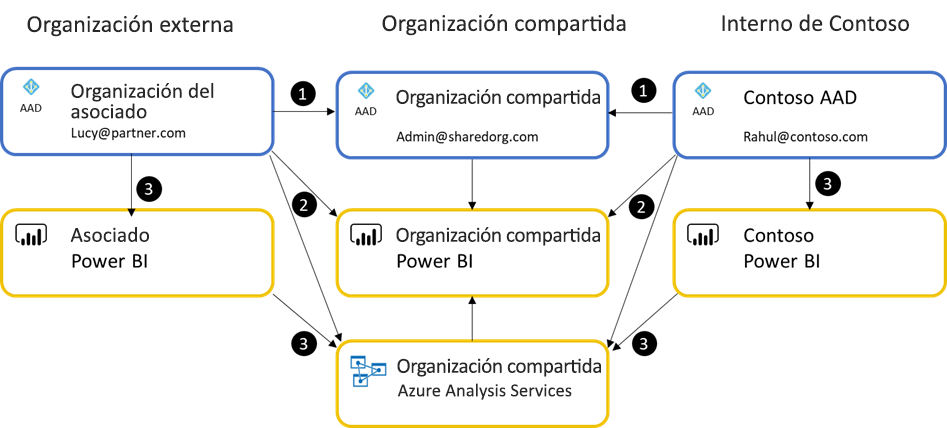

Para establecer un inquilino de Power BI compartido, es necesario crear una Azure Active Directory y al menos una cuenta de usuario de Power BI Pro debe adquirirse para un usuario de ese Active Directory. Este usuario invita a los usuarios necesarios a la organización compartida. Lo importante es que, en este escenario, los usuarios de Contoso se tratan como usuarios externos cuando operan dentro del Power BI de la organización compartida.

El proceso es el siguiente:

1. La organización compartida se establece como una nueva Azure Active Directory y se crea al menos una cuenta de usuario en la nueva organización. Ese usuario debe tener asignada una licencia Power BI Pro.
2. A continuación, este usuario establece un inquilino de Power BI e invita a los usuarios necesarios a contoso y a la organización asociada. El usuario también establece los recursos de datos compartidos como Azure Analysis Services. Contoso y los usuarios del asociado pueden tener acceso a la Power BI de la organización compartida como usuarios invitados. Si se permite editar y administrar contenido en Power BI los usuarios externos pueden usar Power BI Inicio, usar áreas de trabajo, cargar o editar contenido y compartir informes. Normalmente, todos los recursos compartidos se almacenan y se accede a ellos desde la organización compartida.
3. En función de cómo las partes acuerden colaborar, es posible que cada organización desarrolle sus propios datos y análisis propios mediante recursos de almacenamiento de datos compartidos. Pueden distribuirlos a sus respectivos usuarios internos mediante sus inquilinos de Power BI internos.

### Caso 4: distribución a cientos o miles de asociados externos

Aunque contoso creó un informe de confiabilidad de Radiator para un proveedor, ahora contoso desea crear un conjunto de informes estandarizados para cientos de proveedores. Esto permite a contoso asegurarse de que todos los proveedores tienen el análisis que necesitan para realizar mejoras o corregir los defectos de fabricación.

Cuando una organización necesita distribuir datos estandarizados e información sobre muchos usuarios u organizaciones externos, puede usar el uso compartido ad hoc o planeado del escenario de Power BI aplicaciones para crear un portal de BI rápidamente y sin costos de desarrollo completos. El proceso para compilar este portal mediante una aplicación Power BI se trata en el caso práctico: compilar un portal de BI con Power BI + Azure AD B2B: instrucciones paso a paso más adelante en este documento.

Una variante común de este caso es cuando una organización está intentando compartir información con los consumidores, especialmente cuando se usa Azure B2C con Power BI. Power BI no es compatible de forma nativa con Azure B2C. Si va a evaluar las opciones de este caso, considere la posibilidad de usar la opción 2 alternativa en la alternativa común en la sección más adelante en este documento.

## Caso práctico: creación de un portal de BI mediante Power BI + Azure AD B2B: instrucciones paso a paso

La integración de Power BI con Azure AD B2B ofrece a contoso una forma sencilla y sin complicaciones de proporcionar a los usuarios invitados acceso seguro a su portal de BI. Contoso puede configurarlo con tres pasos:

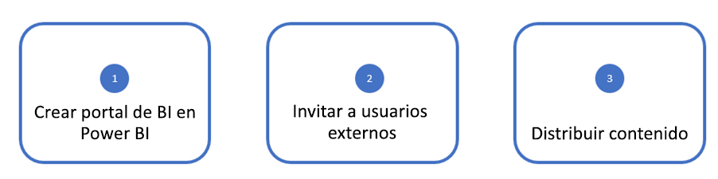

1. Crear portal de BI en Power BI

    La primera tarea para contoso es crear su portal de BI en Power BI. El portal de BI de Contoso constará de una colección de paneles e informes creados específicamente que estarán disponibles para muchos usuarios internos e invitados. La manera recomendada de hacerlo en Power BI es compilar una aplicación Power BI. Más información sobre las [aplicaciones en Power BI](https://powerbi.microsoft.com/blog/distribute-to-large-audiences-with-power-bi-apps/).

- El equipo de BI de Contoso crea un área de trabajo en Power BI

    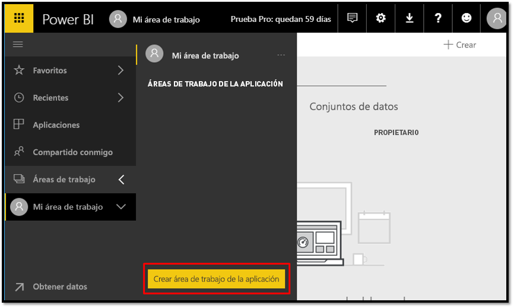
    

- Otros autores se agregan al área de trabajo

    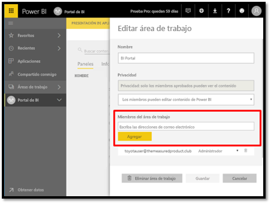

- El contenido se crea dentro del área de trabajo

    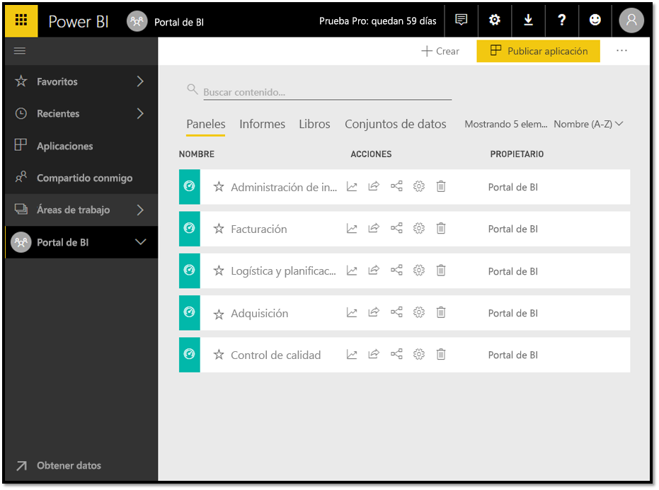

    Ahora que el contenido se crea en un área de trabajo, Contoso está listo para invitar a los usuarios invitados de las organizaciones asociadas a consumir este contenido.

2. Invitar a usuarios externos

    Contoso tiene dos maneras de invitar a los usuarios invitados a su portal de BI en Power BI:

    * Invitados planeados
    * Invitaciones ad hoc

    **Invitados planeados**

    En este enfoque, contoso invita a los usuarios invitados a su Azure AD de antemano y, a continuación, distribuye Power BI contenido a ellos. Contoso puede invitar a usuarios invitados desde el Azure Portal o mediante PowerShell. Estos son los pasos para invitar a usuarios invitados desde el Azure Portal:

    - El administrador de Azure AD de Contoso navega a **Azure Portal > Azure Active Directory > usuarios y grupos > todos los usuarios > nuevo usuario invitado**

    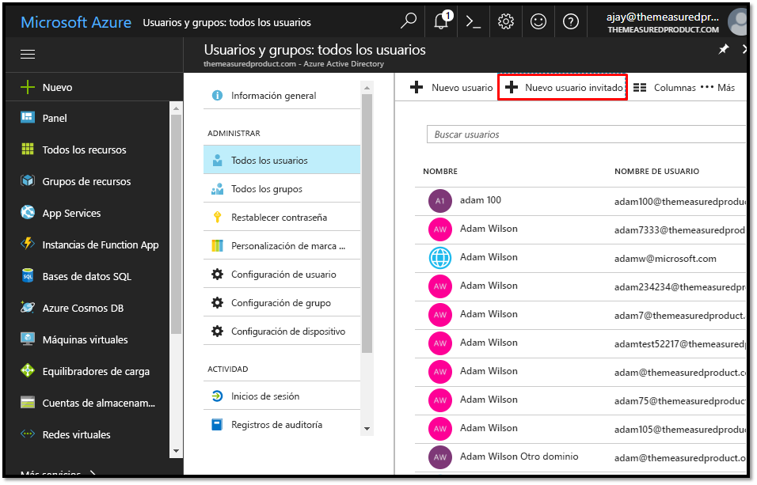

    - Agregue un mensaje de invitación para los usuarios invitados y haga clic en invitar.

    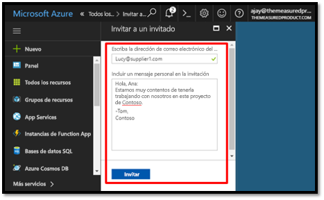

    > [!NOTE]
    > Para invitar a usuarios invitados desde el Azure Portal, necesita un administrador para la Azure Active Directory de su inquilino.

    Si Contoso desea invitar a muchos usuarios invitados, pueden hacerlo mediante PowerShell. El administrador de Azure AD de Contoso almacena las direcciones de correo electrónico de todos los usuarios invitados en un archivo CSV. Estos son [Azure Active Directory código de colaboración B2B e](https://docs.microsoft.com/azure/active-directory/b2b/code-samples) instrucciones y ejemplos de PowerShell.

    Después de la invitación, los usuarios invitados recibirán un correo electrónico con el vínculo de invitación.

    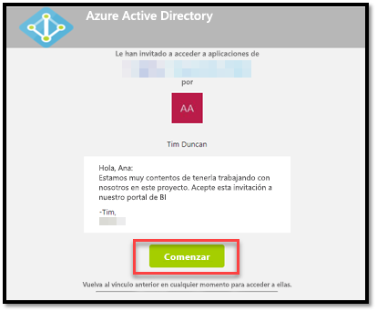

    Una vez que los usuarios invitados hagan clic en el vínculo, podrán acceder al contenido del inquilino de Contoso Azure AD.

    > [!NOTE]
    > Es posible cambiar el diseño del correo electrónico de invitación mediante la característica de personalización de marca de Azure AD como se describe [aquí](https://docs.microsoft.com/azure/active-directory/active-directory-b2b-invitation-email).

    **Invitaciones ad hoc**

    ¿Qué ocurre si Contoso no conoce a todos los usuarios invitados que desea invitar con anterioridad? O bien, ¿qué ocurre si el analista de Contoso que creó el portal de BI desea distribuir contenido a los usuarios invitados? También se admite este escenario en Power BI con invitados ad hoc.

    El analista solo puede Agregar usuarios externos a la lista de acceso de la aplicación cuando los publique. Los usuarios invitados reciben una invitación y, una vez que la aceptan, se redirigen automáticamente al contenido del Power BI.

    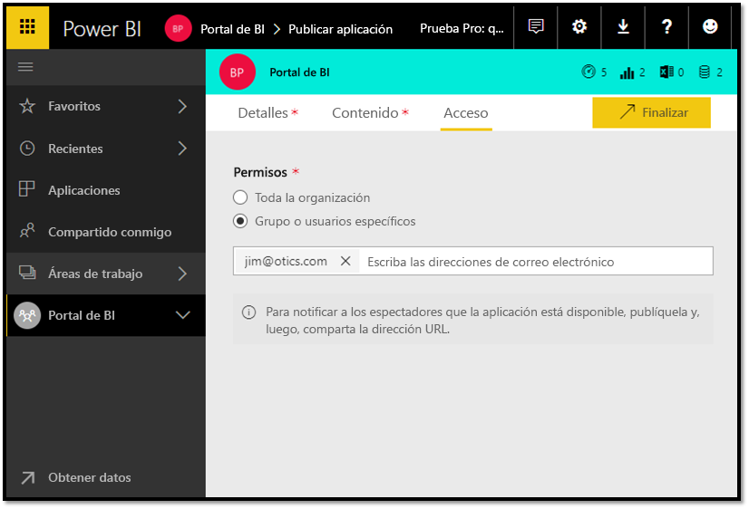

    > [!NOTE]
    > Los invitados solo son necesarios la primera vez que se invita a un usuario externo a la organización.

3. Distribuir contenido

    Ahora que el equipo de BI de Contoso ha creado el portal de BI y los usuarios invitados invitados, pueden distribuir su portal a sus usuarios finales mediante la concesión de acceso a los usuarios invitados a la aplicación y su publicación. Power BI completa automáticamente los nombres de los usuarios invitados que se han agregado previamente al inquilino de contoso. Las invitaciones ad hoc a otros usuarios invitados también se pueden agregar en este momento.

    > [!NOTE]
    > Si usa grupos de seguridad para administrar el acceso a la aplicación para usuarios externos, use el enfoque de invitados planeados y comparta el vínculo de la aplicación directamente con cada usuario externo que deba tener acceso a él. De lo contrario, es posible que el usuario externo no pueda instalar o ver contenido desde la aplicación.

    Los usuarios invitados reciben un correo electrónico con un vínculo a la aplicación.

    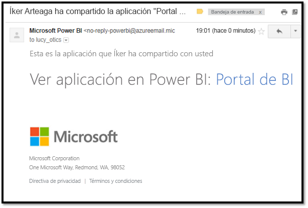

    Al hacer clic en este vínculo, se pide a los usuarios invitados que se autentiquen con la identidad de su organización.

    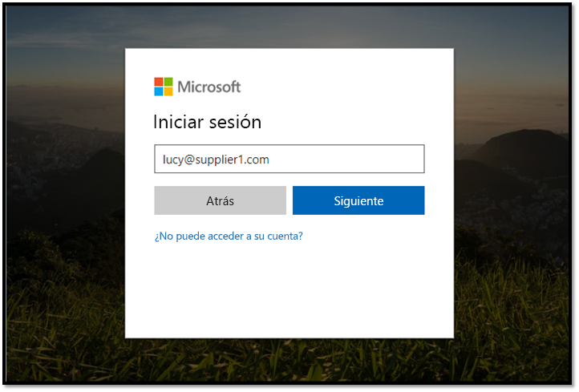

    Una vez que se autentican correctamente, se redirigen a la aplicación BI de contoso.

    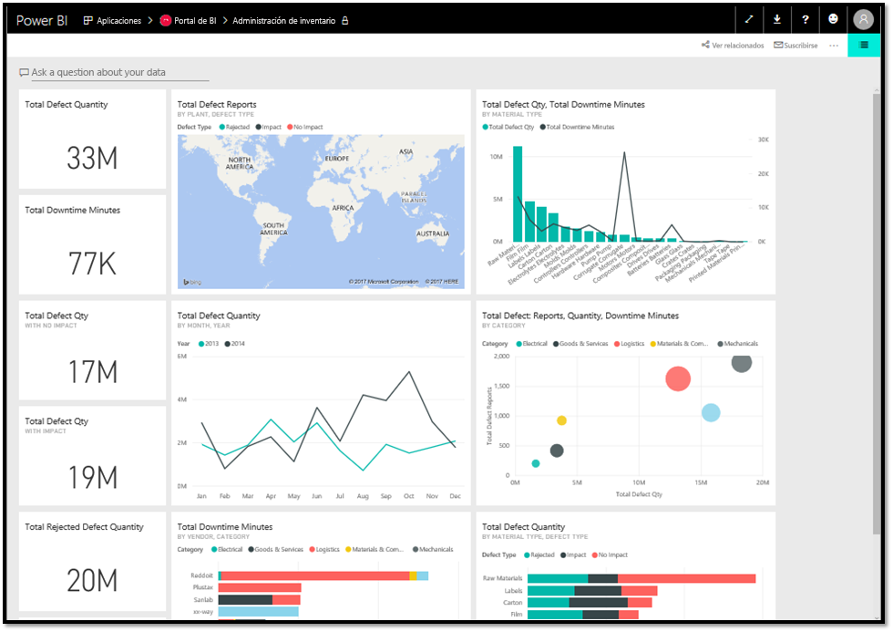

    Los usuarios invitados pueden llegar posteriormente a la aplicación de Contoso haciendo clic en el vínculo del correo electrónico o marcando el vínculo. Contoso también puede facilitar a los usuarios invitados agregando este vínculo a cualquier portal de extranet existente que ya utilicen los usuarios invitados.

4. Pasos siguientes

    Con una aplicación Power BI y Azure AD B2B, contoso pudo crear rápidamente un portal BI para sus proveedores sin código. Esto simplificó en gran medida la distribución del análisis estandarizado a todos los proveedores que lo necesitan.

    Aunque en el ejemplo se ha mostrado el modo en que un único informe común se puede distribuir entre los proveedores, Power BI puede profundizar mucho más. Para asegurarse de que cada asociado solo vea los datos relevantes para ellos mismos, Seguridad de nivel de fila se pueden agregar fácilmente al informe y al modelo de datos. La sección seguridad de datos para asociados externos más adelante en este documento describe este proceso en detalles.

    A menudo, los informes y paneles individuales deben incrustarse en un portal existente. Esto también se puede lograr reutilizar muchas de las técnicas que se muestran en el ejemplo. Sin embargo, en esas situaciones puede ser más fácil insertar informes o paneles directamente desde un área de trabajo. El proceso de invitar y asignar el permiso de seguridad a requiere que los usuarios sigan siendo los mismos.

## En el capó: ¿Cómo Lucy de Supplier1 puede acceder a Power BI contenido del inquilino de Contoso?

Ahora que hemos constatado cómo contoso puede distribuir sin problemas Power BI contenido a los usuarios invitados en organizaciones asociadas, echemos un vistazo a cómo funciona esto en el capó.

Cuando contoso ha invitado [lucy@supplier1.com](mailto:lucy@supplier1.com) a su directorio, Azure ad crea un vínculo entre [Lucy@supplier1.com](mailto:Lucy@supplier1.com) y el inquilino de Contoso Azure ad. Este vínculo permite a Azure AD saber que Lucy@supplier1.com puede tener acceso al contenido del inquilino de contoso.

Cuando Lucy intenta acceder a la aplicación Power BI de Contoso, Azure AD comprueba que Lucy pueda acceder al inquilino de Contoso y, a continuación, proporciona Power BI un token que indica que Lucy está autenticado para tener acceso al contenido del inquilino de contoso. Power BI usa este token para autorizar y asegurarse de que Lucy tenga acceso a la aplicación de Power BI de contoso.

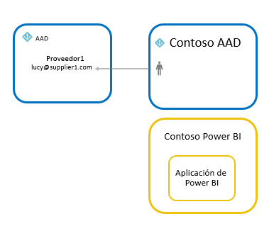

La integración de Power BI con Azure AD B2B funciona con todas las direcciones de correo electrónico empresariales. Si el usuario no tiene una identidad Azure AD, es posible que se le pida que cree una. En la imagen siguiente se muestra el flujo detallado:

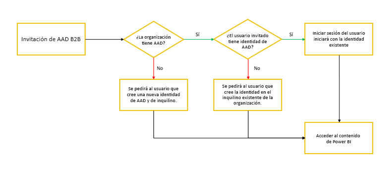

Es importante reconocer que la cuenta de Azure AD se usará o se creará en el Azure AD de la entidad externa, lo que permitirá a Lucy usar su propio nombre de usuario y contraseña, y sus credenciales dejarán de funcionar automáticamente en otros inquilinos siempre que Lucy deja la empresa cuando su organización usa también Azure AD.

## Administración de licencias

Contoso puede elegir uno de los tres métodos para conceder licencias a los usuarios invitados de sus proveedores y organizaciones asociadas para tener acceso a Power BI contenido.

> [!NOTE]
> _El nivel gratis de Azure ad B2B's es suficiente para usar Power BI con Azure ad B2B. Algunas características de Azure AD B2B avanzadas, como los grupos dinámicos, requieren licencias adicionales. Consulte la documentación de Azure ad B2B para obtener información adicional:_ [ _https://docs.microsoft.com/azure/active-directory/b2b/licensing-guidance_ ](https://docs.microsoft.com/azure/active-directory/b2b/licensing-guidance)

### Enfoque 1: contoso usa Power BI Premium

Con este enfoque, contoso adquiere Power BI Premium capacidad y asigna el contenido del portal de BI a esta capacidad. Esto permite a los usuarios invitados de organizaciones asociadas tener acceso a la aplicación de Power BI de Contoso sin ninguna licencia Power BI.

Los usuarios externos también están sujetos a las experiencias de consumo que se ofrecen a los usuarios "gratuitos" en Power BI al consumir contenido dentro de Power BI Premium.

Contoso también puede aprovechar las ventajas de otras funcionalidades Premium de Power BI para sus aplicaciones, como una mayor frecuencia de actualización, capacidad dedicada y tamaños de modelos grandes.

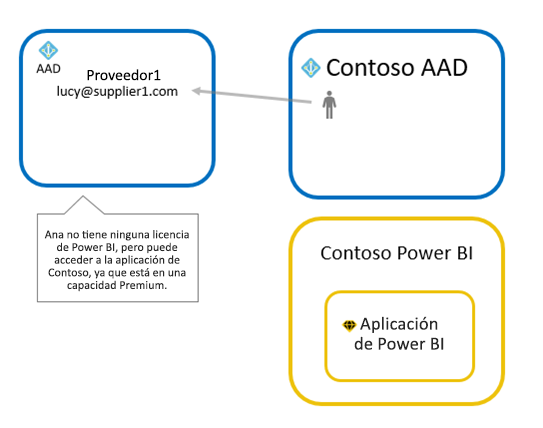

### Enfoque 2: contoso asigna Power BI Pro licencias a los usuarios invitados

Con este enfoque, contoso asigna licencias Pro a usuarios invitados de organizaciones asociadas, lo que se puede hacer desde el centro de administración de Microsoft 365 de contoso. Esto permite a los usuarios invitados de organizaciones asociadas tener acceso a la aplicación de Power BI de Contoso sin adquirir una licencia. Esto puede ser adecuado para compartir con usuarios externos cuya organización no ha adoptado Power BI todavía.

> [!NOTE]
> La licencia de pro de Contoso se aplica a los usuarios invitados solo cuando acceden al contenido del inquilino de contoso. Las licencias Pro permiten el acceso al contenido que no está en una capacidad Power BI Premium. Sin embargo, los usuarios externos con una licencia Pro están restringidos de forma predeterminada a una experiencia de solo consumo. Esto puede cambiarse mediante el enfoque descrito en la sección _habilitación de usuarios externos para editar y administrar contenido dentro de Power BI,_ más adelante en este documento.

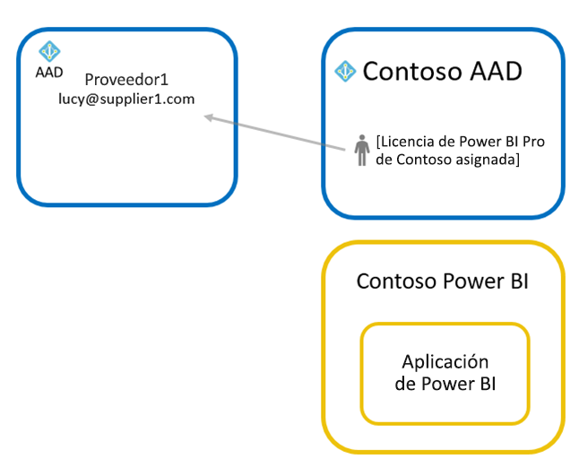

### Enfoque 3: los usuarios invitados traen sus propias licencias de Power BI Pro

Con este enfoque, el proveedor 1 asigna una licencia de Power BI Pro a Lucy. A continuación, pueden acceder a la aplicación de Power BI de Contoso con esta licencia. Dado que Lucy puede usar su propia licencia de pro de su propia organización al acceder a un entorno de Power BI externo, a veces se hace referencia a este enfoque como " _traiga su propia licencia_ " (BYOL). Si ambas organizaciones usan Power BI, esto ofrece una licencia ventajosa para la solución de análisis general y minimiza la sobrecarga que supone asignar licencias a los usuarios externos.

> [!NOTE]
> La licencia de Pro proporcionada a Lucy por el proveedor 1 se aplica a cualquier inquilino de Power BI donde Lucy es un usuario invitado. Las licencias Pro permiten el acceso al contenido que no está en una capacidad Power BI Premium. Sin embargo, los usuarios externos con una licencia Pro están restringidos de forma predeterminada a una experiencia de solo consumo. Esto puede cambiarse mediante el enfoque descrito en la sección _habilitación de usuarios externos para editar y administrar contenido dentro de Power BI,_ más adelante en este documento.

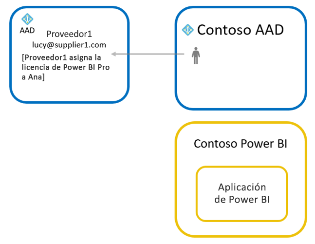

## Seguridad de datos para asociados externos

Normalmente, cuando se trabaja con varios proveedores externos, Contoso debe asegurarse de que cada proveedor vea los datos solo de sus propios productos. La seguridad basada en usuario y la seguridad de nivel de fila dinámica facilitan la realización con Power BI.

### Seguridad basada en usuario

Una de las características más eficaces de Power BI es Seguridad de nivel de fila. Esta característica permite a contoso crear un único informe y un conjunto de informes, pero aplicar reglas de seguridad diferentes para cada usuario. Para obtener una explicación detallada, consulte [seguridad de nivel de fila (RLS)](https://powerbi.microsoft.com/documentation/powerbi-admin-rls/).

La integración de Power BI con Azure AD B2B permite a contoso asignar reglas de Seguridad de nivel de fila a los usuarios invitados en cuanto se les invita al inquilino de contoso. Como hemos visto antes, contoso puede Agregar usuarios invitados a través de invitaciones planeadas o ad hoc. Si Contoso desea exigir la seguridad de nivel de fila, se recomienda encarecidamente usar los invitados planeados para agregar los usuarios invitados de antemano y asignarlos a los roles de seguridad antes de compartir el contenido. Si en su lugar contoso usa invitados ad hoc, puede haber un breve período de tiempo en el que los usuarios invitados no podrán ver ningún dato.

> [!NOTE]
> Este retraso en el acceso a los datos protegidos por RLS cuando se usan invitaciones ad hoc puede dar lugar a solicitudes de soporte técnico al equipo de ti, ya que los usuarios verán informes o paneles en blanco o rotos al abrir un vínculo de uso compartido en el correo electrónico que reciben. Por lo tanto, se recomienda encarecidamente usar invitados planeados en este escenario. * *

Vamos a examinarlo con un ejemplo.

Tal y como se mencionó antes, Contoso tiene proveedores en todo el mundo y desea asegurarse de que los usuarios de sus organizaciones proveedores obtengan información de los datos de solo su territorio.  Pero los usuarios de Contoso pueden acceder a todos los datos. En lugar de crear varios informes diferentes, contoso crea un único informe y filtra los datos en función del usuario que los ve.

Para asegurarse de que contoso puede filtrar los datos en función de quién se está conectando, se crean dos roles en Power BI Desktop. Uno para filtrar todos los datos de SalesTerritory "Europe" y otro para "Norteamérica".

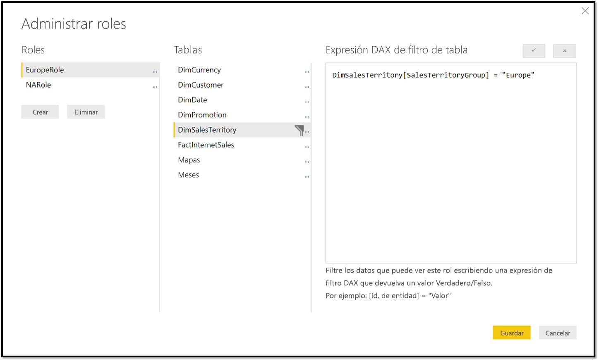

Cada vez que se definen roles en el informe, se debe asignar un usuario a un rol específico para que obtenga acceso a los datos. La asignación de roles tiene lugar dentro del servicio Power BI ( **conjuntos de > seguridad** )

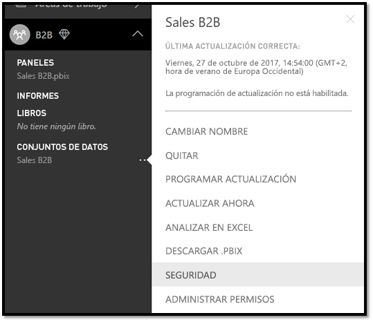

Se abrirá una página en la que el equipo de BI de Contoso puede ver los dos roles que han creado.  Ahora el equipo de BI de Contoso puede asignar usuarios a los roles.

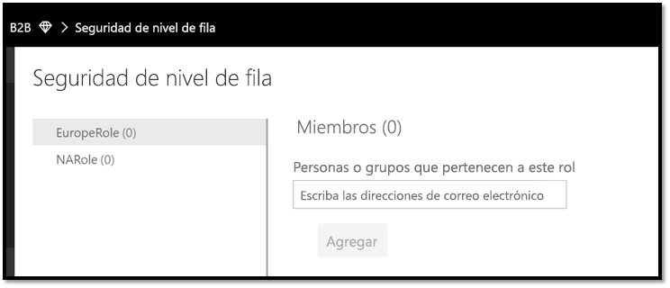

En el ejemplo Contoso está agregando un usuario de una organización asociada con la dirección de correo electrónico "[adam@themeasuredproduct.com](mailto:adam@themeasuredproduct.com)" al rol Europe:

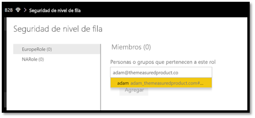

Cuando esto se resuelve mediante Azure AD, contoso puede ver que el nombre aparece en la ventana lista para agregarse:

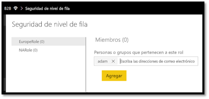

Ahora, cuando este usuario abra la aplicación que se compartió con ellos, solo verá un informe con datos de Europa:

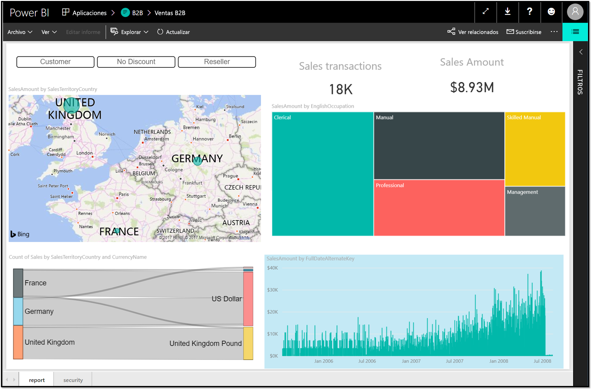

### Seguridad de nivel de fila dinámica

Otro tema interesante es ver cómo funciona la seguridad dinámica de nivel de fila (RLS) con Azure AD B2B.

En Resumen, la seguridad dinámica de nivel de fila funciona filtrando los datos del modelo según el nombre de usuario de la persona que se conecta a Power BI. En lugar de agregar varios roles para grupos de usuarios, defina los usuarios en el modelo. Aquí no describiremos el patrón en detalle. Kasper de Jong ofrece una escritura detallada sobre todos los tipos de seguridad de nivel de fila en [Power BI Desktop hoja](https://www.kasperonbi.com/power-bi-desktop-dynamic-security-cheat-sheet/)de referencia rápida de seguridad dinámica y en [estas notas del producto](https://msdn.microsoft.com/library/jj127437.aspx) .

Echemos un vistazo a un pequeño ejemplo: Contoso tiene un informe sencillo de ventas por grupos:

Ahora este informe debe compartirse con dos usuarios invitados y un usuario interno: el usuario interno puede ver todo, pero los usuarios invitados solo pueden ver los grupos a los que tienen acceso. Esto significa que se deben filtrar los datos solo para los usuarios invitados. Para filtrar los datos de forma adecuada, contoso usa el patrón RLS dinámico, tal y como se describe en las notas del producto y en la entrada de blog. Esto significa que contoso agrega los nombres de usuario a los datos en sí:

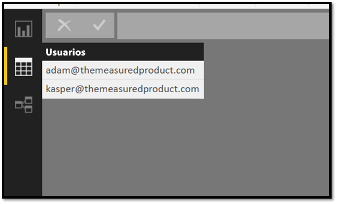

A continuación, contoso crea el modelo de datos correcto que filtra los datos adecuadamente con las relaciones correctas:

Para filtrar los datos automáticamente en función de quién haya iniciado sesión, Contoso debe crear un rol que pase al usuario que se está conectando. En este caso, contoso crea dos roles: el primero es el "SecurityRole" que filtra la tabla de usuarios con el nombre de usuario actual del usuario que ha iniciado sesión en Power BI (esto funciona incluso con Azure AD usuarios invitados de B2B).

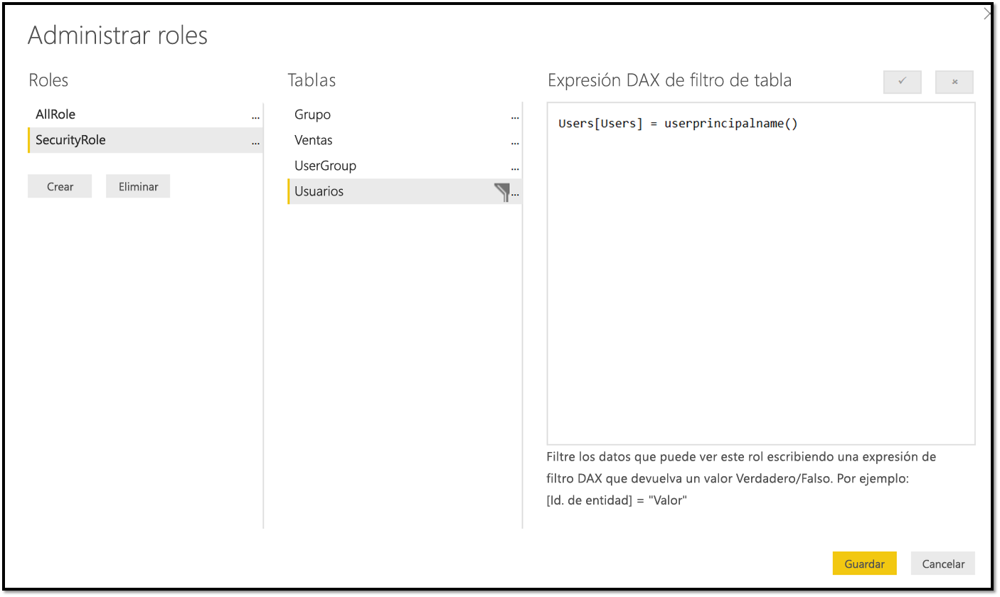

Contoso también crea otro "AllRole" para los usuarios internos que pueden ver todo: este rol no tiene ningún predicado de seguridad.

Después de cargar el archivo de escritorio Power BI en el servicio, contoso puede asignar a los usuarios invitados a "SecurityRole" y a los usuarios internos a "AllRole".

Ahora, cuando los usuarios invitados abran el informe, solo verán las ventas del grupo A:

En la matriz de la derecha puede ver el resultado de la función USERNAME () y USERPRINCIPALNAME () y devuelven la dirección de correo electrónico de los usuarios invitados.

Ahora, el usuario interno ve todos los datos:

Como puede ver, la RLS dinámica funciona con usuarios internos o invitados.

> [!NOTE]
> Este escenario también funciona cuando se usa un modelo en Azure Analysis Services. Por lo general, el servicio de análisis de Azure se conecta al mismo Azure AD que el Power BI; en ese caso, Azure Analysis Services también conoce a los usuarios invitados invitados a través de Azure AD B2B.

## Conexión a orígenes de datos locales

Power BI ofrece la capacidad de que contoso aproveche los orígenes de datos locales, como [SQL Server Analysis Services](https://powerbi.microsoft.com/documentation/powerbi-gateway-enterprise-manage-ssas/) o [SQL Server](https://powerbi.microsoft.com/documentation/powerbi-gateway-kerberos-for-sso-pbi-to-on-premises-data/) directamente gracias a la [puerta de enlace de datos local](https://powerbi.microsoft.com/documentation/powerbi-gateway-onprem/). Incluso es posible iniciar sesión en esos orígenes de datos con las mismas credenciales que se usan con Power BI.

> [!NOTE]
> Al instalar una puerta de enlace para conectarse a su inquilino de Power BI, debe usar un usuario creado dentro de su inquilino. Los usuarios externos no pueden instalar una puerta de enlace y conectarla a su inquilino.

En el caso de los usuarios externos, esto podría ser más complicado, ya que los usuarios externos normalmente no son conocidos para la instancia de AD local. Power BI ofrece una solución alternativa para esto, ya que permite a los administradores de Contoso asignar los nombres de usuario externos a los nombres de usuario internos, tal y como se describe en [administrar el origen de datos-Analysis Services](https://powerbi.microsoft.com/documentation/powerbi-gateway-enterprise-manage-ssas/). Por ejemplo, [lucy@supplier1.com](mailto:lucy@supplier1.com) se puede asignar a [lucy\_supplier1\_com #EXT@contoso.com](mailto:lucy_supplier1_com).

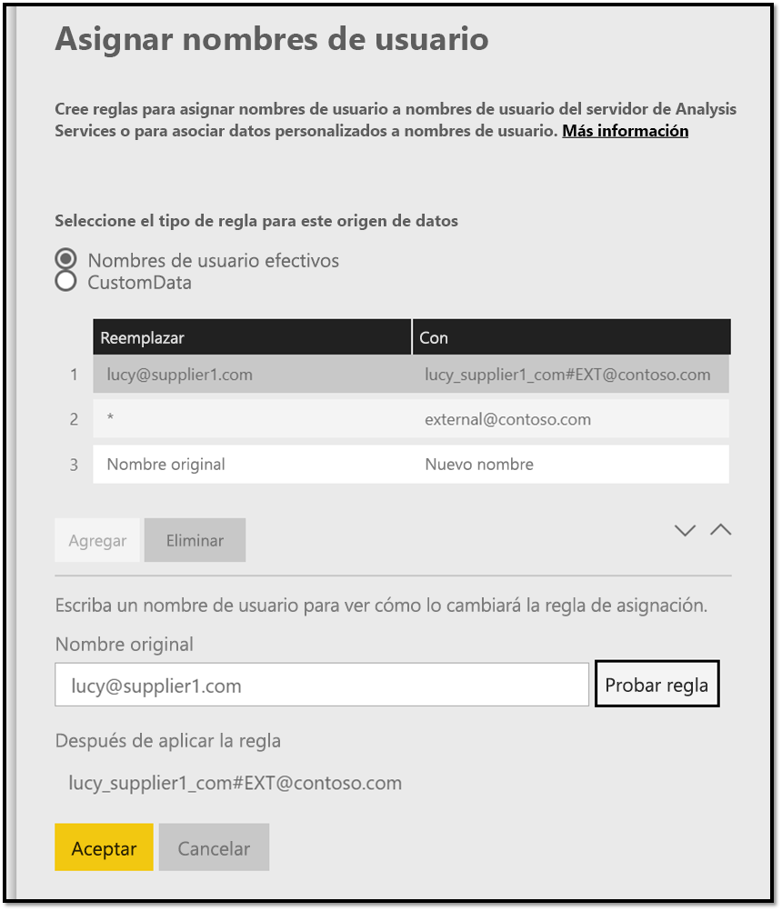

Este método es correcto si Contoso solo tiene un puñado de usuarios o si Contoso puede asignar todos los usuarios externos a una cuenta interna única. En escenarios más complejos en los que cada usuario necesita sus propias credenciales, existe un enfoque más avanzado que usa [atributos de ad personalizados](https://technet.microsoft.com/library/cc961737.aspx) para realizar la asignación, tal y como se describe en [administrar el origen de datos: Analysis Services](https://powerbi.microsoft.com/documentation/powerbi-gateway-enterprise-manage-ssas/). Esto permitiría al administrador de Contoso definir una asignación para cada usuario del Azure AD (también usuarios de B2B externos).  Estos atributos se pueden establecer a través del modelo de objetos de AD mediante scripts o código para que contoso pueda automatizar completamente la asignación en invite o en una cadencia programada.

## Permitir a los usuarios externos editar y administrar contenido dentro de Power BI

Contoso puede permitir a los usuarios externos aportar contenido dentro de la organización, tal y como se ha descrito anteriormente en la sección de edición y administración entre organizaciones de Power BI contenido.

> [!NOTE]
> Para editar y administrar el contenido de la Power BI de su organización, el usuario debe tener una licencia de Power BI Pro en un área de trabajo distinta de mi área de trabajo. Los usuarios pueden obtener licencias de Pro como se describe en la sección de _licencias_ de este documento.

En el portal de administración de Power BI se proporciona la configuración **permitir a los usuarios invitados externos editar y administrar el contenido de la organización en la** configuración del inquilino. De forma predeterminada, la opción está establecida en deshabilitado, lo que significa que los usuarios externos obtienen una experiencia de solo lectura restringida de forma predeterminada. La configuración se aplica a los usuarios con UserType establecido en invitado en Azure AD. En la tabla siguiente se describen los comportamientos que experimentan los usuarios en función de su UserType y de cómo se configura la configuración.

| **Tipo de usuario en Azure AD** | **Permitir a los usuarios externos invitados editar y administrar la configuración de contenido** | **Conducta** |
| --- | --- | --- |
| Invitado | Deshabilitado para el usuario (predeterminado) | Vista de solo consumo por elemento. Permite el acceso de solo lectura a los informes, paneles y aplicaciones cuando se ve a través de una dirección URL enviada al usuario invitado. Power BI Mobile Aplicaciones proporcionan una vista de solo lectura al usuario Guest. |
| Invitado | Habilitada para el usuario | El usuario externo obtiene acceso a la experiencia de Power BI completa, aunque algunas características no están disponibles para ellos. El usuario externo debe iniciar sesión en Power BI mediante la dirección URL del servicio Power BI con la información del inquilino incluida. El usuario obtiene la experiencia doméstica, mi área de trabajo y, en función de los permisos, puede examinar, ver y crear contenido.    Power BI Mobile Aplicaciones proporcionan una vista de solo lectura al usuario Guest. |

> [!NOTE]
> Los usuarios externos de Azure AD también se pueden establecer en miembro UserType. Esto no se admite actualmente en Power BI.

En el portal de administración de Power BI, la configuración se muestra en la siguiente imagen.

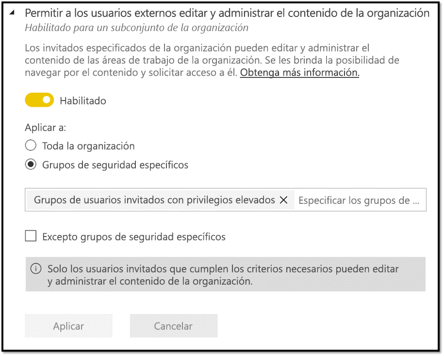

Los usuarios invitados obtienen la experiencia predeterminada de solo lectura y pueden editar y administrar el contenido. El valor predeterminado es deshabilitado, lo que significa que todos los usuarios invitados tienen la experiencia de solo lectura. El administrador de Power BI puede habilitar la configuración para todos los usuarios invitados de la organización o para grupos de seguridad específicos definidos en Azure AD. En la siguiente imagen, el administrador de Contoso Power BI creó un grupo de seguridad en Azure AD para administrar qué usuarios externos pueden editar y administrar el contenido del inquilino de contoso.

Para ayudar a estos usuarios a iniciar sesión en Power BI, proporcione la dirección URL del inquilino. Para buscar la dirección URL del inquilino, siga estos pasos.

1. En el servicio Power BI, en el menú superior, seleccione ayuda ( **?** ) a continuación **Power BI**.
2. Busque el valor junto a la **dirección URL del inquilino**. Esta es la dirección URL del inquilino que puede compartir con los usuarios invitados.

    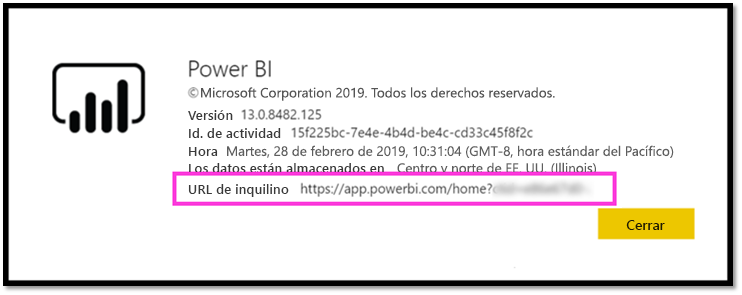

Cuando se usa la opción permitir a los usuarios externos invitados editar y administrar el contenido de la organización, los usuarios invitados especificados obtienen acceso al Power BI de la organización y ven cualquier contenido para el que tengan permiso. Pueden acceder al contenido doméstico, de exploración y de colaboración en áreas de trabajo, instalar aplicaciones donde están en la lista de acceso y tener un área de trabajo. Pueden crear o ser administradores de áreas de trabajo que usen la nueva experiencia de área de trabajo.

> [!NOTE]
> Al usar esta opción, asegúrese de revisar la sección de gobierno de este documento, ya que la configuración de Azure AD predeterminada evita que los usuarios invitados usen ciertas características como los selectores de personas, lo que puede dar lugar a una experiencia reducida. * *

En el caso de los usuarios invitados habilitados a través de la configuración permitir que los usuarios invitados externos editen y administren el contenido del inquilino de la organización, algunas experiencias no están disponibles para ellos. Para actualizar o publicar informes, los usuarios invitados deben usar la interfaz de usuario Web de servicio Power BI, incluido obtener datos para cargar archivos de Power BI Desktop. Las siguientes experiencias no se admiten:

- Publicación directa desde Power BI Desktop en el servicio Power BI
- Los usuarios invitados no pueden usar Power BI Desktop para conectarse a conjuntos de datos de servicio en el servicio Power BI
- Áreas de trabajo clásicas vinculadas a Office 365 grupos: el usuario invitado no puede crear o ser administradores de estas áreas de trabajo. Pueden ser miembros.
- No se admite el envío de invitaciones ad hoc para listas de acceso al área de trabajo
- Power BI Publisher para Excel no se admite para usuarios invitados
- Los usuarios invitados no pueden instalar Power BI Gateway y conectarlo a la organización
- Los usuarios invitados no pueden instalar la publicación de aplicaciones para toda la organización
- Los usuarios invitados no pueden usar, crear, actualizar ni instalar paquetes de contenido de organización
- Los usuarios invitados no pueden usar Analizar en Excel
- Los usuarios invitados no se pueden @mentioned en los comentarios (esta funcionalidad se agregará en una próxima versión)
- Los usuarios invitados no pueden usar suscripciones (esta funcionalidad se agregará en una próxima versión)
- Los usuarios invitados que usen esta funcionalidad deben tener una cuenta profesional o educativa. Los usuarios invitados que usan cuentas personales experimentan más limitaciones debido a las restricciones de inicio de sesión.

## Gobernanza

### Opciones de Azure AD adicionales que afectan a las experiencias en Power BI relacionadas con Azure AD B2B

Al usar Azure AD el uso compartido de B2B, el administrador de Azure Active Directory controla aspectos de la experiencia del usuario externo. Se controlan en la página Configuración de colaboración externa dentro de la configuración Azure Active Directory del inquilino.

Aquí encontrará información detallada sobre la configuración:

[https://docs.microsoft.com/azure/active-directory/b2b/delegate-invitations](https://docs.microsoft.com/azure/active-directory/b2b/delegate-invitations)

> [!NOTE]
> De forma predeterminada, los permisos usuarios invitados tienen una opción limitada está establecida en sí, por lo que los usuarios invitados dentro de Power BI tienen experiencias limitadas especialmente en el uso compartido en el que las ius del selector de personas no funcionan para esos usuarios. Es importante trabajar con el administrador de Azure AD para establecerlo en no, como se muestra a continuación para garantizar una buena experiencia. * *

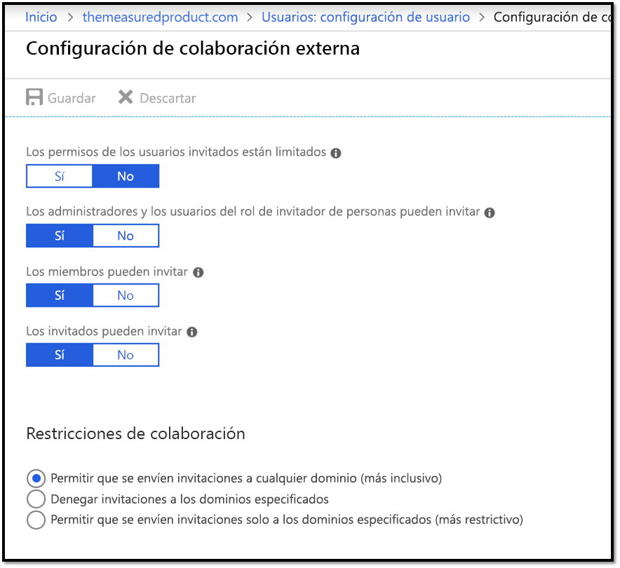

### Controlar invitados invitados

Power BI los administradores pueden controlar el uso compartido externo solo para Power BI visitando el portal de administración de Power BI. Sin embargo, los administradores de inquilinos también pueden controlar el uso compartido externo con varias directivas de Azure AD.  Estas directivas permiten a los administradores de inquilinos

- Desactivar invitaciones de usuarios finales
- Solo los administradores y los usuarios del rol de invitador invitado pueden invitar
- Los administradores, el rol de invitador invitado y los miembros pueden invitar
- Todos los usuarios, incluidos los invitados, pueden invitar

Puede leer más sobre estas directivas en [invitaciones de delegado para Azure Active Directory colaboración B2B](https://docs.microsoft.com/azure/active-directory/active-directory-b2b-delegate-invitations).

Todas las acciones de Power BI por parte de usuarios externos también se [auditan en nuestro portal de auditoría](https://powerbi.microsoft.com/documentation/powerbi-admin-auditing/).

### Directivas de acceso condicional para usuarios invitados

Contoso puede aplicar directivas de acceso condicional a los usuarios invitados que acceden al contenido del inquilino de contoso. Puede encontrar instrucciones detalladas en [acceso condicional para usuarios de colaboración B2B](https://docs.microsoft.com/azure/active-directory/active-directory-b2b-mfa-instructions).

## Enfoques alternativos comunes

Aunque Azure AD B2B facilita el uso compartido de datos e informes entre organizaciones, existen otros enfoques que se usan con frecuencia y que pueden ser superiores en ciertos casos.

### Opción 1 alternativa: crear identidades duplicadas para los usuarios asociados

Con esta opción, contoso tenía que crear manualmente identidades duplicadas para cada usuario asociado en el inquilino de Contoso, tal como se muestra en la siguiente imagen. A continuación, en Power BI, contoso puede compartir con las identidades asignadas los informes, paneles o aplicaciones adecuados.

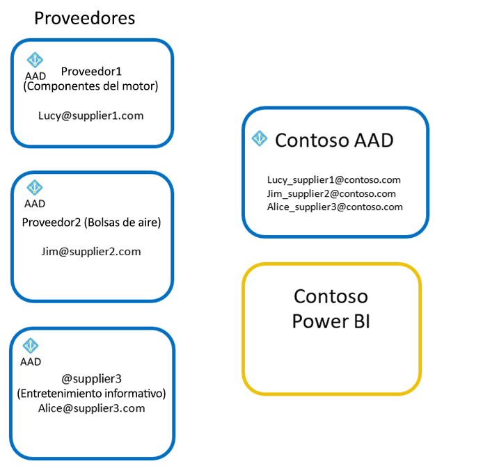

Razones para elegir esta alternativa:

- Dado que la identidad del usuario está controlada por su organización, cualquier servicio relacionado como el correo electrónico, SharePoint, etc. también se encuentra dentro del control de su organización. Los administradores de TI pueden restablecer las contraseñas, deshabilitar el acceso a las cuentas o auditar las actividades de estos servicios.
- A menudo, los usuarios que usan cuentas personales para su empresa tienen restringido el acceso a determinados servicios, por lo que pueden necesitar una cuenta profesional.
- Algunos servicios solo funcionan con los usuarios de la organización. Por ejemplo, puede que no sea posible usar Intune para administrar el contenido de los dispositivos personales o móviles de usuarios externos con Azure B2B.

Razones para no elegir esta alternativa:

- Los usuarios de organizaciones asociadas deben recordar dos conjuntos de credenciales: uno para acceder al contenido de su propia organización y el otro para tener acceso al contenido de contoso. Esto es una molestia para estos usuarios invitados y muchos usuarios invitados están confundidos por esta experiencia.
- Contoso debe adquirir y asignar licencias por usuario a estos usuarios. Si un usuario necesita recibir correo electrónico o usar aplicaciones de Office, necesita las licencias adecuadas, incluidas Power BI Pro para editar y compartir contenido en Power BI.
- Es posible que contoso quiera aplicar directivas de control y autorización más rigurosas para usuarios externos en comparación con los usuarios internos. Para lograr esto, contoso necesita crear una nomenclatura interna para los usuarios externos y todos los usuarios de Contoso deben educarse sobre esta nomenclatura.
- Cuando el usuario abandona su organización, sigue teniendo acceso a los recursos de Contoso hasta que el administrador de Contoso elimina manualmente su cuenta
- Los administradores de Contoso tienen que administrar la identidad del invitado, incluida la creación, restablecimiento de contraseña, etc.

### Opción 2 alternativa: creación de una aplicación de Power BI Embedded personalizada mediante la autenticación personalizada

Otra opción para contoso es crear su propia aplicación de Power BI incrustada personalizada con autenticación personalizada (["la aplicación posee los datos"](https://docs.microsoft.com/power-bi/developer/embed-sample-for-customers)). Aunque muchas organizaciones no tienen el tiempo o los recursos necesarios para crear una aplicación personalizada para distribuir Power BI contenido a sus asociados externos, para algunas organizaciones es el mejor enfoque y merece una consideración seria.

A menudo, las organizaciones disponen de portales de partners que centralizan el acceso a todos los recursos de la organización para asociados, proporcionan aislamiento de los recursos internos de la organización y proporcionan experiencias simplificadas para que los asociados admitan muchos asociados y sus usuarios individuales.

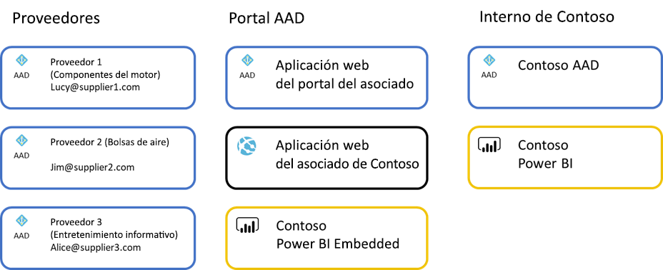

En el ejemplo anterior, los usuarios de cada proveedor inician sesión en el portal de Partners de Contoso que usa AAD como proveedor de identidades. Podría usar AAD B2B, Azure B2C, identidades nativas o federar con cualquier otro proveedor de identidades. El usuario tendría que iniciar sesión y acceder a un portal de asociados que se crea mediante una aplicación Web de Azure o una infraestructura similar.

Dentro de la aplicación Web, se insertan Power BI informes desde una implementación de Power BI Embedded. La aplicación web simplificaría el acceso a los informes y todos los servicios relacionados en una experiencia coherente para facilitar a los proveedores la interacción con contoso. Este entorno de portal se aislaría del entorno de Power BI interno de AAD de Contoso y del de Contoso para asegurarse de que los proveedores no podían acceder a esos recursos. Normalmente, los datos se almacenarían en un almacén de datos asociado independiente para garantizar también el aislamiento de los datos. Este aislamiento tiene ventajas, ya que limita el número de usuarios externos con acceso directo a los datos de la organización, lo que limita los datos que podrían estar disponibles para el usuario externo y limita el uso compartido accidental con usuarios externos.

Con Power BI Embedded, el portal puede aprovechar las licencias ventajosas, mediante el token de la aplicación o el usuario maestro más la capacidad Premium adquirida en el modelo de Azure, lo que simplifica los problemas relacionados con la asignación de licencias a los usuarios finales, y puede escalar o reducir verticalmente según lo previsto. uso. El portal puede ofrecer una experiencia global y una mayor calidad, ya que los asociados acceden a un solo portal diseñado pensando en todas las necesidades de los asociados. Por último, como las soluciones basadas en Power BI Embedded suelen estar diseñadas para ser multiinquilino, facilita el aislamiento entre organizaciones asociadas.

Razones para elegir esta alternativa:

- Más fácil de administrar a medida que crece el número de organizaciones asociadas. Dado que los asociados se agregan a un directorio independiente aislado del directorio de AAD interno de Contoso, simplifica sus tareas de gobierno y ayuda a evitar el uso compartido accidental de datos internos para los usuarios externos.
- Los portales de asociados típicos son experiencias altamente marcadas con experiencias coherentes en todos los asociados y se optimizan para satisfacer las necesidades de los asociados típicos. Por lo tanto, contoso puede ofrecer una mejor experiencia general a los asociados mediante la integración de todos los servicios necesarios en un solo portal.
- Los costos de licencias para escenarios avanzados, como la edición de contenido dentro del Power BI Embedded están incluidos en el Power BI Premium de Azure adquirido y no requieren la asignación de licencias de Power BI Pro a esos usuarios.
- Proporciona un mejor aislamiento entre asociados si se diseña como una solución de varios inquilinos.
- El portal de Partners incluye a menudo otras herramientas para asociados más allá Power BI informes, paneles y aplicaciones.

Razones para no elegir esta alternativa:

- Se requiere un esfuerzo importante para crear, operar y mantener un portal de este tipo, lo que supone una inversión importante en recursos y tiempo.
- El tiempo para la solución es mucho más largo que usar el uso compartido de B2B, ya que se requiere un cuidadoso planeamiento y ejecución en varias secuencias de archivos.
- Si hay un número menor de asociados, es probable que el esfuerzo necesario para esta alternativa sea demasiado alto para justificarlo.
- La colaboración con el uso compartido ad hoc es el escenario principal al que se enfrenta la organización.
- Los informes y los paneles son diferentes para cada asociado. Esta alternativa introduce una sobrecarga de administración más allá de compartir directamente con los asociados.

## PREGUNTAS MÁS FRECUENTES

**¿Puede contoso enviar una invitación para que se canjee automáticamente, de modo que el usuario esté "listo para funcionar"? ¿O el usuario siempre tiene que hacer clic en la dirección URL de canje?**

El usuario final siempre debe hacer clic en la experiencia de consentimiento para poder tener acceso al contenido.

Si va a invitar a muchos usuarios invitados, le recomendamos que lo delegue desde los administradores principales de Azure AD [agregando un usuario al rol de invitador invitado en la organización de recursos](https://docs.microsoft.com/azure/active-directory/active-directory-b2b-add-guest-to-role). Este usuario puede invitar a otros usuarios de la organización asociada mediante la interfaz de usuario de inicio de sesión, los scripts de PowerShell o las API. Esto reduce la carga administrativa de los administradores de Azure AD para invitar o reenviar invitaciones a los usuarios de la organización asociada.

**¿Puede contoso forzar la autenticación multifactor para usuarios invitados si sus asociados no tienen autenticación multifactor?**

Sí. Para obtener más información, consulte [acceso condicional para usuarios de colaboración B2B](https://docs.microsoft.com/azure/active-directory/active-directory-b2b-mfa-instructions).

**¿Cómo funciona la colaboración B2B cuando el socio invitado usa la Federación para agregar su propia autenticación local?**

Si el asociado tiene un inquilino de Azure AD que está federado en la infraestructura de autenticación local, el inicio de sesión único (SSO) local se consigue automáticamente. Si el asociado no tiene un inquilino de Azure AD, se puede crear una cuenta de Azure AD para nuevos usuarios.

**¿Puedo invitar a usuarios invitados con cuentas de correo electrónico de consumidor?**

La invitación de usuarios invitados con cuentas de correo electrónico de consumidor es compatible con Power BI. Esto incluye dominios como hotmail.com, outlook.com y gmail.com. Sin embargo, esos usuarios pueden experimentar limitaciones más allá de lo que los usuarios con cuentas profesionales o educativas encuentran.
