# Implementación y administración de las capacidades de Power BI Premium

**Resumen:** Power BI Premium proporciona un rendimiento más homogéneo, compatibilidad con grandes volúmenes de datos y la flexibilidad de una plataforma unificada de BI de autoservicio y enterprise para todas las personas de su organización. Estas notas del producto técnicas de nivel 300 se ha escrito específicamente para los administradores de Power BI y los creadores de contenido y los publicadores. Su objetivo es para ayudarlos a comprender el potencial de Power BI Premium y explicar cómo diseñar, implementar, supervisar y solucionar problemas de soluciones escalables.

**Autor:** [Peter Myers](https://www.linkedin.com/in/peterjsmyers) (MVP de la plataforma de datos y experto en BI independiente con las soluciones de bit a bit)

**Revisores técnicos:** ADAM Saxton, Akshai Mirchandani, Bhavik comerciante, David Magar, Josh Caplan, Michael Blythe, Nimrod Shalit, Olivier Matrat, Gupta Swati

**Se aplica a:** Servicio Power BI, Power BI Premium y capacidades de Azure Power BI Embedded

> [!NOTE]
> Para guardar o imprimir estas notas del producto, haga clic en **Imprimir** en el explorador y después en **Guardar como PDF**.

## Presentación de Power BI

Power BI es un servicio de análisis empresarial diseñado para proporcionar información que permite tomar decisiones informadas y rápidas. Desde su lanzamiento en 2015 se ha convertido rápidamente en un popular servicio usado para entregar soluciones para las organizaciones más pequeñas a la mayor de las empresas.

Está disponible de dos maneras: Solución de informes denominada como un servicio en la nube, como un uso local **Power BI Report Server**. \[[1](#endnote-01)\]

Power BI como un servicio en la nube es Software-como-servicio (SaaS) \[ [2](#endnote-02)\]. Representa un conjunto de servicios y aplicaciones que permiten a las organizaciones a desarrollar, implementar, administrar, compartir soluciones para supervisar su negocio.

No es la intención de este artículo para proporcionar una descripción completa del servicio Power BI. En su lugar, se centra en temas relacionados con el asunto de Power BI Premium. Para obtener información general sobre Power BI, consulte la completa [documentación de Power BI](service-admin-premium-multi-geo.md). Para obtener una explicación más detallada del servicio Power BI con un enfoque en lograr el buen rendimiento de las implementaciones empresariales, consulte la completa [planear una implementación de Power BI Enterprise](https://aka.ms/pbienterprisedeploy) notas del producto.

En el contexto de asunto de este artículo, esta sección presenta y describe las capacidades, Power BI los tipos de contenido, los modos de almacenamiento del modelo y las licencias. Una descripción de estos temas es esencial para implementar y administrar Power BI Premium correctamente.

### Capacidades

**Las capacidades de** es un concepto de Power BI básico que representa un conjunto de recursos (almacenamiento, procesador y memoria) utilizados para hospedar y ofrecer Power BI content. Las capacidades se compartido o dedicadas. Un **capacidad compartida** es compartido con otros clientes de Microsoft, mientras que un **capacidad dedicada** está totalmente comprometido a un solo cliente. Capacidad dedicada se introducen en el [las capacidades Premium](#premium-capacities) tema.

En la capacidad compartida, cargas de trabajo se ejecutan en recursos informáticos compartidos con otros clientes. Como la capacidad debe compartir recursos, se imponen limitaciones para asegurarse de "fair reproducir", como el tamaño máximo del modelo (1 GB) y frecuencia de actualización diaria máxima (ocho veces por día).

### Áreas de trabajo

Áreas de trabajo de Power BI residen dentro de las capacidades y que representan los contenedores de seguridad, la colaboración y la implementación. Cada usuario de Power BI tiene un área de trabajo personal que se conoce como **mi área de trabajo**. Se pueden crear áreas de trabajo adicionales para habilitar la colaboración y la implementación, y estos se conocen como **las áreas de trabajo de aplicación**. De forma predeterminada, las áreas de trabajo (incluidos las áreas de trabajo personales) se crean en la capacidad compartida.

### Tipos de contenido de BI energía

Para presentar los temas de Power BI Premium, es importante empezar con un análisis detallado de la arquitectura de Power BI, incluidos los tipos de contenido fundamentales.

Todo el contenido de Power BI se almacena y administra las áreas de trabajo que son contenedores de contenido de Power BI. Cada usuario de Power BI tiene su propia área de trabajo personal, pero el procedimiento recomendado general consiste en crear áreas de trabajo de aplicación. Las áreas de trabajo de aplicación permiten co-propiedad de contenido y la capacidad de compartir contenido. También proporcionan la capacidad de organizar y distribuir contenido a audiencias amplias como las aplicaciones.

El siguiente contenido de Power BI se almacena en las áreas de trabajo:

- Flujos de datos
- Conjuntos de datos
- Libros
- Informes
- Paneles

#### Flujos de datos

Flujos de datos de Power BI ayuda a las organizaciones unificar los datos de orígenes dispares. Se puede considerar como datos preparado y almacenados provisionalmente para su uso en los modelos, pero no puede usarse directamente como origen para los informes. Aprovechan la amplia colección de conectores de datos de Microsoft, lo que permite la ingesta de datos locales y los orígenes de datos en la nube.

Flujos de datos solo se pueden crear y administran en las áreas de trabajo de aplicación y se almacenan como entidades en el modelo de datos comunes (CDs) en Azure Data Lake Storage Gen2. Por lo general, que están programados para actualizar de forma periódica para almacenar los datos actualizados.

Para obtener más información, consulte el [de preparación de datos de autoservicio en Power BI (versión preliminar)](service-dataflows-overview.md) documento.

#### Conjuntos de datos

Conjuntos de datos de Power BI representan un origen de datos listos para realizar informes y visualización. Hay muchos tipos de conjuntos de datos, creado por:

- Conectarse a un modelo de datos existente que no se hospeda en una capacidad de Power BI
- Cargar un archivo de Power BI Desktop que contenga un modelo
- Cargar un libro de Excel (que contiene una o varias tablas de Excel o un modelo de datos de libro) o cargar un archivo de valores separados por comas (CSV)
- Mediante el servicio de Power BI para crear una inserción, transmisión por secuencias o híbrida conjunto de datos de transmisión por secuencias

Excepto para los conjuntos de datos de transmisión por secuencias \[ [3](#endnote-03)\], el conjunto de datos representa un modelo de datos que aprovecha las tecnologías de modelado madura de Analysis Services.

Tenga en cuenta que en la documentación, a veces las terminologías conjuntos de datos y los modelos son intercambiables. Por lo general, desde la perspectiva del servicio Power BI, se dice que un **dataset** y desde una perspectiva de desarrollo, se dice que un **modelo**. En el contexto de estas notas del producto significan lo mismo.

##### Modelos hospedado externamente

Conectarse a un modelo hospedado externamente implica la instalación de la [On-Premises Data Gateway](service-gateway-onprem.md) para conectarse a SQL Server Analysis Services, ya sea local u hospedado en máquina virtual de infraestructura como-servicio (IaaS). Azure Analysis Services no requiere una puerta de enlace. Este escenario suele tener sentido cuando se den las inversiones existentes de modelo, que normalmente forman parte de almacenamiento de datos empresarial (EDW). Permite que Power BI realizar un **conexión dinámica** (LC) a Analysis Services y para ello, aplicar permisos de datos mediante el uso de la identidad del usuario de informes de Power BI. SQL Server Analysis Services, se admiten los modelos multidimensionales (cubos) y los modelos tabulares. Como se muestra en la siguiente imagen, un conjunto de datos de conexión dinámica pasa las consultas a los modelos hospedados externamente.

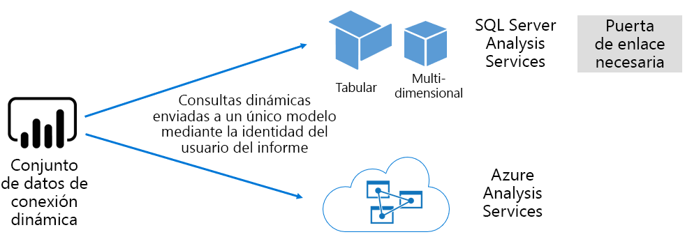

##### Modelos desarrollados por el escritorio de Power BI

Power BI Desktop - una aplicación de cliente destinada a desarrollo de Power BI - puede utilizarse para desarrollar un modelo que es realmente un modelo tabular de Analysis Services. Los modelos se pueden desarrollar importando datos de flujos de datos, que, a continuación, se pueden integrar con otros orígenes de datos. Aunque los detalles sobre cómo se pueden lograr modelos está fuera del ámbito de este artículo, es importante saber que existen tres diferentes tipos - o modos de - de modelos que se pueden desarrollar mediante el uso de Power BI Desktop. Estos modos de determinan si se importan datos en el modelo, o si mantiene en el origen de datos. Los tres modos son: Import, DirectQuery y compuesto. Una explicación completa de cada modo se tratarán en la [modos de almacenamiento del modelo](#model-storage-modes) tema.

Modelos pero hospedado y modelos desarrollados en Power BI desktop pueden aplicar seguridad a nivel de fila (RLS) para limitar los datos que se pueden recuperar para un determinado usuario. Por ejemplo, los usuarios asignados al grupo de seguridad de los vendedores solo pueden ver los datos de informe para las regiones de ventas a los que están asignadas. Roles de RLS pueden ser estática o dinámica. **Roles dinámicos** filtrar por el usuario del informe, mientras que **funciones estáticas** se aplican los mismos filtros para todos los usuarios asignados a la función.

##### Modelos de libro de Excel

Crear conjuntos de datos basándose en los libros de Excel o CSV archivos dará como resultado la creación automática de un modelo. Para crear tablas de modelos, mientras que un modelo de datos del libro de Excel se estar transpuesto para crear un modelo de Power BI, se importarán las tablas de Excel y datos CSV. En todos los casos, los datos de archivo se importan en un modelo.

Distinciones, a continuación, se pueden realizar sobre los conjuntos de datos de Power BI que representan los modelos:

- Que estén hospedados en el servicio Power BI o externamente se hospedan en Analysis Services
- Pueden almacenar los datos importados o pueden emitir solicitudes de consulta passthrough a orígenes de datos subyacentes, o una combinación de ambas

Este es un resumen de hechos importantes acerca de los conjuntos de datos de Power BI que representan los modelos:

- Los modelos de SQL Server Analysis Services hospedada requieren una puerta de enlace para realizar consultas LC
- Modelos de Power BI hospedados que importarán datos
  - Debe ser totalmente cargado en la memoria, por lo que puede consultarse
  - Requieren actualización para mantener datos actualizados y deben incluir las puertas de enlace al origen de datos no es accesible directamente a través de Internet
- Power BI hospedados los modelos que utilizan el modo de almacenamiento DirectQuery (DQ) requieren conectividad con los datos de origen. Cuando se consulta el modelo, Power BI emite consultas al origen de datos para recuperar los datos actuales. Este modo debe implicar las puertas de enlace al origen de datos no es accesible directamente a través de Internet.
- Los modelos pueden exigir las reglas RLS, aplicar filtros para limitar el acceso de datos a determinados usuarios

Para implementar y administrar Power BI Premium correctamente, es importante comprender dónde se hospedan modelos, modo de almacenamiento, las dependencias de las puertas de enlace, el tamaño de los datos importados y el tipo y la frecuencia de actualización. Estos todos pueden tener un impacto significativo en los recursos de Power BI Premium. Además, el diseño del modelo mismo, incluidas sus consultas de preparación de datos y cálculos puede agregar a la combinación de consideraciones.

También es importante comprender que importación hospedados en Power BI pueden actualizar según la programación o ser modelos desencadenarse a petición para un usuario en el servicio Power BI.

Diseñar modelos optimizados se explica más adelante en este artículo técnico en el [optimizar modelos](#optimizing-models) tema.

#### Libros

Libros de Power BI son un tipo de contenido de Power BI \[ [4](#endnote-04)\]. Son los libros de Excel que se han cargado en el servicio Power BI y no debe confundirse con los libros de Excel cargados que crean conjuntos de datos (modelos). El tipo de contenido del libro representa una conexión a un libro, que se pudo cargar el servicio Power BI o debería permanecer en el almacenamiento en la nube en OneDrive o SharePoint Online.

Es importante comprender que este tipo de contenido no está disponible como un origen de datos para las visualizaciones de datos de Power BI. En su lugar, se puede abrir como un libro en el servicio Power BI mediante el uso de Excel Online. El objetivo principal de este tipo de contenido es permitir que los informes heredados de libro de Excel para ser accesible desde dentro del servicio Power BI y para permitir que sus visualizaciones de datos que se pueden anclar a paneles de Power BI.

Para obtener más información, consulte el [obtener datos de archivos de libro de Excel](service-excel-workbook-files.md) documento.

#### Informes

Hay dos tipos de informes: Informes de Power BI e informes paginados.

**Informes de Power BI** proporcionan una experiencia que se conecta a un único conjunto de datos de una visualización interactiva de datos. Informes a menudo están diseñados para fomentar la participación del usuario lo que les permite interactuar con una matriz extraordinaria de funcionalidades, como el filtrado, la segmentación, cross filtrado y resaltado, exploración, obtención de detalles, explorando, preguntas y respuestas física preguntas de lenguaje, centrándose, navegación de páginas, destacar, marcadores de visualización y más.

En el contexto de este artículo, es importante comprender cómo la arquitectura de Power BI, interacciones de usuario y el diseño del informe de Power BI pueden influir en los recursos del servicio Power BI:

- Para cargar e interactuar con informes basados en modelos de importación, el modelo debe ser totalmente cargado en la memoria (ya sea hospedados en el servicio Power BI o externamente)
- Cada objeto visual de informe emite una consulta para recuperar datos si se consulta el modelo
- Por lo general, las interacciones de segmentación y filtros implican consultar el modelo. Por ejemplo, cambiar una selección de segmentación de datos: de forma predeterminada, requerirá recargar cada objeto visual en la página \[ [5](#endnote-05)\]
- Informes de Power BI no garantizan la visualización de datos actuales y pueden requerir al usuario que actualice el informe para volver a cargar la página del informe y los objetos visuales
- Los usuarios pueden ponerse en contacto con preguntas y & lo permita una característica de lenguaje natural para formular preguntas, que proporciona el diseño del informe de Power BI y el conjunto de datos representa un modelo de importación de datos hospedados en Power BI o un conjunto de datos de LC configurados para habilitar preguntas y respuestas

**Informes paginados** lo que permite la publicación y la representación de informes de SQL Server Reporting Services (SSRS) (\*formato .rdl). Como sugiere su nombre, los informes paginados se usan normalmente cuando los requisitos de dictan una necesidad para imprimir en un tamaño de página fijo, o cuando hay listas de variables de datos que se deben expandir por completo. Por ejemplo, una factura diseñada para la representación de varias páginas (en lugar de desplazarse dentro de un objeto visual) e impresión.

Los dos tipos de informe admitido proporcionan opciones para los autores de informes, lo que les permite seleccionar el tipo según los requisitos y uso previsto. Por lo general, los informes de Power BI son ideales para experiencias interactivas, que permite al usuario explorar y descubrir información a partir de datos, mientras que los informes paginados son adecuados para los diseños de página basados en parámetros.

Independientemente del tipo de informe, es imperativo para ofrecer una experiencia de usuario de confianza y buen rendimiento para lograr las actualizaciones de carga y los datos de informe con capacidad de respuesta (cuando se cambian los filtros o parámetros).

#### Paneles

Paneles de Power BI están pensados para proporcionar experiencias de supervisión y son conceptualmente muy diferentes de los informes de Power BI. Los paneles están diseñados para aparecer en un único panel de vidrio para expresar valores y visualizaciones de datos en los iconos. Por lo general, los paneles ofrecen experiencias de interacción menos que los informes de Power BI, con algunos diseños de panel que se espera ninguna interacción. Por ejemplo, un panel desatendido presentado una pantalla no táctil en una sala de servidores. Otra diferencia importante es que los paneles pueden presentar los iconos que solo se pueden basar en un único conjunto de datos de informes de datos de origen de varios conjuntos de datos, mientras que un Power BI.

Es importante entender que un panel está diseñado para cargar rápidamente y expresar los datos más actuales (conocidos para el servicio Power BI) en todo momento. Esto consigue al almacenamiento en caché de resultados de la consulta de icono y lo hace para cada panel. De hecho, debe hacer esto para cada usuario que tiene acceso a un panel que se basa en los modelos que aplican RLS dinámica.

El servicio Power BI actualiza automáticamente las memorias caché de panel consulta inmediatamente después de actualizarán los modelos hospedados en Power BI import. En el caso de los modelos LC y calidad de datos, el propietario del conjunto de datos tiene un grado de control sobre la frecuencia con el servicio Power BI actualiza la caché, que puede configurarse como con frecuencia como cada 15 minutos, o tan pocas veces como una vez por semana. Tenga en cuenta que las actualizaciones de caché de consulta LC consultará primero los metadatos del modelo para determinar si una actualización del modelo ha tenido lugar desde la última actualización de caché y no continuará para actualizar la memoria caché cuando una actualización no se ha producido desde entonces. Esta comprobación no es posible que los modelos de calidad de datos y, por lo que las actualizaciones de caché se realizará si el origen de datos ha cambiado o no.

Caché de consultas del panel actualiza en función de calidad de datos y modelos de LC pueden afectar considerablemente en los recursos del servicio Power BI y orígenes de datos externos. Considere la posibilidad de un panel con iconos de 20, todos basados en un modelo de Azure Analysis Services que exige RLS dinámica y que se actualizan cada hora, y que este panel se comparte con 100 usuarios. Si el conjunto de datos está configurado para actualizar cada hora, esto daría como resultado en al menos 2000 (20 x 100) consultas LC. Esto podría suponer una enorme carga en el servicio Power BI y los orígenes de datos externos, y también podrían superar los límites impuestos en los recursos disponibles. Recursos de capacidad y los límites se describen en la [nodos de capacidad](#capacity-nodes) tema.

Los usuarios pueden interactuar con los paneles de varias maneras, que requieren recursos del servicio Power BI. En concreto, puede:

- Desencadenar una actualización de los iconos de paneles, que puede dar lugar a una actualización de la petición de todos ellos relacionados con los modelos de importación de datos hospedados en Power BI
- Ponerse en contacto con preguntas y respuestas de una característica de lenguaje natural para formular preguntas (proporcionando lo permite el diseño del panel y el conjunto de datos es un modelo de importación de datos hospedados en Power BI o un conjunto de datos de LC configurados para habilitar preguntas y respuestas)
- Use la característica información rápida para que Power BI descubrir información a partir de un conjunto de datos subyacente y responder con objetos visuales que muestran y describen (siempre que el icono se basa en un conjunto de datos que es el modelo de importación de datos hospedados en Power BI)
- Configurar alertas en iconos del panel, que requiere el servicio Power BI para comparar los umbrales en mosaico valores - posiblemente con tanta frecuencia como hora - y notificar a los usuarios cuando se superan los umbrales (siempre que el icono muestra un único valor numérico y se basa en un conjunto de datos que es el modelo de importación de datos hospedados en Power BI)

### Modos de almacenamiento del modelo

Recuerde que Power BI Desktop permite desarrollar un modelo en uno de tres modos. Es importante entender el razonamiento para cada modo de almacenamiento de datos modelo y los posibles impactos en recursos del servicio Power BI. Esta sección presenta los tres modos. Se tratarán con más detalle más adelante en estas notas del producto en el tema de los modelos de optimización.

#### Modo de importación

Modo de importación es el modo más común utilizado para desarrollar modelos debido a un rendimiento extremadamente rápido asociado a la consulta, la flexibilidad de diseño disponible para los modeladores, en memoria y soporte para funcionalidades específicas de servicio de Power BI (preguntas y respuestas, Quick Insights etcetera.). Es el modo predeterminado cuando se crea una nueva solución de Power BI Desktop.

Es importante comprender que los datos importados siempre se almacenan en disco y debe estar totalmente cargado en memoria consultar o actualizar. Una vez en la memoria, los modelos de importación lograr resultados de la consulta sorprendentemente rápido. También es importante comprender que no hay ningún concepto de un modelo de importación que se cargan parcialmente en la memoria.

Cuando se actualiza, datos se comprimen y se ha optimizado y, a continuación, se almacenan en el disco mediante el motor de almacenamiento de VertiPaq. Cuando se cargan desde el disco en memoria, es posible ver una compresión 10 veces y, por lo que es razonable esperar que los 10 GB de datos de origen puede comprimir a aproximadamente 1 GB de tamaño. Tamaño de almacenamiento en disco puede conseguirlo una reducción del 20% en la parte superior. \[[6](#endnote-06)\]

Flexibilidad de diseño se puede lograr de tres maneras. Los modeladores de datos pueden:

- Integrar datos almacenando en caché datos de varios orígenes de datos - independientemente del tipo de origen de datos y formato
- Aproveche todo el conjunto de funciones de lenguaje de fórmulas de Power Query (conocer informalmente como M) al crear consultas de preparación de datos
- Aproveche todo el conjunto de funciones de expresiones de análisis de datos (DAX) al mejorar el modelo con lógica de negocios, conseguir con las tablas calculadas, medidas y columnas calculadas

Como se muestra en la siguiente imagen, un modelo de importación puede integrar datos de cualquier número de tipos de orígenes de datos admitidos.

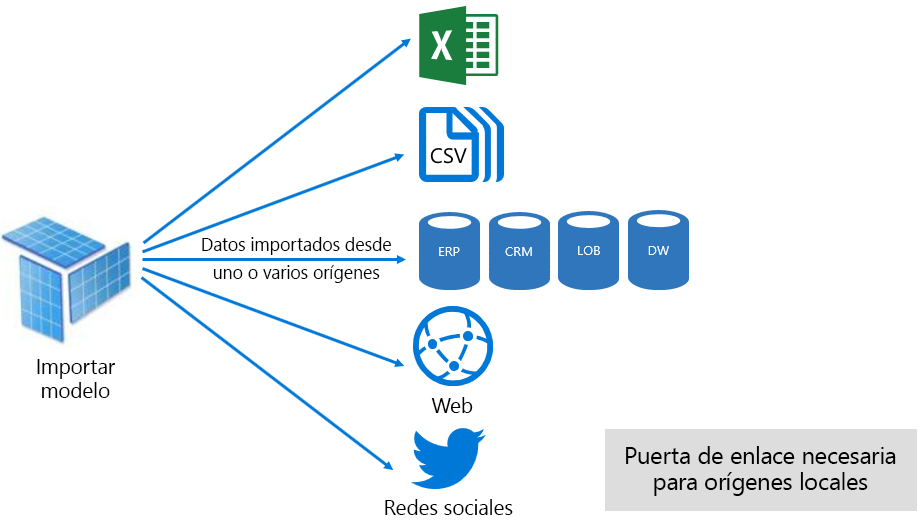

Sin embargo, si bien hay ventajas atractivas asociadas con los modelos de importación, hay inconvenientes demasiado:

- Todo el modelo se debe cargar en la memoria antes de Power BI pueda consultar el modelo, que puede colocar la presión en los recursos disponibles a medida que crecen el número y tamaño de los modelos
- Datos del modelo están tan actualizados como la actualización más reciente y, por lo que los modelos de importación deben actualizarse, preferiblemente de forma programada
- Una actualización completa quitará todos los datos de todas las tablas y volver a cargarlo desde el origen de datos. Esto puede ser muy costosa en términos de tiempo y recursos para el servicio Power BI y los orígenes de datos. Power BI disponen de soporte técnico para la actualización incremental que se puede evitar el truncamiento y volver a cargar tablas enteras, y esto se trata en el [Optimizing Power BI-Hosted modelos](#optimizing-power-bi-hosted-models) tema.

Desde una perspectiva de recursos del servicio Power BI, necesitan importar modelos:

- Memoria suficiente para cargar el modelo cuando se consulta o se actualizan
- Recursos de memoria adicionales para actualizar los datos y recursos de procesamiento

#### Modo DirectQuery

Modelos desarrollados en modo DirectQuery (DQ) importar datos. En su lugar, que constan únicamente de metadatos que, cuando consulta las consultas nativas de problemas en el origen de datos subyacente.

Hay dos razones principales para desarrollar un modelo de calidad de datos. El primer motivo es que cuando los volúmenes de datos son demasiado grandes - incluso cuando se aplican los métodos de reducción de datos - cargar en un modelo o de actualización en la práctica. La segunda razón es cuando necesitan informes y paneles para entregar datos "casi en tiempo real", más allá de lo que puede lograrse dentro de los límites de la actualización programada (48 veces al día para una capacidad dedicada).

Hay varias ventajas asociadas con los modelos de calidad de datos:

- No se aplican los límites de tamaño del modelo de importación
- Los modelos no requieren la actualización
- Los usuarios de informes verán los datos más recientes al interactuar con filtros y segmentaciones de datos y puede actualizar el informe completo para recuperar los datos actuales
- Iconos del panel, cuando basados en modelos de calidad de datos, pueden actualizar automáticamente con tanta frecuencia como cada 15 minutos

Sin embargo, hay varias desventajas y limitaciones relacionadas con modelos de calidad de datos:

- El modelo debe basarse en un origen de datos admitidos único y, por tanto, ya se logra una integración de datos del origen de datos. Orígenes de datos admitidos son sistemas de análisis y relacionales, con compatibilidad para muchos almacenes de datos populares \[ [7](#endnote-07)\].
- Rendimiento puede ser lento, impacto potencialmente negativo en el servicio Power BI (las consultas pueden ser muy intensivo de CPU) y en el origen de datos (que no se puede optimizar para consultas analíticas)
- Consultas de Power Query no pueden ser complejas y se limitan a expresiones de M y funciones que pueden estar transpuestas a las consultas nativas entendidas el origen de datos
- Funciones de DAX se limitan a los que puede estar transpuestos a las consultas nativas entendidas el origen de datos, y no hay ninguna compatibilidad para las tablas calculadas o capacidades integradas de inteligencia de tiempo
- De forma predeterminada, las consultas de modelo que requieren que se recuperen de más de un millón de filas se producirá un error
- Los informes y paneles con varios objetos visuales pueden mostrar resultados incoherentes, especialmente cuando el origen de datos es volátil
- Preguntas y respuestas y no se admite información rápida

Desde una perspectiva de recursos del servicio Power BI, los modelos de calidad de datos requieren:

- Memoria mínima para cargar el modelo (únicamente metadatos) cuando se le consulta
- Recursos de procesador significativo a veces para generar y procesar las consultas enviadas al origen de datos

Para obtener más información, consulte el [Use Direct Query en Power BI Desktop](desktop-use-directquery.md) documento.

#### Modo compuesto

Modelos desarrollados en modo compuesto permiten configurar el modo de almacenamiento para las tablas de modelo individuales. Por tanto, admite una mezcla de importación y tablas de calidad de datos. También es compatible con las tablas calculadas (definidas como DAX) y varios orígenes de datos de calidad de datos.

Modo de almacenamiento de tabla puede configurarse como Import, DirectQuery o doble. Una tabla configurada como modo de almacenamiento Dual es importación y DirectQuery, y esto permite al servicio Power BI determinar el modo más eficaz utilizar según una consulta mediante la consulta.

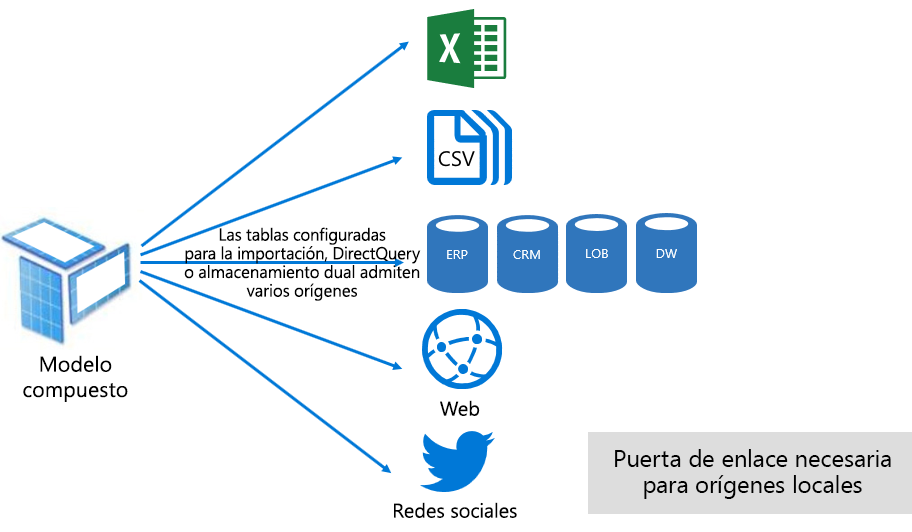

Modelos compuestos se esfuerzan por ofrecen lo mejor de los modos de importación y DirectQuery. Cuando se ha configurado correctamente pueden combinar rendimiento elevado de consultas de modelos en memoria con la capacidad de recuperar casi en tiempo real datos procedentes de orígenes de datos.

Es probable que los modeladores de datos que desarrollar modelos compuestos configurar las tablas de tipo de dimensión en la importación o Dual modo y el tipo de hechos tablas de almacenamiento en el modo DirectQuery. Por ejemplo, considere la posibilidad de un modelo con una tabla de tipo de dimensión de producto de modo Dual y una tabla de tipo de hechos de ventas en el modo DirectQuery. La tabla Product podría consultarse de forma rápida y eficaz de en memoria para representar una segmentación de datos de informe. La tabla Sales, a continuación, puede consultarse en el modo DirectQuery unido a la tabla de productos relacionada. La última consulta podría permitir la generación de una sola consulta nativa eficaz para unir las tablas Product y Sales y filtre por los valores de segmentación de datos.

En general, se pueden considerar las ventajas y desventajas, asociadas con cada modo de modelo para aplicar a modo de almacenamiento de tabla en los modelos compuestos.

Para obtener más información, consulte el [usar modelos compuestos en Power BI Desktop](desktop-composite-models.md) documento.

### Licencias

Power BI tiene tres licencias:

- Power BI gratuito
- Power BI Pro
- Power BI Premium

El **gratuita de Power BI** licencia permite que una persona inicie sesión en el servicio Power BI y trabajar dentro de su área de trabajo personal mediante la publicación de informes y modelos. Es importante comprender que no es posible compartir el contenido de Power BI mediante el uso de esta licencia. Esta licencia, como su nombre sugiere, es gratis.

El **Power BI Pro** licencia permite contenido a un individuo a colaborar dentro de las áreas de trabajo de aplicación, crear, compartir y distribuir Power BI. También puede configurar la actualización para los conjuntos de datos mantener automáticamente datos actual, incluidos orígenes de datos de forma local. Además, pueden auditar y controlar cómo se tiene acceso y utiliza los datos. Esta licencia es necesaria para recibir contenido compartido de otros usuarios a menos que el usuario está asociado con una capacidad dedicada de Power BI Premium.

El **Power BI Premium** licencia es un nivel de inquilino y se describe en el [Introducción a Power BI Premium](#introducing-power-bi-premium) sección.

Para obtener más información acerca de las licencias de Power BI, consulte el [precios de Power BI](https://powerbi.microsoft.com/pricing/) página.

## Introducción a Power BI Premium

Power BI Premium ofrece una plataforma unificada de BI de autoservicio y enterprise con escala, un rendimiento confiable y costos predecibles. Principalmente, esto logra proporcionando recursos dedicados para ejecutar el servicio Power BI para su organización.

Además, Power BI Premium ofrece muchas características de enterprise:

- Distribución de contenido y rentable, lo que permite el uso compartido de contenido de Power BI para usuarios gratuita de Power BI ilimitados, incluidos los usuarios externos
- Compatibilidad con tamaños más grandes de conjunto de datos \[ [8](#endnote-08)\]
- Mayores tasas de actualización de los flujos de datos y conjuntos de datos (hasta 48 veces al día)
- Actualización incremental de los flujos de datos y conjuntos de datos
- Las entidades de flujo de datos vinculado y ejecución en paralelo de transformaciones
- Informes paginados
- Power BI Report Server en local de informes
- Capacidad para insertar contenido en las aplicaciones en nombre de usuarios de la aplicación (PaaS)

Muchas de estas características se pueden aprovechar para entregar soluciones empresariales escalables y eficaces y se tratan en el [optimizar capacidades Premium](#optimizing-premium-capacities) sección.

### Las suscripciones y licencias

Power BI Premium es una suscripción de Office 365 de nivel de inquilino disponible en dos familias de SKU (Stock Keeping Unit):

- **EM** SKU (EM1-EM3) para la inserción, que requieren un compromiso anual, mensualmente
- **P** SKU (P1-P3) para insertar y las funciones empresariales, que requieren un compromiso mensual o anual, facturado mensualmente e incluye una licencia para instalar Power BI Report Server local

Un enfoque alternativo consiste en adquirir una suscripción de Power BI Embedded de Azure que tiene una sola familia de SKU: **Un** SKU (A1 a A6) para insertarlo y capacidad solo con fines de prueba.

Todas las SKU de núcleos para crear las capacidades de entregar \[ [9](#endnote-09)\], pero las SKU EM están restringidas para la inserción de menor escala. Mientras el foco de este artículo está en las SKU P, gran parte de lo que se describe también es relevante también para las SKU.

A diferencia de la suscripción Premium SKU, las SKU de Azure no requiere ningún compromiso de tiempo y se facturan por hora. Ofrecen elasticidad completa habilitar el escalado de, reducir verticalmente, pausar, reanudar y eliminar.

Azure Power BI Embedded es en gran medida fuera del ámbito de estas notas del producto, pero se describe en el tema de enfoques de pruebas como una opción práctica y económica para probar y medir las cargas de trabajo.

Para obtener más información acerca de las SKU de Azure, consulte el [documentación de Azure Power BI Embedded](/azure/power-bi-embedded/).

Las suscripciones de Power BI Premium se adquieren por administradores en el centro de administración de Microsoft 365. En concreto, sólo los administradores globales de Office 365 o administradores de facturación pueden comprar las SKU.

Una vez adquirido, el inquilino recibe un número correspondiente de núcleos para asignar a las capacidades de: Esto se conoce como **agrupación de núcleo virtual**. Por ejemplo, la compra una SKU P3 proporciona al inquilino 32 núcleos.

Para obtener más información, consulte el [cómo comprar Power BI Premium](service-admin-premium-purchase.md) documento.

### Capacidades Premium

A diferencia de una capacidad compartida donde se ejecutan cargas de trabajo en recursos informáticos compartidos con otros clientes, un **capacidad dedicada** es para uso exclusivo por una organización. Que está aislada con recursos informáticos dedicados que proporcionan un rendimiento confiable y coherente para el contenido hospedado.

El enfoque de estas notas del producto es **capacidad Premium** , lo que significa que está asociado con cualquiera de las SKU de P o EM.

#### Nodos de capacidad

Como se describe en las suscripciones y licencias de tema, hay dos familias de SKU de Power BI Premium: EM y P. Todas las SKU Premium de Power BI están disponibles como nodos de capacidad, con cada uno representa una cierta cantidad de recursos que consta de procesador, memoria y almacenamiento. Además de los recursos, cada SKU tiene límites operativos en el número de conexiones de DirectQuery (DQ) y conexión en vivo (LC) por segundo y actualiza el número de modelo paralelo.

El procesamiento se consigue mediante un número determinado de núcleos, dividida por igual entre el back-end y front-end.

**Núcleos de back-end** son responsables de la funcionalidad de Power BI core, incluidos el procesamiento de consultas, administración de memoria caché, ejecución de R services, actualización del modelo, el procesamiento de lenguaje natural (preguntas y respuestas) y la representación del lado servidor de informes e imágenes. Núcleos de back-end se asignan una cantidad fija de memoria, lo que es primario se usa para los modelos de host que también se conocen como conjuntos de datos activos.

**Núcleos de front-end** es responsable de la web informes, paneles y servicio de administración de documentos, administración de derechos de acceso, la programación, API, carga y descarga y generalmente las experiencias para todo lo relacionado con el usuario.

Storage se establece en 100 TB por nodo de capacidad.

Los recursos y los límites de cada SKU Premium (y tamaño de forma equivalente A SKU) se describen en la tabla siguiente.

| Nodos de capacidad | Total de núcleos virtuales | Núcleos virtuales de back-end | RAM (GB) | Núcleos virtuales de front-end | Calidad de datos/LC (por segundo) | Paralelismo de actualización del modelo |
| --- | --- | --- | --- | --- | --- | --- |
| EM1/A1 | 1 | 0,5 | 2.5 | 0,5 | 3.75 | 1 |
| EM2/A2 | 2 | 1 | 5 | 1 | 7.5 | 2 |
| EM3/A3 | 4 | 2 | 10 | 2 | 15 | 3 |
| P1/A4 | 8 | 4 | 25 | 4 | 30 | 6 |
| P2/A5 | 16 | 8 | 50 | 8 | 60 | 12 |
| P3/A6 | 32 | 16 | 100 | 16 | 120 | 24 |
| | | | | | | |

#### Cargas de trabajo de capacidad

Capacidad cargas de trabajo son servicios estén disponibles para usuarios. De forma predeterminada, las capacidades Premium y Azure admiten solo una carga de trabajo de conjunto de datos asociado con la ejecución de consultas de Power BI que no se puede deshabilitar.

Las cargas de trabajo adicionales se pueden habilitar para los informes paginados, flujos de datos e inteligencia artificial. Cada carga de trabajo adicional requiere configurar la memoria máxima (como un porcentaje de memoria total disponible) que se puede usar la carga de trabajo.

#### Cómo funcionan las capacidades

En todo momento, el servicio Power BI se esfuerza por hacer el mejor uso de recursos de capacidad, mientras no supere los límites impuestos en la capacidad.

Las operaciones de capacidad se clasifican como interactivo o en segundo plano. Operaciones interactivas incluyen las solicitudes de representación y responder a las interacciones del usuario (filtrado, preguntas y respuestas, etcetera.). Por lo general, realizar consultas de modelo de importación es memoria consume muchos recursos, mientras que consultar modelos de calidad de datos/LC es intensiva de CPU. Operaciones en segundo plano incluyen el flujo de datos e importación las actualizaciones del modelo y almacenamiento en caché de consultas de panel.

Es importante comprender que siempre tienen mayor prioridad operaciones interactivas a través de operaciones en segundo plano para garantizar la mejor experiencia posible. Si hay recursos insuficientes, operaciones en segundo plano se agregan a una cola para procesar al liberan recursos. Operaciones en segundo plano, como las actualizaciones del conjunto de datos y funciones de inteligencia artificial, pueden ser la mitad del proceso detenido por el servicio Power BI y se agregan a una cola.

Modelos de importación deben ser totalmente cargados en la memoria para que se puedan consultar o actualizar. El servicio Power BI administra la memoria, uso mediante el uso de sofisticados algoritmos para garantizar el máximo uso de memoria disponible y puede lograr la sobrecarga de la capacidad: Aunque es posible para una capacidad para almacenar la importación de muchos modelos (hasta 100 TB por capacidad Premium), cuando su almacenamiento en disco combinada supera la memoria compatible (y es necesaria para consultar y actualizar la memoria adicional), a continuación, no todos se podrán cargados en memoria a el mismo tiempo.

Modelos de importación, por tanto, se cargan en - y quitó - memoria según el uso. Un modelo de importación se carga cuando resulta consultado (operación interactiva) y todavía no en memoria, o cuando es necesario actualizar (operación en segundo plano).

La eliminación de un modelo de memoria se conoce como **expulsión** , y es una operación de Power BI puede realizar rápidamente según el tamaño de los modelos. Si la capacidad no experimenta la presión de memoria, los modelos se simplemente se cargan en memoria y permanecerán allí. \[[10](#endnote-10) \] sin embargo, cuando no hay memoria suficiente está disponible para cargar un modelo, el servicio Power BI primero deberá liberar memoria. Libera memoria mediante la detección de los modelos que se han vuelto inactivos buscando los modelos que no se usaron en los últimos tres minutos \[ [11](#endnote-11)\]y, a continuación, expulsión de ellos. Si no hay ningún modelo para expulsar inactiva, el servicio Power BI busca expulsar los modelos de carga para las operaciones en segundo plano. Esto puede incluir la expulsión de cargas de trabajo en segundo plano, como la carga de trabajo de inteligencia artificial. Un último recurso después de 30 segundos de intentos fallidos \[ [11](#endnote-11)\], es un error en la operación interactiva. En este caso, se notifica correctamente al usuario de informe de error con una sugerencia que vuelva a intentarlo.

Es importante resaltar que la expulsión del conjunto de datos es un comportamiento normal y esperado. Se esfuerza por maximizar el uso de memoria mediante la carga y descarga modelos cuyos tamaños combinados pueden superar la memoria disponible. Esto es así por diseño y completamente transparente para los usuarios de informes. Las tasas de expulsión alta no necesariamente que insuficientemente es con la capacidad de los recursos. Sin embargo, pueden, convertirse en un problema si está experimentando la capacidad de respuesta de consulta o actualización debido a las tarifas de expulsión alta.

Las actualizaciones de los modelos de importación son siempre uso intensivo de memoria como modelos deben cargarse en memoria y se necesita memoria adicional para el procesamiento. Una actualización completa puede utilizar aproximadamente el doble de memoria requerida por el modelo. Esto garantiza que se puede consultar el modelo incluso cuando está procesando (las consultas se envían al modelo existente, hasta que se ha completado la actualización y los nuevos datos de modelo están disponibles). Tenga en cuenta, actualización incremental requerirá menos memoria y se complete más rápido y, por lo que puede reducir significativamente la presión sobre los recursos de capacidad. Las actualizaciones también pueden ser intensivo de CPU para los modelos, especialmente aquellos con transformaciones complejas de Power Query o tablas o columnas calculadas que son complejas o se basan en tablas grandes.

-Como consultas, las actualizaciones requieren que el modelo se cargan en memoria. Si hay suficiente memoria, el servicio Power BI intentará expulsar modelos inactivos y, si esto no es posible (como todos los modelos están activos), el trabajo de actualización se pone en cola. Las actualizaciones son normalmente muy intensivo de CPU, incluso mucho más que las consultas. Por este motivo, hay límites de capacidad en el número de actualizaciones simultáneas, que se establece en 1,5 veces el número de núcleos de virtuales back-end, redondeado al alza. Si hay demasiadas actualizaciones simultáneas, una actualización programada se pondrá en cola. Cuando se producen estas situaciones, tarda más tiempo para completar la actualización. Tenga en cuenta que las actualizaciones y a petición (desencadenadas por una solicitud de usuario o una llamada de API) volverá a intentar tres veces \[ [11](#endnote-11)\]y, a continuación, un error si aún no hay suficientes recursos.

## Administración de Power BI Premium

Administración de Power BI Premium implica la compra de suscripciones y crear, administrar y supervisar las capacidades Premium.

### Crear y administrar las capacidades

El **la configuración de capacidad** página del **administración de Power BI** Portal muestra el número de núcleos adquiridos y disponible (es decir, aún que se asignará a una capacidad) y enumera las capacidades Premium. La página permite a los administradores globales de Office 365 o Power BI los administradores de servicios para crear las capacidades Premium de núcleos virtuales disponibles, o para modificar las capacidades Premium existentes.

Al crear una capacidad Premium, el administrador debe definir:

- Nombre de capacidad (es único dentro del inquilino)
- Administradores de capacidad
- Tamaño de capacidad
- Región de residencia de datos \[ [12](#endnote-12)\]

Debe asignarse al menos un administrador de capacidad. Los usuarios asignados como administradores de capacidad de hacer lo siguiente:

- Asignar áreas de trabajo a la capacidad
- Administrar permisos de usuario, para agregar los usuarios con permisos de asignación (que les permite asignar áreas de trabajo a la capacidad) o los administradores de capacidad adicionales
- Administrar las cargas de trabajo, para configurar el uso de memoria máximo para los informes paginados y cargas de trabajo de flujos de datos
- Reinicie la capacidad para restablecer todas las operaciones en el caso de sobrecarga del sistema \[ [13](#endnote-13)\]

Los administradores de capacidad no pueden obtener acceso a contenido del área de trabajo (a menos que se asigna explícitamente los permisos del área de trabajo) y no tienen acceso a todas las áreas de administración de Power BI (a menos que se asigne explícitamente), como las métricas de uso, los registros de auditoría o configuración de inquilinos. Lo que es importante, los administradores de capacidad no tiene permisos para crear nuevas capacidades o ampliar las capacidades existentes. Además, se asigna en un por base de capacidad, lo que garantiza que solo pueden ver y administrar las capacidades a los que están asignadas.

Tamaño de capacidad debe seleccionarse de una lista de las opciones de SKU disponible que está restringida por el número de núcleos virtuales disponibles en el grupo. Es posible crear varias de las capacidades del grupo que podría proceder de uno o más adquirir la SKU. Por ejemplo, una SKU P3 (32 núcleos) podrían usarse para crear tres capacidades: uno P2 (16 núcleos) y P1 dos (2 x 8 núcleos). Se pueden lograr un mejor rendimiento y escalabilidad mediante la creación de capacidades de tamaño más pequeñas y, en este tema se describe en el [optimizar capacidades Premium](#optimizing-premium-capacities) sección. La siguiente imagen muestra una configuración de ejemplo para la organización ficticia de Contoso que consta de cinco de las capacidades Premium (3 x P1 y 2 x P3) con cada contenedor áreas de trabajo de aplicación y varias áreas de trabajo en capacidad compartida.

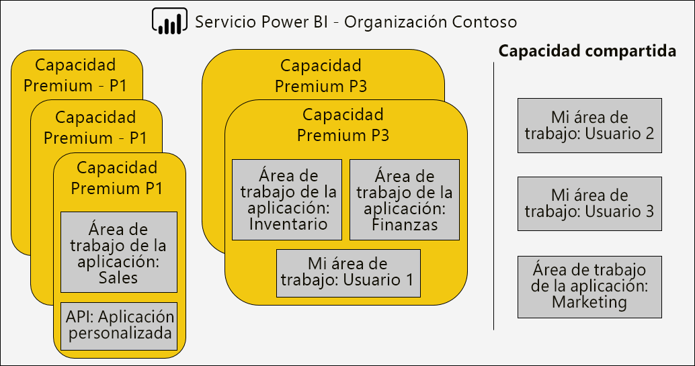

Una capacidad Premium puede asignarse a una región distinta de la región principal del inquilino de Power BI, que proporciona control administrativo sobre qué centros de datos (dentro de regiones geográficas definidas) que reside el contenido de Power BI. \[[12](#endnote-12)\]

Los administradores de servicios de Power BI y los administradores globales de Office 365 pueden modificar las capacidades Premium. En concreto, puede:

- Cambiar el tamaño de la capacidad para escalar o reducir verticalmente los recursos. Sin embargo, no es posible cambiar una SKU P a una SKU EM, o actualizar a la inversa.
- Agregar o quitar administradores de capacidad
- Agregar o quitar usuarios que tengan permisos de asignación
- Agregar o quitar las cargas de trabajo adicionales
- Cambiar las regiones

Se requieren permisos de asignación para asignar un área de trabajo a una capacidad Premium específica. Los permisos pueden concederse a la toda la organización, usuarios o grupos específicos.

De forma predeterminada, las capacidades Premium admiten cargas de trabajo asociados con la ejecución de consultas de Power BI. También admite tres cargas de trabajo adicionales: **Informes paginados**, **Dataflows**, y **AI**. Cada carga de trabajo requiere la configuración de la memoria máxima (como un porcentaje de memoria total disponible) que se puede usar la carga de trabajo. Es importante entender que puede afectar a aumentar las asignaciones de memoria máximo en el número de modelos activos que se pueden hospedar y el rendimiento de las actualizaciones.

La memoria se asigna de manera dinámica a los flujos de datos, pero se asigna de forma estática a los informes paginados. La razón para asignar estáticamente la memoria máxima es que se ejecutan los informes paginados dentro de un espacio protegido independiente de la capacidad. Debe tener cuidado al valor paginado informes memoria, ya que reduce la memoria disponible para cargar los modelos.

|                     | EM3                      | P1                       | P2                      | P3                       |
|---------------------|--------------------------|--------------------------|-------------------------|--------------------------|
| Informes paginados | N/D | 20 % predeterminado; 10 % mínimo | 20 % predeterminado; 5 % mínimo | 20 % predeterminado; 2,5 % mínimo |
| Flujos de datos | 20 % predeterminado; 8 % mínimo  | 20 % predeterminado; 4 % mínimo  | 20 % predeterminado; 2 % mínimo | 20 % predeterminado; 1 % mínimo  |
| AI | N/D | valor predeterminado de 20%; mínimo de 20%  | 20 % predeterminado; 10 % mínimo | 20 % predeterminado; 5 % mínimo  |
| | | | | |

Eliminación de una capacidad Premium, es posible y no dará como resultado la eliminación de sus áreas de trabajo y el contenido. En su lugar, moverá las áreas de trabajo asignados a la capacidad compartida. Cuando se creó la capacidad Premium en una región distinta, el área de trabajo se moverán a la capacidad compartida de la región principal.

### Asignar áreas de trabajo a las capacidades

Las áreas de trabajo se pueden asignar a una capacidad Premium en el **administración de Power BI** **Portal** o - para un área de trabajo de aplicación: en el **área de trabajo** panel.

Administradores de capacidad, así como los administradores globales de Office 365 o los administradores de servicios de Power BI, se pueden asignar áreas de trabajo de forma masiva el **administración de Power BI** **Portal**. Puede aplicar masiva asignado a:

- **Áreas de trabajo de usuarios** : Todas las áreas de trabajo que pertenecen a esos usuarios, incluidas las áreas de trabajo personales, se asignan a la capacidad Premium. Esto incluirá la reasignación de las áreas de trabajo cuando ya está asignadas a una capacidad Premium diferentes. Además, los usuarios también se asignan permisos de asignación de área de trabajo.

- **Áreas de trabajo específicas**
- **Las áreas de trabajo de toda la organización** : Todas las áreas de trabajo, incluidas las áreas de trabajo personales, se asignan a la capacidad Premium. Además, todos los usuarios actuales y futuros se asignan permisos de asignación de área de trabajo. \[[14](#endnote-14)\]

Un área de trabajo se puede agregar a una capacidad Premium mediante el uso de la **área de trabajo** panel que proporciona el usuario sea administrador del área de trabajo y tiene permisos de asignación.

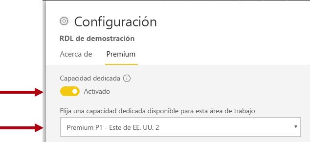

Los administradores del área de trabajo pueden quitar un área de trabajo de una capacidad (a la capacidad compartida) sin necesidad de un permiso de asignación. Quitar las áreas de trabajo de capacidades dedicadas efectivamente vuelve a colocar en el área de trabajo en capacidad compartida. Tenga en cuenta que al quitar un área de trabajo de una capacidad Premium puede tener consecuencias negativas resultante, por ejemplo, en el contenido compartido no esté disponible para la versión gratuita de Power BI con licencia a los usuarios o la suspensión de la actualización programada cuando se superen las provisiones de compatibles comparte las capacidades.

En el servicio Power BI, un área de trabajo asignado a una capacidad Premium se identifica fácilmente mediante el icono de rombo que adorna el nombre del área de trabajo.

### Capacidades de supervisión

Supervisión de las capacidades Premium proporciona a los administradores comprender cómo funcionan las capacidades. Las capacidades se pueden supervisar mediante el uso de la [métricas de capacidad de Power BI Premium app](service-admin-premium-monitor-capacity.md) o el [portal de administración de Power BI](service-admin-premium-monitor-portal.md).

#### Interpretación de las métricas

Las métricas deben supervisarse para establecer una comprensión de la línea de base de actividad de carga de trabajo y el uso de recursos. Si la capacidad se convierte en lenta, es importante comprender las métricas que desea supervisar y las conclusiones puede realizar.

Idealmente, las consultas se completará en un segundo para ofrecer experiencias con capacidad de respuesta a los usuarios de informes y habilitar un mayor rendimiento de consulta. Suele ser de menor importancia cuando los procesos en segundo plano (incluidos las actualizaciones) toman tiempos más largos en completarse.

En general, informes lentos pueden ser una indicación de una capacidad de sobrecalentamiento. Cuando no se pudo cargar informes, esto es una indicación de una capacidad exceso calentada. En cualquier caso, la causa podría ser atribuible a muchos factores, como:

- **Consultas erróneas** ciertamente indican la presión de memoria, y que no se pudo cargar un modelo en memoria. El servicio Power BI intentará cargar un modelo de 30 segundos antes de desistir.

- **Tiempos de espera de consulta excesivo** puede deberse a varias razones:
  - La necesidad de que el servicio Power BI primero a expulsar modelos y, a continuación, cargar el modelo se va a consultar (Recuerde que mayores tasas de expulsión de conjunto de datos por sí solo no son una indicación de esfuerzo de capacidad, a menos acompañado por largos tiempos de espera de consulta que indican hiperpaginación de memoria)
  - Carga de modelos veces (especialmente la espera para cargar un modelo de gran tamaño en memoria)
  - Consultas de larga ejecución
  - Demasiadas conexiones LC\DQ (si se supera los límites de capacidad)
  - Saturación de la CPU
  - Diseños de informe complejos con un número excesivo de objetos visuales en una página (Recuerde que cada objeto visual es una consulta)
- **Consulta de larga duración** puede indicar que no se optimizan los diseños de modelo, sobre todo cuando están activos en una capacidad de varios conjuntos de datos, y solo un conjunto de datos está produciendo una larga duración de las consulta. Esto sugiere que la capacidad se ha extraído suficientemente y que el conjunto de datos en la pregunta es simplemente lentas o poco óptimo. Consultas de larga ejecución pueden ser problemática, ya puede bloquear el acceso a los recursos requeridos por otros procesos.
- **Tiempos de espera de actualización largo o tiempos de espera de llamada de inteligencia artificial** indican una memoria insuficiente debido a muchos modelos activos que consumen memoria o que una actualización problemática esté bloqueando otras actualiza (que superan los límites de actualización paralela).

Se trata más adelante una explicación más detallada de cómo usar las métricas en el [optimizar capacidades Premium](#optimizing-premium-capacities) sección.

## Optimizar las capacidades Premium

Cuando surgen problemas de rendimiento de capacidad Premium, un primer enfoque común es optimizar o ajustar las soluciones ya implementado para restaurar los tiempos de respuesta aceptables. La lógica reemplaza es para evitar comprar una capacidad Premium adicional a menos que se puede justificar.

Cuando se requiere más capacidad Premium, hay dos opciones que se tratará más adelante en esta sección:

- Escalar verticalmente la capacidad Premium
- Agregar una nueva capacidad Premium

Por último, la prueba enfoques y dimensionar la capacidad Premium concluirá en esta sección.

### Procedimientos recomendados generales

Cuando se esfuerza por lograr la mejor utilización y rendimiento, son algunos procedimientos recomendados que pueden considerarse como recomendaciones generales a bordo. Estas incluyen:

- Uso de las áreas de trabajo de la aplicación en lugar de áreas de trabajo personales
- Separar crítico para la empresa y BI de autoservicio (SSBI) en las diferentes capacidades

  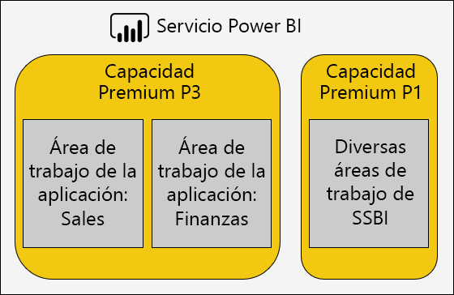

- Si comparte contenido solo con usuarios de Power BI Pro, es no posible que es necesario almacenar el contenido en una capacidad dedicada
- Usar las capacidades de dedicado comparada para lograr un tiempo de actualización específica, o cuando las características específicas son necesarias, por ejemplo grandes conjuntos de datos o paginaron de reporting

### Direccionamiento de las preguntas más frecuentes

Optimizar las implementaciones de Power BI Premium es un tema complejo que implica comprender los requisitos de carga de trabajo, los recursos disponibles y su uso real.

Este tema tratan siete preguntas comunes de soporte técnico, que describe los posibles problemas y explicaciones y obtener información sobre cómo identificar y solucionarlos problemas.

#### ¿Por qué es la capacidad lenta y lo puedo hacer?

Hay muchas razones que pueden contribuir a una capacidad Premium lento. Esta pregunta requiere más información para comprender qué se entiende por lento. ¿Son informes tarda en cargarse? ¿O bien, son errores en la carga? ¿Son objetos visuales de informe tarda en cargar o actualizar cuando los usuarios interactúan con el informe? ¿Las actualizaciones tardan más tiempo en completarse de lo esperado o experimenta anteriormente?

Tras conseguir una descripción del motivo, a continuación, puede empezar a investigar. Las respuestas a las preguntas siguientes seis le ayudará a solucionar más problemas específicos.

#### ¿El contenido que está usando mi capacidad?

Puede usar el **métricas de capacidad de Power BI Premium** aplicación para filtrar por la capacidad y revisar las métricas de rendimiento para el contenido del área de trabajo. Es posible revisar el uso de recursos y las métricas de rendimiento por hora durante los últimos siete días para todo el contenido almacenado en una capacidad Premium. Esto suele ser el primer paso para tomar para solucionar el problema una duda general sobre el rendimiento de capacidad Premium.

Las métricas claves para supervisar incluyen:

- Promedio de CPU y el recuento de utilización alta
- Promedio de memoria y recuento de alta utilización y uso de memoria para los conjuntos de datos específicos, flujos de datos e informes paginados
- Conjuntos de datos activos cargados en memoria
- Duración promedio y máximo de consulta
- Tiempos de espera de la media de las consultas
- Flujo de datos y el conjunto de datos promedio actualización veces
- AI promedio llama a veces y tiempos de espera

Además, en la aplicación de las métricas de Power BI Premium capacidad de memoria activa muestra la cantidad total de memoria asignada a un informe que no se puede expulsar porque está en uso en los últimos tres minutos. Un pico alta en el tiempo de espera de actualización podría estar correlacionado con un conjunto de datos grande o activa.

El gráfico "Top 5 por promedio de duración" resalta los cinco primeros conjuntos de datos, informes paginados, flujos de datos y llamadas de inteligencia artificial consume recursos de capacidad. Contenido en las listas de cinco principales son candidatas para la optimización de investigación y posibles.

#### ¿Por qué informes lenta?

Las siguientes tablas muestran los posibles problemas y maneras de identificar y controlarlos.

##### Recursos de capacidad suficiente

| Obtener posibles explicaciones | Cómo identificar | Cómo resolver |
| --- | --- | --- |
| Memoria alta totales (modelo no se puede expulsar porque está en uso en los últimos tres minutos)   Picos alta varias en tiempos de espera de consulta   Picos alta varias en tiempos de espera de actualización | Supervisar las métricas de memoria \[ [18](#endnote-18)\]y los recuentos de expulsión \[ [19](#endnote-19)\] | Reducir el tamaño del modelo, o convertir en el modo DirectQuery, consulte el [optimizar modelos](#optimizing-models) tema en esta sección   Escalar verticalmente la capacidad   Asignar el contenido a una capacidad diferente |

##### Diseños de informe ineficaz

| Obtener posibles explicaciones | Cómo identificar | Cómo resolver |
| --- | --- | --- |
| Las páginas de informe contienen numerosos objetos visuales (filtrado interactivo puede desencadenar una al menos una consulta por objeto visual)   Los objetos visuales recuperan más datos que es necesario | Revise los diseños de informe   Entrevistar a los usuarios de informes para entender cómo interactúan con los informes   Supervisar las métricas de consulta de conjunto de datos \[ [20](#endnote-20)\] | Nuevo diseño de informes con menos elementos visuales por página |

##### Conjunto de datos lenta (especialmente cuando los informes hayan realizado previamente la bien)

| Obtener posibles explicaciones | Cómo identificar | Cómo resolver |
| --- | --- | --- |
| Cada vez más grandes volúmenes de datos de importación   Lógica de cálculo complejo o ineficiente, incluidos los roles de RLS   Modelo no totalmente optimizado   (DQ/LC) Latencia de la puerta de enlace   Tiempos de respuesta de consulta de origen de calidad de datos lentas | Revise los diseños de modelo   Supervisar los contadores de rendimiento de puerta de enlace | Consulte la [optimizar modelos](#optimizing-models) tema en esta sección |

##### Uso de informes simultáneas alta

| Obtener posibles explicaciones | Cómo identificar | Cómo resolver |
| --- | --- | --- |
| Tiempos de espera de consulta alta   Saturación de la CPU   Ha superado los límites de conexiones de calidad de datos/LC | Supervisar la utilización de CPU \[ [21](#endnote-21)\], tiempos de espera de consulta y la utilización de calidad de datos/LC \[ [22](#endnote-22) \] métricas + duración de las consulta – si fluctúa puede indicar problemas de simultaneidad | Escalar verticalmente la capacidad, o asignar el contenido a una capacidad diferente   Nuevo diseño de informes con menos elementos visuales por página |

#### ¿Por qué son los informes no está cargando?

Cuando los informes no pueden realizar la carga es un escenario pesimista y un inicio de sesión seguro de que la capacidad no tiene suficiente memoria y es excesiva calentada. Esto puede ocurrir cuando se consultan activamente de todos los modelos cargados y por lo que no se puede expulsar, y cualquier operación de actualización se han pausado o retrasado. El servicio Power BI intentará cargar el conjunto de datos durante 30 segundos y se notifica correctamente al usuario del error con una sugerencia que vuelva a intentarlo.

Actualmente no hay ninguna métrica para supervisar para informe de errores de carga. Puede identificar el potencial para resolver este problema mediante la memoria del sistema de supervisión, específicamente mayor uso y tiempo de utilización más alta. Expulsiones de conjunto de datos alta y tiempo de espera de actualización a largo conjunto de datos podrían sugerir que se está produciendo este problema.

Si esto ocurre muy en ocasiones, esto es posible que no se considera un problema de prioridad. Los usuarios de informes le informa de que el servicio está ocupado y que debe reintentar después de un breve tiempo. Si esto sucede con demasiada frecuencia, el problema puede solucionarse al escalar verticalmente la capacidad Premium o al asignar el contenido a una capacidad diferente.

Los administradores de capacidad (y los administradores de servicios de Power BI) puede supervisar el **errores de consulta** métrica para determinar cuando esto ocurra. También puede reiniciar la capacidad de restablecer todas las operaciones en el caso de sobrecarga del sistema.

#### ¿Por qué las actualizaciones no se está iniciando en programación?

No se garantiza que las horas de inicio de la actualización programada. Recuerde que el servicio Power BI siempre priorizará operaciones interactivas a través de operaciones en segundo plano. La actualización es una operación en segundo plano que puede producirse cuando se cumplen las dos condiciones:

- No hay memoria suficiente
- No se supera el número de actualizaciones simultáneas admitidas por la capacidad Premium

Cuando no se cumplen las condiciones, la actualización se pone en cola hasta que las condiciones son favorables.

Para una actualización completa, recuerde que se requiere al menos el doble el tamaño de memoria del conjunto de datos actual. Si no hay suficiente memoria disponible, a continuación, la actualización no puede comenzar hasta la expulsión del modelo que se libere memoria; Esto significa retrasos hasta que uno o varios conjuntos de datos pasa a estar inactiva y se pueden expulsar.

Recuerde que el número admitido de las actualizaciones simultáneas máximos se establece en 1,5 veces el back-end núcleos, redondeado hacia arriba.

Una actualización programada se producirá un error cuando no puede comenzar antes del vencimiento comenzar la siguiente actualización programada. Una actualización a petición desencadenada manualmente desde la interfaz de usuario se intentará ejecutar hasta tres veces antes de desistir.

Los administradores de capacidad (y los administradores de servicios de Power BI) puede supervisar el **tiempo promedio de actualización de espera (minutos)** métrica para determinar el intervalo promedio entre la hora programada y el inicio de la operación.

Aunque normalmente no se actualiza una prioridad administrativa, para influir en los datos a la hora, asegúrese de que hay suficiente memoria disponible. Esto puede implicar el aislamiento de conjuntos de datos de las capacidades con suficientes recursos conocidos. También es posible que podrían coordinar los administradores con los propietarios del conjunto de datos para ayudar a fin de escalonar o reducir los tiempos de actualización de datos programada se minimizan los conflictos. Tenga en cuenta que no es posible que un administrador para ver la cola de actualización, o para recuperar las programaciones del conjunto de datos.

#### ¿Por qué son las actualizaciones de baja velocidad?

Las actualizaciones pueden ser lento - o percibido lenta (como las direcciones de pregunta común anterior).

Cuando la actualización de hecho es lenta, puede deberse a varias razones:

- Una CPU insuficiente (actualización puede ser muy intensivo de CPU)
- Memoria insuficiente, lo que resulta en pausa la actualización (que requiere la actualización para volver a empezar cuando las condiciones son favorables para reanudarse)
- Capacidad de que no son razones, incluida la capacidad de respuesta del sistema de origen de datos, latencia de red, permisos no válidos o el rendimiento de puerta de enlace
- Volumen de datos: actualizar una buena razón para configurar incremental, como se describe a continuación

Los administradores de capacidad (y los administradores de servicios de Power BI) puede supervisar el **promedio actualizar duración (minutos)** métrica para determinar un banco de pruebas para la comparación con el tiempo y el **tiempo promedio de actualización de espera (minutos)** las métricas para determinar el intervalo promedio entre promedio de retardo entre la hora programada y el inicio de la operación.

Actualización incremental puede reducir considerablemente la duración de la actualización de datos, especialmente para las tablas del modelo de gran tamaño. Hay cuatro beneficios asociados con la actualización incremental:

- **Las actualizaciones son más rápidas** : Solo un subconjunto de una tabla necesita el uso de CPU y memoria de carga, lo que disminuye y paralelismo puede ser superior al actualizar varias particiones
- **Las actualizaciones se producen solo cuando sea necesario** : Se pueden configurar directivas de actualización incremental para cargar solo cuando los datos han cambiado
- **Las actualizaciones son más confiables** : Conexiones de ejecución más cortas para los sistemas de origen de datos volátiles son menos susceptibles a la desconexión
- **Modelos permanecen recorte** : Se pueden configurar directivas de actualización incremental para quitar automáticamente historial más allá de una ventana deslizante de tiempo

Para obtener más información, consulte el [actualización Incremental en Power BI Premium](service-premium-incremental-refresh.md) documento.

#### ¿Por qué datos actualiza no completan?

Cuando comienza la actualización de datos, pero no se puede completar, puede deberse a varias razones:

- Memoria insuficiente, incluso si hay un único modelo la capacidad Premium, es decir, el tamaño del modelo es muy grande
- Capacidad de que no son motivos, incluidos los datos de origen de desconexión del sistema, los permisos no válidos o error de puerta de enlace

Los administradores de capacidad (y los administradores de servicios de Power BI) puede supervisar el **actualizar errores debido a memoria insuficiente** métrica.

#### ¿Por qué son las llamadas de inteligencia artificial con errores?

Las llamadas de inteligencia artificial pueden producir un error por varios motivos. La memoria mínima necesaria para iniciar la IA carga de trabajo es de 5 GB, pero esto puede no ser suficiente para algunos conjuntos de datos de entrada. Por ejemplo, entrenamiento del modelo de aprendizaje de máquina automática requiere al menos dos veces y, a veces varias veces el tamaño del conjunto de datos de entrada. Además, una llamada de AI se termina si tarda más de dos horas en completarse. Máquina automatizada llamadas al modelo de aprendizaje que no se realizan en dos horas, el mejor modelo se encuentra en esas dos horas de aprendizaje se devuelve.  También se pueden interrumpir las llamadas de AI por solicitudes interactivas, que tienen prioridad.

Los administradores deben supervisar los tiempos de espera de inteligencia artificial en busca de indicios de otras solicitudes tienen prioridad. Los administradores también pueden asegurarse de que hay suficiente memoria disponible para la carga de trabajo de inteligencia artificial en relación con los tamaños de datos de entrada. Esto puede implicar aislar las cargas de trabajo de inteligencia artificial a las capacidades que se sabe que tiene suficientes recursos. También es posible que podrían coordinar los administradores con los propietarios de flujo de datos para ayudar a fin de escalonar o reducir los tiempos de actualización de flujo de datos se minimizan los conflictos. Tenga en cuenta que no es posible que un administrador para ver la cola de la llamada de inteligencia artificial.

### Optimización de los modelos

Diseño del modelo óptimo es crucial para ofrecer una solución eficaz y escalable. Sin embargo, resulta más allá del ámbito de este artículo proporcionar una explicación completa. En su lugar, esta sección proporciona áreas clave deben tener en cuenta al optimizar los modelos.

#### Optimización de los modelos de Power BI hospedados

Optimizar modelos hospedados en una capacidad Premium se pueden lograr en los niveles de modelo y los orígenes de datos.

Tenga en cuenta las posibilidades de optimización de un modelo de importación:

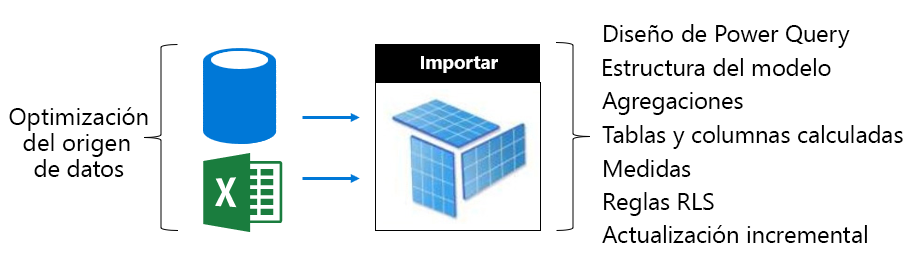

En la capa de origen de datos:

- Orígenes de datos relacionales se pueden optimizar para garantizar la actualización más rápida posible previamente integración de datos, aplicar los índices apropiados, definir las particiones de tabla que se ajusten a los puntos de actualización incremental y materializar los cálculos (en lugar de calcular modelo de tablas y columnas) o agregar lógica de cálculo a las vistas
- Orígenes de datos no relacionales se pueden integrar previamente con almacenes relacionales
- Asegúrese de que las puertas de enlace tengan suficientes recursos, preferiblemente en máquinas dedicadas, con suficiente ancho de banda de red y cerca de los orígenes de datos

En el nivel de modelo:

- Los diseños de consulta de Power Query pueden minimizar o eliminar transformaciones complejas y especialmente los que la combinación de distintos orígenes de datos (almacenes de datos lograrlo durante su fase de extracción, transformación y carga). Además, lo que garantiza que se establecen los niveles de privacidad del origen de datos adecuado, esto puede evitar la necesidad de Power BI cargar los resultados completos para generar un resultado combinado en todas las consultas.
- La estructura del modelo determina los datos que se va a cargar y tiene un impacto directo en el tamaño del modelo. Se pueden diseñarse para evitar la carga de datos innecesarios mediante la eliminación de columnas, quitar filas (especialmente datos históricos) o mediante la carga de datos resumidos (a costa de la carga de datos detallados). Reducción de tamaño considerable puede lograrse mediante la eliminación de columnas de una cardinalidad alta (especialmente las columnas de texto) que no almacenar o comprimir de forma muy eficaz.
- Rendimiento de consultas de modelo se puede mejorar mediante la configuración de las relaciones de una dirección única a menos que haya un motivo convincente para permitir el filtrado bidireccional. Tenga en cuenta también con la función CROSSFILTER en lugar de filtrado bidireccional.
- Tablas de agregación pueden lograr consultas rápido respuestas mediante la carga previamente los datos resumen de, sin embargo, Esto aumentará el tamaño del modelo y resultado tiempos más largos de actualización. Por lo general, las tablas de agregación se deben reservar para modelos muy grandes o diseños de modelo compuesto.
- Tablas y columnas calculadas, aumentar el tamaño del modelo y dar lugar a tiempos de actualización. Por lo general, se pueden lograr un tamaño menor de almacenamiento y la hora de actualización más rápida cuando los datos se materializan o calculados en el origen de datos. Si esto no es posible, utilizan columnas personalizadas de Power Query puede ofrecer la compresión de almacenamiento mejorado.
- Puede haber oportunidad para optimizar las expresiones de DAX para medidas y las reglas RLS, quizás volver a escribir la lógica para evitar el costosas fórmulas
- Actualización incremental drásticamente puede reducir el tiempo de actualización y conservar memoria y CPU. La actualización incremental también puede configurarse para quitar datos históricos mantener recorte tamaños de modelo.
- Un modelo podría ser rediseñado como dos modelos cuando hay patrones de consulta diferentes y en conflicto. Por ejemplo, algunos informes presentes agregados de alto nivel a través de todos los historial y puede toleran la latencia de 24 horas. Otros informes preocupados por los datos de hoy en día y necesitan acceso granular a las transacciones individuales. En lugar de un único modelo de diseño para satisfacer todos los informes, crear dos modelos optimizados para cada requisito.

Tenga en cuenta las posibilidades de optimización para un modelo DirectQuery. Como el modelo emite las solicitudes de consulta al origen de datos subyacente, optimización del origen de datos es fundamental para la entrega de las consultas de modelo con capacidad de respuesta.

 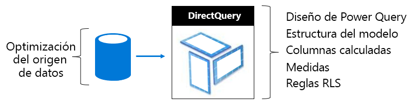

En la capa de origen de datos:

- El origen de datos se puede optimizar para asegurarse de que las consultas más rápido posible integrando previamente los datos (lo cual no es posibles en el nivel de modelo), aplicar los índices apropiados, definir las particiones de tabla, materializar los datos resumidos (con vistas indizadas), y minimizar la cantidad de cálculo. La mejor experiencia se logra cuando las consultas de paso a través deben filtrar solo y realizar combinaciones internas entre las tablas indizadas o las vistas.
- Asegúrese de que las puertas de enlace tengan suficientes recursos, preferiblemente en máquinas dedicadas, con suficiente ancho de banda de red y cerca del origen de datos

En el nivel de modelo:

- Consulta de Power Query diseños, preferiblemente, no deben aplicar ninguna transformación - en caso contrario, intenta mantener las transformaciones de absoluta mínimo
- Rendimiento de consultas de modelo se puede mejorar mediante la configuración de las relaciones de una dirección única a menos que haya un motivo convincente para permitir el filtrado bidireccional. También, las relaciones de modelo deben estar configuradas para que asuman se exige integridad referencial (si este es el caso) y se producirá en las consultas de origen de datos mediante combinaciones internas más eficaces (en lugar de las combinaciones externas).
- Evite crear columnas personalizadas de consulta de Power Query o una columna calculada de modelo: materializar estas opciones en el origen de datos, siempre que sea posible
- Puede haber oportunidad para optimizar las expresiones de DAX para medidas y las reglas RLS, quizás volver a escribir la lógica para evitar el costosas fórmulas

Tenga en cuenta las posibilidades de optimización de un modelo compuesto. Recuerde que un modelo compuesto permite una combinación de importación y DirectQuery tablas.

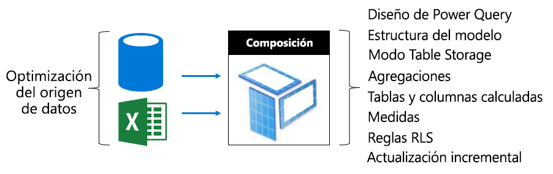

- Por lo general, los temas de optimización para los modelos de importación y DirectQuery se aplican a las tablas de modelo compuesto que usan estos modos de almacenamiento.
- Normalmente, se esfuerzan por lograr un diseño equilibrado mediante la configuración de las tablas de tipo de dimensión (que representan las entidades empresariales) como tablas de modo y el tipo de hechos de almacenamiento Dual (a menudo las tablas grandes, que representa los hechos operativos) como el modo de almacenamiento DirectQuery. Modo de almacenamiento dual significa que ambos importación y DirectQuery y modos de almacenamiento, esto permite que el servicio Power BI determinar el modo de almacenamiento más eficaz que se utilizará al generar una consulta nativa de paso a través.
- Asegúrese de que las puertas de enlace tengan suficientes recursos, preferiblemente en máquinas dedicadas, con suficiente ancho de banda de red y cerca de los orígenes de datos
- Configurar las tablas de agregaciones como modo de almacenamiento de importación puede ofrecer mejoras de rendimiento de consulta considerable cuando se usa para resumir las tablas de hechos de tipo de modo de almacenamiento DirectQuery. En este caso, aumentará el tamaño del modelo y aumentar el tiempo de actualización de las tablas de agregación y a menudo esto es una exigencia asumible para consultas más rápidas.

#### Optimización de los modelos hospedado externamente

Muchas de las posibilidades de optimización que se describen en el [Optimizing Power BI-Hosted modelos](#optimizing-power-bi-hosted-models) tema también se aplica a modelos desarrollados con Azure Analysis Services y SQL Server Analysis Services. Borrar excepciones son ciertas características que no se admiten actualmente, incluidos modelos compuestos y las tablas de agregación.

Una consideración adicional para los conjuntos de datos hospedado externamente es la base de datos de hospedaje en relación con el servicio Power BI. Azure Analysis Services, esto significa crear el recurso de Azure en la misma región que el inquilino de Power BI (región principal). Para SQL Server Analysis Services de la IaaS, esto significa que hospeda la máquina virtual en la misma región y en local, significa garantizar una configuración eficaz de la puerta de enlace.

Por otro lado, puede ser de interés para que tenga en cuenta que las bases de datos de Azure Analysis Services y bases de datos tabulares de SQL Server Analysis Services requieren que sus modelos de cargarse totalmente en memoria y que permanecen allí en todo momento para admitir la consulta. Al igual que el servicio Power BI, debe haber suficiente memoria para la actualización si el modelo debe permanecer en línea durante la actualización. A diferencia del servicio Power BI, no hay ningún concepto modelos vencen automáticamente dentro y fuera de memoria según el uso. Power BI Premium, por lo tanto, ofrece un enfoque más eficaz para maximizar el modelo consultando con menor uso de memoria.

### Planificación de capacidad

El tamaño de una capacidad Premium determina su memoria disponible y los recursos del procesador y límites impuestos en la capacidad. El número de las capacidades Premium también es una consideración, como crear Premium varias capacidades pueden ayudar a aislar las cargas de trabajo entre sí. Tenga en cuenta que storage es 100 TB por nodo de capacidad, y esto es probable que sea más que suficiente para cualquier carga de trabajo.

Determinar el tamaño y el número de las capacidades Premium puede resultar complicado, especialmente para la capacidad inicial que cree. El primer paso al ajuste de tamaño de capacidad es comprender la carga de trabajo promedio que representa el uso diario esperado. Es importante entender que no todas las cargas de trabajo son iguales. Por ejemplo, en un extremo de un espectro - 100 usuarios simultáneos tienen acceso a una única página del informe que contiene un solo objeto visual es puede realizar fácilmente. Aún - en el otro extremo del espectro - 100 usuarios simultáneos que tienen acceso a 100 informes diferentes, cada uno con 100 objetos visuales de la página del informe, va a hacer muy distintas demandas de recursos de capacidad.

Los administradores de capacidad, por tanto, debe tener en cuenta muchos factores específicos de su entorno, el contenido y el uso esperado. El objetivo reemplazo es maximizar la utilización de capacidad al tiempo que ofrece tiempos de consultas coherentes, tiempos de espera aceptable y tasas de expulsión. Pueden incluir factores deben tener en cuenta:

- **Las características de datos y del tamaño del modelo** : Modelos de importación deben ser totalmente cargados en memoria que permite consultar o actualizar. LC/DQ conjuntos de datos pueden requerir tiempo de procesador significativo y posiblemente importantes de memoria para evaluar medidas complejas o las reglas RLS. Memoria y procesador, rendimiento y tamaño LC/DQ consulta están limitados por el tamaño de la capacidad.
- **Modelos activos simultáneos** : La realización de consultas simultáneas de modelos de importación diferente a ofrecer mejor la capacidad de respuesta y el rendimiento cuando queden en memoria. Debe haber suficiente memoria para hospedar todos los modelos que se consultan con mucha frecuencia, con memoria adicional para permitir su actualización.
- **Actualización del modelo de importación** : El tipo de actualización (completo o incremental), la duración y la complejidad de las consultas de Power Query y la lógica de la tabla o columna calculada pueden afectar a en memoria y uso del procesador especialmente. Las actualizaciones simultáneas están limitadas por el tamaño de la capacidad (1,5 x backend núcleos, redondeado al alza).
- **Consultas simultáneas** : Pueden dar lugar a muchas consultas simultáneas en informes no responde al procesador o LC/DQ conexiones supera el límite de capacidad. Esto sucede especialmente para las páginas de informes que incluyen muchos objetos visuales.
- **Paginado de flujos de datos, informes y funciones de inteligencia artificial** : La capacidad puede configurarse para admitir flujos de datos, informes paginados y funciones de inteligencia artificial, con cada uno con un porcentaje máximo configurable de capacidad de memoria. Memoria se asigna dinámicamente a los flujos de datos, pero está asignada estáticamente para informes paginados y la carga de trabajo de inteligencia artificial.

Además de estos factores, los administradores de capacidad puede crear varias capacidades. Varias capacidades permiten para el aislamiento de las cargas de trabajo y pueden configurarse para asegurarse de que las cargas de trabajo de prioridad tienen garantizados los recursos. Por ejemplo, se pueden crear dos capacidades para separar las cargas de trabajo empresariales críticas de las cargas de trabajo (SSBI) de BI de autoservicio. La capacidad crítico para la empresa puede utilizarse para aislar los modelos corporativos grandes proporcionarles recursos garantizados, con acceso concedido sólo al departamento de TI de creación. La capacidad SSBI puede usarse para hospedar un número creciente de los modelos más pequeños, con acceso concedido a los analistas de negocios. La capacidad SSBI a veces puede experimentar esperas de consulta o actualización tolerables.

Con el tiempo, los administradores de capacidad puede equilibrar las áreas de trabajo en las capacidades de mover contenido entre las áreas de trabajo, o áreas de trabajo entre las capacidades y las capacidades de ajuste de escala hacia arriba o hacia abajo. Por lo general, para hospedar más grandes modelos que escala verticalmente y para una mayor simultaneidad, el escalado horizontal.

Recuerde que comprar una licencia proporciona al inquilino con núcleos. La compra de un **P3** suscripción puede utilizarse para crear uno, o hasta cuatro capacidades Premium, es decir, 1 x P3, o 2 x P2 o 4 x P1. Además, antes de la conversión de una capacidad de P2 a una capacidad de P3, se puede prestar atención a dividir los núcleos virtuales para crear dos capacidades de P1.

### Enfoques de pruebas

Una vez que se decide el tamaño de la capacidad, las pruebas pueden realizarse mediante la creación de un entorno controlado. Es una opción práctica y económica crear una capacidad de Azure (SKU), teniendo en cuenta que una capacidad de P1 es el mismo tamaño que una capacidad A4, con el P2 y P3 capacidades del mismo tamaño que las capacidades A5 y A6, respectivamente. Capacidades de Azure se pueden crear rápidamente y se facturan por hora. Por lo tanto, una vez completada la prueba, se puede eliminar fácilmente para dejar de acumular los costos.

El contenido de la prueba se puede agregar a las áreas de trabajo creados en la capacidad de Azure y, a continuación, como un único usuario puede ejecutar informes para generar una carga de trabajo realista y representativo de las consultas. Si no hay modelos de importación, también debe realizarse una actualización para cada modelo. Herramientas de supervisión, a continuación, pueden utilizarse para revisar todas las métricas para comprender el uso de recursos.

Es importante que las pruebas son repetibles: Se deben ejecutar las pruebas varias veces y que deben proporcionar aproximadamente el mismo resultado cada vez. Un promedio de estos resultados puede utilizarse para extrapolar y calcular una carga de trabajo en condiciones de producción es true.

Para generar una prueba de esfuerzo, considere la posibilidad de desarrollar una aplicación para simular una carga de trabajo realista de prueba de carga. Los detalles de cómo lograr esto están fuera del ámbito de este artículo. Para obtener información adicional incluido un ejemplo de código, consulte el [carga probar aplicaciones de Power BI con Visual Studio Load Test](https://blogs.msdn.microsoft.com/charles_sterling/2018/04/04/webinar-load-testing-power-bi-applications-with-visual-studio-load-test/) seminario Web.

## Exploración de escenarios del mundo Real

En esta sección, se introducirán varias situaciones del mundo real para describir problemas comunes o los desafíos, cómo identificarlos y cómo ayudar a resolverlos:

- [Mantener actualizados los conjuntos de datos](#keeping-datasets-up-to-date)
- [Identificación de los conjuntos de datos de respuesta lento](#identifying-slow-responding-datasets)
- [Identificar las causas de forma esporádica lenta-responder los conjuntos de datos](#identifying-causes-for-sporadically-slow-responding-datasets)
- [Determinar si hay suficiente memoria.](#determining-whether-there-is-enough-memory)
- [Determina si hay suficiente CPU](#determining-whether-there-is-enough-cpu)

Son los pasos, junto con ejemplos de gráfico y tabla desde el **aplicación de las métricas de capacidad de Power BI Premium** (aplicación) que un administrador de Power BI tendrán acceso a.

### Mantener copia de los conjuntos de datos hasta la fecha

En este escenario, se desencadenó una investigación cuando los usuarios reciben quejas que los datos de informe a veces parecían ser anterior o "obsoletas".

En la aplicación, el administrador interactúa con el **actualiza** visual, ordenar los conjuntos de datos la **de tiempo de espera máximo** estadísticas en orden descendente. Esto les ayuda a revelar los conjuntos de datos que tienen mayor esperar tiempos, agrupadas por nombre de área de trabajo.

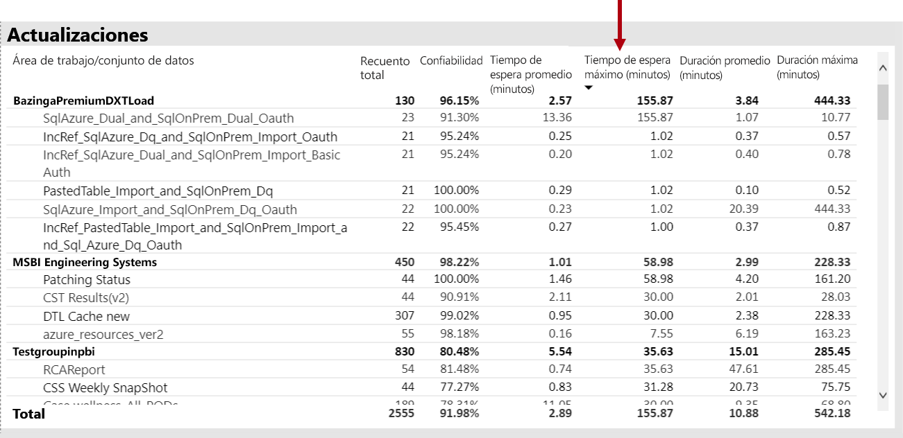

Además, en el **por hora promedio actualizar tiempos de espera de** visual, tenga en cuenta que los tiempos de espera de actualización de forma coherente máxima aproximadamente 4 P.M. cada día.

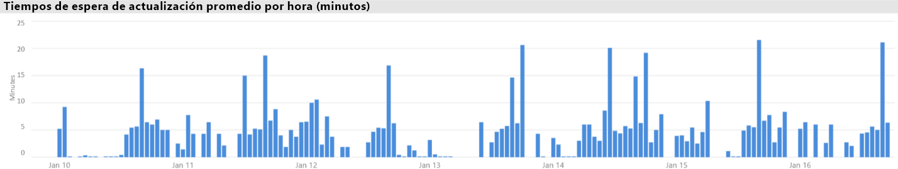

Hay varios posibles explicaciones de estos resultados:

- Demasiados intentos de actualización podrían estar teniendo lugar al mismo tiempo, si se supera los límites impuestos por el nodo de capacidad (seis actualizaciones simultáneas en una P1 con asignación de memoria predeterminada)

- Actualizar conjuntos de datos pueden ser demasiado grande para caber en la memoria disponible (lo que requiere al menos 2 veces la memoria necesaria para la actualización completa)
- Lógica de Power Query ineficaz es posible que lo que en un pico de uso de memoria durante la actualización del conjunto de datos. En una capacidad ocupada en ocasiones, esto puede alcanzar el límite físico, por error de la actualización y pueden afectar a otras operaciones de vista de informe en la capacidad.
- Conjuntos de datos consultados con más frecuencia que deben permanecer en memoria pueden afectar a la capacidad de otros conjuntos de datos para actualizar, debido a la memoria disponible limitada

Para ayudar a investigar esto, puede buscar el Administrador de Power BI:

- Poca memoria disponible en el momento de la actualización de datos, cuando la memoria disponible es inferior a 2 veces el tamaño del conjunto de datos que se va a actualizar
- Conjuntos de datos que no se está actualizando y no estaban en la memoria antes de una actualización, pero que empezó a mostrar tráfico interactiva durante las horas de actualización pesado. Para ver qué conjuntos de datos se cargaron en la memoria en un momento dado Power BI administrador puede mirar el área de conjuntos de datos de **conjuntos de datos** ficha en la aplicación y entre el filtro a un momento dado, haga clic en una de las barras en el **por hora Cargar conjunto de datos recuentos**. Un pico local (que se muestra en la imagen siguiente) indica una hora cuando se cargaron varios conjuntos de datos en memoria, lo que puede retrasar el inicio de las actualizaciones programadas
- Expulsiones de conjunto de datos mayor teniendo lugar cuando las actualizaciones de datos están programadas para iniciarse, que indican había ocasionada por servir a demasiados informes interactivos diferentes antes de la fecha de actualización de presión de memoria. El **expulsiones de conjunto de datos por hora y el consumo de memoria** visual puede indicar claramente los picos de expulsiones.

La siguiente imagen muestra un pico local en los conjuntos de datos cargado, lo que sugiere consultas interactivas retrasa el inicio de las actualizaciones de. Seleccionar un período de tiempo en el **conjunto de datos cargados por hora recuentos** visual cruzará filtro el **tamaños del conjunto de datos** visual.

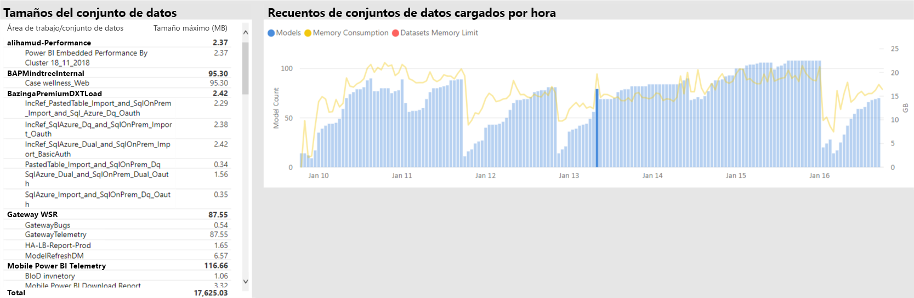

El Administrador de Power BI puede intentar resolver el problema realizando los pasos para asegurarse de que está disponible para las actualizaciones de datos por memoria suficiente:

- Programaciones de actualización de ponerse en contacto con el conjunto de datos de los propietarios y que se les solicita para escalonar y espacio de datos
- Reducir el conjunto de datos de carga de consultas mediante la eliminación de paneles innecesarios o panel iconos, especialmente los que aplicar la seguridad de nivel de fila
- Acelerar las actualizaciones de datos al optimizar la lógica de Power Query, columnas calculadas de modelo o actualizan tablas, lo que reduce el tamaño del conjunto de datos o la configuración de conjuntos de datos mayores para llevar a cabo datos incrementales

### Identificación de los conjuntos de datos de respuesta lento

En este escenario, se desencadenó una investigación cuando los usuarios reciben quejas que determinados informes tardaron mucho tiempo en Abrir y a veces dejaba de responder.

En la aplicación, puede usar el Administrador de Power BI el **consulta duraciones** visual para determinar los conjuntos de datos con peor rendimiento al ordenar por orden descendente de los conjuntos de datos **promedio de duración**. Este objeto visual también muestra conjunto de datos, los recuentos de consulta para que pueda ver con qué frecuencia se consultan los conjuntos de datos.

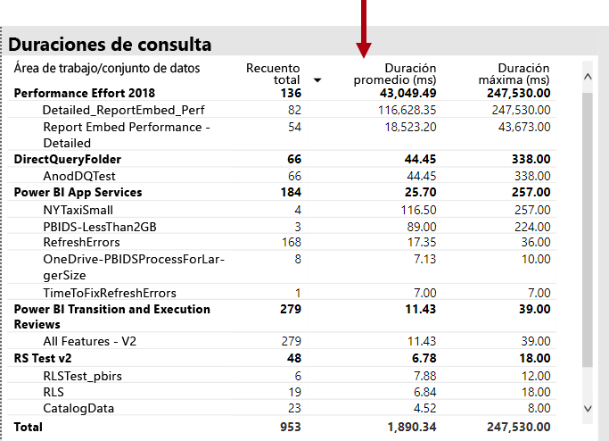

El Administrador de Power BI puede hacer referencia a la **distribución de duración de la consulta** visual, que muestra una distribución global de rendimiento de las consultas de depósitos (< = ubicación 30, 0-100 ms, etc.) durante el período de tiempo filtrado. Por lo general, las consultas que toman un segundo o menos se considera con capacidad de respuesta mediante la mayoría de los usuarios; las consultas que tardan más tiempo tienden a crear una percepción de rendimiento incorrecto.

El **distribución por hora de duración de consulta** visual permite que el Administrador de Power BI identificar los períodos de una hora cuando el rendimiento de capacidad podría haber ha percibe malos. Cuanto mayor sea la barra de segmentos de esa consulta representan duraciones durante un segundo, mayor será el riesgo de que los usuarios notarán un rendimiento deficiente.

El objeto visual es interactivo y, cuando se selecciona un segmento de la barra, el correspondiente **consulta duraciones** visual en la página del informe de tabla es realizar un filtrado cruzado para mostrar los conjuntos de datos representa. Este filtrado cruzado permite que el Administrador de Power BI identificar fácilmente que los conjuntos de datos responden con lentitud.

La siguiente imagen muestra un objeto visual filtrado **distribuciones por hora de duración de consulta**, especializado en los conjuntos de datos con peor rendimiento de los cubos de una hora. 

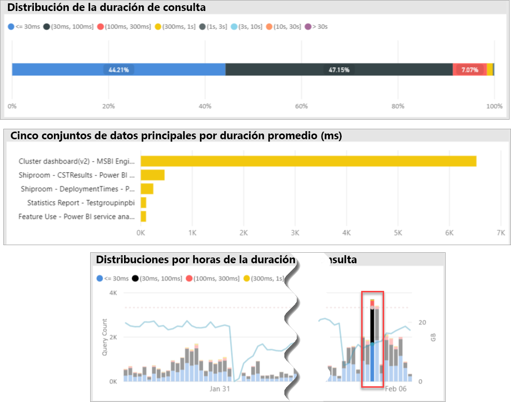

Una vez que se identifica el conjunto de datos de rendimiento deficiente en un intervalo de tiempo específico de 1 hora, el Administrador de Power BI puede investigar si está provocado por una capacidad sobrecargada un rendimiento deficiente o debido a un mal diseñado el conjunto de datos o informe. Para lograr esto, que pueden hacer referencia a la **tiempos de espera de consulta** visual y conjuntos de datos de ordenar por orden descendente de tiempo de espera de la media de las consultas. Si espera un gran porcentaje de consultas, una gran demanda para el conjunto de datos es probablemente la causa de las muchas esperas de consulta. Si el tiempo de espera de la media de las consultas es importante (> 100 ms), es posible que vale la pena revisar el conjunto de datos y el informe para ver si se pueden realizar las optimizaciones. Por ejemplo, quizás menos objetos visuales de recibir las páginas del informe o una optimización de la expresión de DAX.

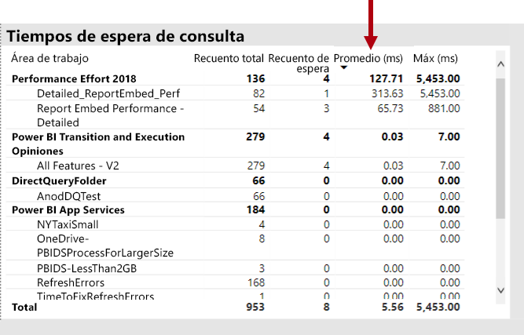

Hay varias razones posibles para consulta la compilación del tiempo de espera de en conjuntos de datos:

- Un modelo deficiente, expresiones de medida o incluso diseño de informes - todas las circunstancias que pueden contribuir a las consultas que consumen los niveles altos de CPU de larga ejecución. Esto obliga a las nuevas consultas para esperar hasta que los subprocesos de CPU disponibles y pueden crear un efecto de convoy (atasco de tráfico de reflexión), que se observa habitualmente durante las horas punta. El **consulta espera** página será el principal recurso para determinar si los conjuntos de datos tienen tiempos de espera de la media alta de las consultas.
- Un gran número de usuarios simultáneos de capacidad (cientos de miles) consumiendo el mismo informe o conjunto de datos. Conjuntos de datos incluso bien diseñada pueden tener un mal rendimiento supera un umbral de simultaneidad. Esto normalmente se indica mediante un único conjunto de datos que muestra un valor considerablemente mayor para la consulta cuenta que otros mostrar conjuntos de datos (es decir, 300K las consultas para un conjunto de datos en comparación con < 30 KB consultas para todos los otros conjuntos de datos). En algún momento de la consulta espera para este conjunto de datos se iniciará escalonar, y esto se verá en el **consulta duraciones** visual.
- Muchos diversos conjuntos de datos consultados al mismo tiempo, provocando hiperpaginación como conjuntos de datos con frecuencia del ciclo dentro y fuera de la memoria. Esto resulta en usuarios experimenta un rendimiento lento cuando el conjunto de datos se carga en memoria. Para confirmar esto, el Administrador de Power BI puede hacer referencia a la **expulsiones de conjunto de datos por hora y el consumo de memoria** visual, que puede indicar que un gran número de conjuntos de datos se carga en memoria se repetidamente expulsan.

### Identificar las causas de forma esporádica lenta-responder los conjuntos de datos

En este escenario, se desencadenó una investigación cuando los usuarios se describe que el informe objetos visuales a veces se sentían lenta para responder o puede dejar de responder, pero en otras ocasiones estaban con capacidad de respuesta aceptable.

Dentro de la aplicación, el **consulta duraciones** sección utilizada para buscar el conjunto de datos de la causa de la manera siguiente:

- En el **consulta duraciones** visual el administrador filtra el conjunto de datos (comenzando por los conjuntos de datos principales consultados) el conjunto de datos y examinar las barras de filtrado cruzadas en la **distribuciones de consulta por hora** visual.
- Cuando una sola barra una hora mostró cambios significativos en la relación entre todos los grupos de duración de consulta frente a otras barras de una hora para ese conjunto de datos (es decir, las relaciones entre los colores cambia drásticamente), significa que este conjunto de datos muestra un cambio de esporádico rendimiento.
- Las barras de una hora que muestra una parte irregular de las consultas de rendimiento deficientes, indica un intervalo de tiempo donde ese conjunto de datos se haya visto afectado por un efecto de vecino ruidoso, causado por actividades de otros conjuntos de datos.

La imagen siguiente muestra una hora, 30 de enero, de donde se ha producido un obstáculo significativo del rendimiento de un conjunto de datos, indicado por el tamaño de la "(3,10s]"duración depósito de ejecución. Al hacer clic en esa barra de una hora, se muestra todos los conjuntos de datos cargados en la memoria durante ese tiempo, presentar, por tanto, los conjuntos de datos de la causa de candidato provocando el efecto de vecino ruidoso.

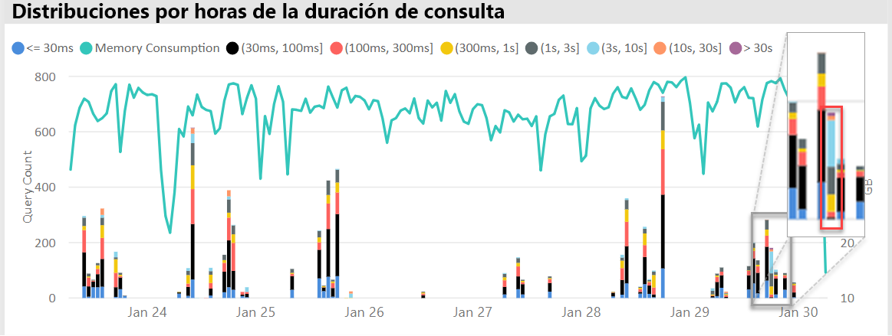

Una vez que se identifica un intervalo de tiempo problemático (es decir, durante el 30 de enero en la imagen anterior) del Administrador de Power BI puede quitar todos los filtros de conjunto de datos, a continuación, filtrar únicamente por ese intervalo de tiempo para determinar qué conjuntos de datos se consultaron activamente durante este tiempo. El conjunto de datos de la causa del efecto de vecino ruidoso suele ser el conjunto de datos consultado superior o con la duración más larga Media de las consultas.

Una solución a este problema podría ser para distribuir al culpable se admiten conjuntos de datos a través de diferentes áreas de trabajo en las diferentes capacidades Premium, o en capacidad compartida si el tamaño del conjunto de datos, los requisitos de consumo y actualización de datos patrones.

También pudo true la inversa. El Administrador de Power BI podría identificar veces cuando un conjunto de datos de rendimiento de consulta mejora drásticamente y, a continuación, busque lo que ha desaparecido. Si falta cierta información en ese momento, que puede ayudar para que apunte al problema que producen.

### Determinar si existe suficiente memoria

Para determinar si hay suficiente memoria para la capacidad para completar sus cargas de trabajo, el Administrador de Power BI puede hacer referencia a la **porcentajes de memoria consumida** visual en el **conjuntos de datos** pestaña de la aplicación. **Todos los** memoria (total) representa la memoria consumida por los conjuntos de datos que se cargan en memoria, independientemente de si están consultar o procesar activamente. **Active** memoria representa la memoria consumida por los conjuntos de datos que se están procesando activamente.

En una capacidad en buen estado, el objeto visual aparecerá como esta, que muestra un intervalo entre todas (total) y la memoria activa:

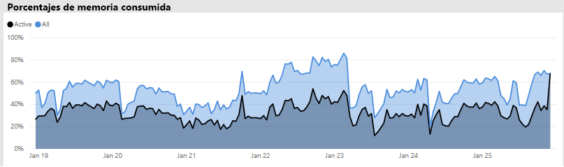

En una capacidad que experimenta la presión de memoria, al mismo objeto visual mostrará claramente memoria activa y la memoria total convergen, lo que significa que no podrá cargar conjuntos de datos adicionales en la memoria en ese momento dado. En este caso, el Administrador de Power BI puede hacer clic **capacidad reiniciar** (en **opciones avanzadas** del área de configuración de la capacidad del portal de administración). Reiniciando los resultados de la capacidad en todos los conjuntos de datos que se va a vacían de la memoria y se le permite volver a cargar en la memoria según sea necesario (por las consultas o actualización de datos).

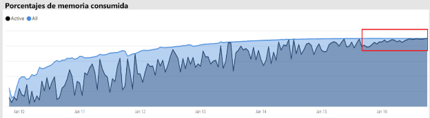

### Determinar si existe es lo suficientemente CPU

En general, uso de una capacidad medio de CPU debe permanecer por debajo del 80%. Si se supera este valor significa que la capacidad se está aproximando a la saturación de la CPU.

Efectos de la saturación de la CPU se expresan mediante operaciones tardan más de los que deberían debido a la capacidad de realizar muchos cambios de contexto de la CPU mientras intenta procesar todas las operaciones. Tiempos de espera en una capacidad Premium con un gran número de consultas simultáneas, que esto se indica mediante la consulta alta. Una consecuencia de los tiempos de espera de consulta alta es la capacidad de respuesta más lenta de lo habitual. El Administrador de Power BI puede identificar fácilmente cuando la CPU está saturada observando el **distribuciones de tiempo de espera de consulta por hora** visual. Recuentos de indican posible saturación de la CPU de tiempo de espera de picos periódicos de consulta.

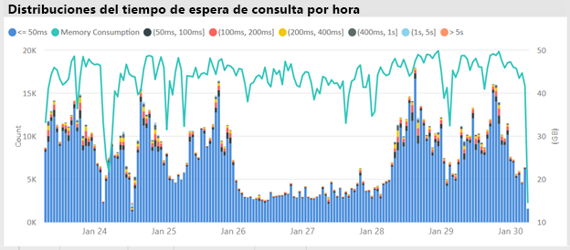

A veces se puede detectar un patrón similar en operaciones en segundo plano si contribuyen a la saturación de la CPU. Un administrador de Power BI puede buscar un pico periódico en tiempos de actualización para un conjunto de datos específico, lo que puede indicar la saturación de la CPU en el momento (probablemente debido a otras actualizaciones en curso del conjunto de datos o consultas interactivas). En este caso, que hace referencia a la **sistema** vista de la aplicación puede no necesariamente revelar que la CPU está al 100%. El **sistema** vista muestra los promedios de cada hora, pero la CPU puede saturarse durante varios minutos de operaciones intensivas, que se muestra como los picos en tiempos de espera.

Hay más matices a ver el efecto de saturación de la CPU. Aunque el número de consultas que esperan es importante, tiempo de espera de consulta siempre se realizará en cierta medida sin causar una degradación del rendimiento perceptible. Algunos conjuntos de datos (con la hora media de las consultas más largo, que indica la complejidad o tamaño) son más propensas a los efectos de saturación de la CPU que otras. Para identificar fácilmente estos conjuntos de datos, el Administrador de Power BI pueda buscar cambios en la composición de color de las barras en el **distribución del tiempo de espera por hora** visual. Después de detectar una barra de valores atípicos, pueden buscar los conjuntos de datos que tenía esperas de consulta durante ese tiempo y examine también el tiempo de espera de la media de las consultas en comparación con el promedio de duración de la consulta. Cuando estas dos métricas son de la misma magnitud y la carga de trabajo de consulta del conjunto de datos no es trivial, es probable que el conjunto de datos se ve afectado por una CPU insuficiente.

Este efecto puede ser especialmente evidente cuando se consume un conjunto de datos en ráfagas cortas de las consultas de alta frecuencia por varios usuarios (es decir, en una sesión de entrenamiento), lo que produce la saturación de CPU durante cada ráfagas. En este caso, se pueden experimentar tiempos de espera de consulta importantes en este conjunto de datos, así como afectar en otros conjuntos de datos en la capacidad (efecto de vecino ruidoso).

En algunos casos, los administradores de Power BI pueden solicitar que los propietarios del conjunto de datos crean una menor carga de trabajo volátiles consulta mediante la creación de un panel (actualización de las consultas que periódicamente con cualquier conjunto de datos para los iconos en caché) en lugar de un informe. Esto puede ayudar a evitar picos cuando se carga el panel. Esta solución no sea siempre posible dados los requisitos empresariales, pero puede ser una forma eficaz para evitar la saturación de CPU, sin realizar ningún cambio en el conjunto de datos.

## Conclusión

Power BI Premium proporciona un rendimiento más homogéneo, compatibilidad con grandes volúmenes de datos y la flexibilidad de una plataforma unificada de BI de autoservicio y enterprise para todas las personas de su organización. Estas notas del producto técnicas de nivel 300 se ha escrito específicamente para los administradores de Power BI y los creadores de contenido y los publicadores. Su objetivo es para ayudarlos a comprender el potencial de Power BI Premium y explicar cómo diseñar, implementar, supervisar y solucionar problemas de soluciones escalables.

Para implementar y administrar las capacidades de Power BI Premium, los administradores y desarrolladores de modelos requerirá una muy buena comprensión de la función de las capacidades, cómo puede administrarlos y supervisarlos y cómo se pueden optimizar los modelos, con el fin de responder apropiadamente a los cuellos de botella y problemas de rendimiento que surjan.

## Notas finales

\[1\] este documento técnico se ocupa de Power BI Premium que solo es compatible con el servicio de nube de Power BI y, por lo que Power BI Report Server está fuera del ámbito, excepto para el estado de la licencia necesaria para instalar Power BI Report Server se incluye con algunos SKU de Power BI Premium.

\[2\] power BI como un servicio en la nube cuando se usa para insertar contenido en nombre de usuarios de la aplicación es la plataforma como-servicio (PaaS). Este tipo de inserción se puede lograr con dos productos diferentes, uno de los cuales es Power BI Premium.

\[3\] push, streaming y los conjuntos de datos híbrido no se almacenan en las capacidades Premium y, por tanto, no son una consideración al implementar, administrar y supervisar las capacidades Premium.

\[4\] libros de Excel como un tipo de contenido de Power BI no se almacenan en las capacidades Premium y, por tanto, no son una consideración al implementar, administrar o supervisar las capacidades Premium.

\[5\] objetos visuales se pueden configurar para pasar por alto las interacciones de segmentación de datos. Para obtener más información, consulte el [interacciones de visualización en un informe de Power BI](service-reports-visual-interactions.md) documento.

\[6\] se puede determinar la diferencia de tamaño comparando el tamaño del archivo de Power BI Desktop con el uso de memoria de administrador de tareas para el archivo.

\[7\] incluir de soporte técnico para orígenes de datos de Microsoft SQL Server, instancia de Azure Databricks, Azure HDInsight Spark (Beta), Azure SQL Database y Azure SQL Data Warehouse. Para obtener información acerca de los orígenes adicionales, consulte el [orígenes de datos admitidos por Directquery en Power BI](desktop-directquery-data-sources.md) documento.

\[8\] power BI Premium admite la carga de un archivo de Power BI Desktop (.pbix) hasta un máximo de 10 GB de tamaño. Una vez cargado, un conjunto de datos puede crecer hasta 12 GB de tamaño como resultado de la actualización. Tamaño máximo de carga varía según la SKU. Para obtener más información, consulte el [soporte técnico de Power BI Premium para grandes conjuntos de datos](service-premium-large-datasets.md) documento.

\[9\] SKU con menos de cuatro núcleos no se ejecutan en infraestructura dedicada. Esto incluye EM1, EM2, A1 y A2 SKU.

\[10\] aunque es poco habitual, los modelos pueden ser descargados de memoria debido a las operaciones de servicio.

\[11\] esos intervalos están sujetos a cambios en cualquier momento.

\[12\] Esto se conoce como multigeográficas, actualmente en versión preliminar. La lógica para una implementación multigeográficas normalmente es para corporativa o cumplimiento de normas gubernamentales, en lugar de rendimiento y escalabilidad. Informes y la carga del panel todavía supone las solicitudes a la región principal para los metadatos. Para obtener más información, consulte el [Multigeográficas compatibilidad con Power BI Premium (versión preliminar)](service-admin-premium-multi-geo.md) documento.

\[13\] es posible que los usuarios pueden provocar problemas de rendimiento por sobrecargando el servicio Power BI con trabajos, escribir consultas excesivamente complejas, crear referencias circulares, etcetera.

\[14\] no se recomienda la opción de asignar áreas de trabajo de toda la organización, y se prefiere un enfoque más realista. Por lo general, no es recomendable usar áreas de trabajo personales para el contenido de producción.

\[15\] es posible supervisar SKU en la aplicación o en el portal de Azure, pero no en el Portal de administración de Power BI. Para supervisar la SKU, se producirá un error en la actualización del informe si la aplicación no se agregó al rol lector del recurso. Para obtener más información, consulte el [las capacidades del Monitor de Power BI Premium y Power BI Embedded](service-admin-premium-monitor-capacity.md) documento.

\[16\] actualizaciones pueden esperar cuando no hay suficiente memoria o CPU para iniciar.

\[17\] el tamaño del conjunto de datos en memoria puede ser mayor que el tamaño en disco en hasta un 20%.

\[18\] promedio de uso de memoria (GB) y el consumo de memoria máximo (GB)

\[19\] expulsiones de conjunto de datos

\[20\] las consultas de conjunto de datos, duración de la consulta de conjunto de datos promedio (ms), conjunto de datos esperan recuento y el tiempo de espera promedio del conjunto de datos (ms)

\[21\] recuento alto de utilización de CPU y el tiempo de CPU de mayor uso (últimos siete días)

\[22\] recuento alto de utilización de calidad de datos/LC y la hora de calidad de datos/LC de utilización más alta (últimos siete días)