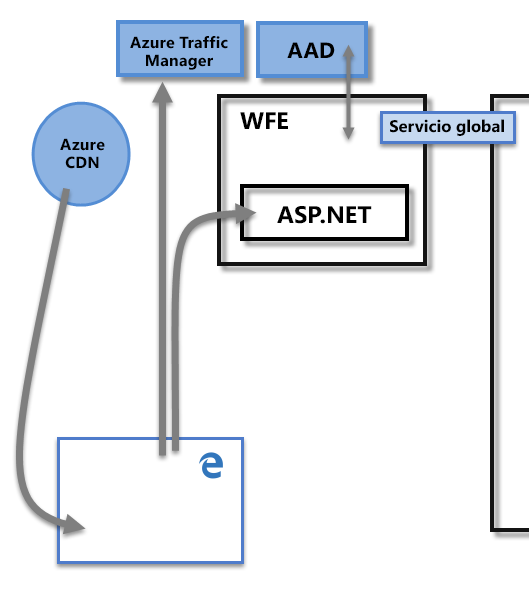
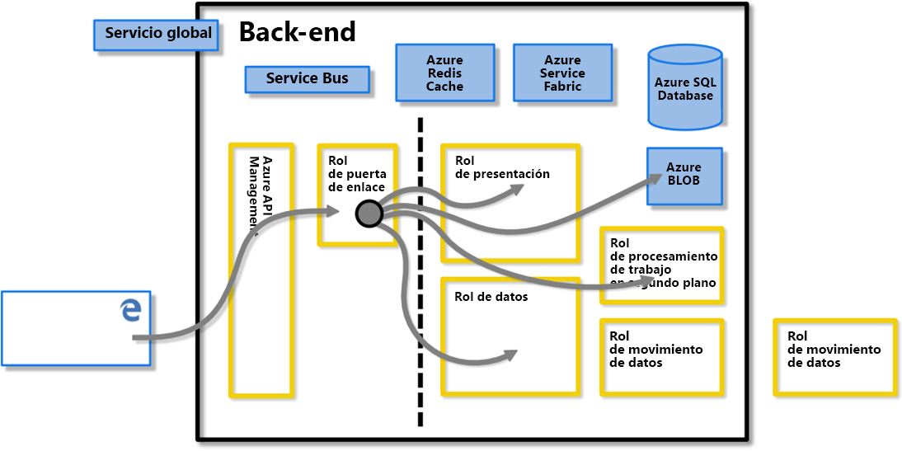
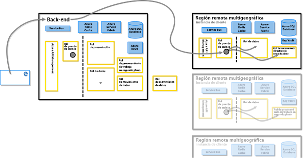
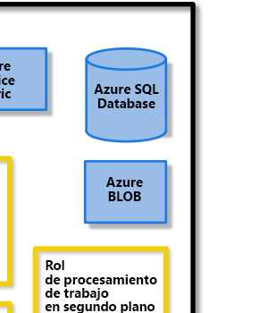
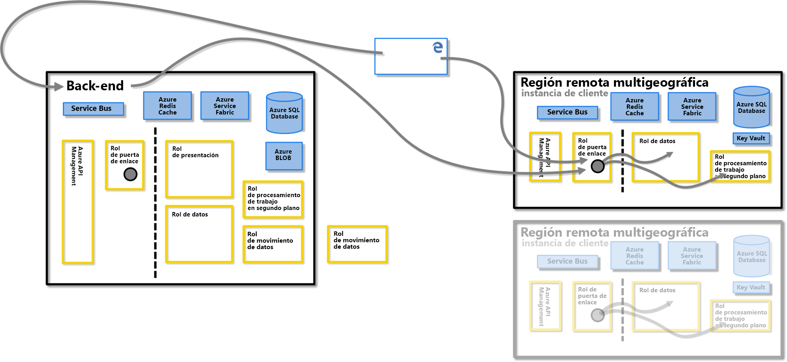
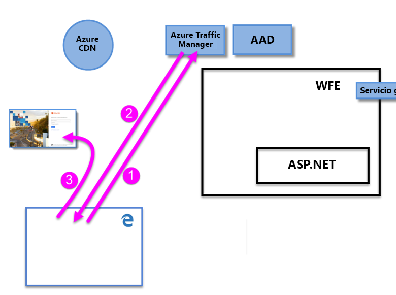
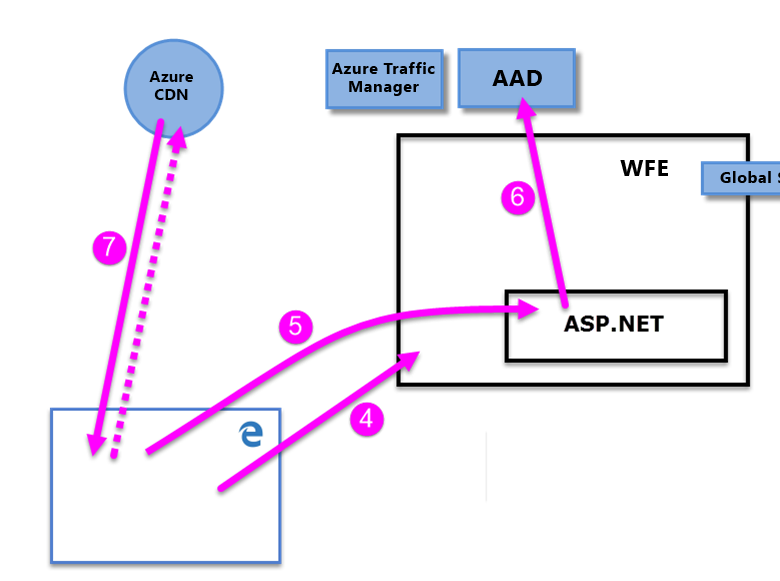
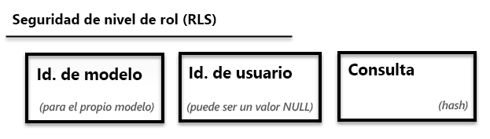

# Notas del producto sobre la seguridad de Power BI

**Resumen:** Power BI es una oferta de servicio de software en línea (*SaaS* o Software como servicio) de Microsoft que permite crear de forma rápida y sencilla paneles de inteligencia empresarial con características de autoservicio, informes, conjuntos de datos y visualizaciones. Con Power BI, se puede conectar a muchos orígenes de datos diferentes, combinar y dar forma a los datos de esas conexiones y, después, crear informes y paneles que se pueden compartir con otros usuarios.

**Autor:** David Iseminger

**Revisores técnicos:** Pedram Rezaei, Cristian Petculescu, Siva Harinath, Tod Manning, Haydn Richardson, Adam Wilson, Ben Childs, Robert Bruckner, Sergei Gundorov, Kasper de Jonge

**Se aplica a:** Power BI SaaS, Power BI Desktop, Power BI Embedded, Power BI Premium

> [!NOTE]
> Para guardar o imprimir estas notas del producto, haga clic en **Imprimir** en el explorador y después en **Guardar como PDF**.

## Introducción

**Power BI** es una oferta de servicio de software en línea (_SaaS_ o Software como servicio) de Microsoft que permite crear de forma rápida y sencilla paneles de inteligencia empresarial con características de autoservicio, informes, conjuntos de datos y visualizaciones. Con Power BI, se puede conectar a muchos orígenes de datos diferentes, combinar y dar forma a los datos de esas conexiones y, después, crear informes y paneles que se pueden compartir con otros usuarios.

El servicio Power BI se rige por los [términos de Microsoft Online Services](http://www.microsoftvolumelicensing.com/DocumentSearch.aspx?Mode=3&amp;DocumentTypeId=31) y la [Declaración de privacidad de Microsoft Enterprise](http://www.microsoft.com/privacystatement/OnlineServices/Default.aspx). Para conocer la ubicación de procesamiento de datos, vea los términos de ubicación de procesamiento de datos de los Términos de Microsoft Online Services. Para obtener información de cumplimiento, el [Centro de confianza de Microsoft](https://www.microsoft.com/trustcenter) es el principal recurso para Power BI. El equipo de Power BI se esfuerza para brindar a sus clientes las innovaciones y la productividad más recientes. En la actualidad, Power BI está en el nivel D del [Marco de cumplimiento de Office 365](http://go.microsoft.com/fwlink/p/?LinkID=618494).

En este artículo se describe la seguridad de Power BI a través de una explicación de su arquitectura; después se explica cómo se autenticarán los usuarios en Power BI y cómo se establecen las conexiones de datos y, luego, cómo se almacenan y mueven los datos a través del servicio en Power BI. La última sección está dedicada a preguntas relacionadas con la seguridad, con las respuestas correspondientes.

## Arquitectura de Power BI

El servicio **Power BI** se basa en **Azure**, que es la [plataforma de informática en la nube](http://azure.microsoft.com/overview/what-is-azure/) de Microsoft. En la actualidad, Power BI se implementa en muchos centros de datos en todo el mundo: hay muchas implementaciones activas a disposición de los clientes en las regiones a las que sirven esos centros de datos y un número equivalente de implementaciones pasivas que actúan como copias de seguridad para cada implementación activa.

Cada implementación de Power BI consta de dos clústeres: un front-end web (**WFE**) y un **back-end**. Estos dos clústeres se muestran en la imagen siguiente y constituyen el fondo del resto de este artículo. 

Power BI usa Azure Active Directory (**AAD**) para la autenticación y administración de cuentas. Power BI también usa **Azure Traffic Manager (ATM)** para dirigir el tráfico del usuario al centro de datos más cercano, según el registro DNS del cliente que se intenta conectar, durante el proceso de autenticación y para descargar archivos y contenido estático. Power BI usa **Azure Content Delivery Network (CDN)** para distribuir de forma eficaz el contenido estático y los archivos necesarios a los usuarios en función de la configuración regional geográfica.

### El clúster WFE

El clúster **WFE** administra el proceso de autenticación y conexión inicial para Power BI, con AAD para autenticar clientes y proporcionar tokens para conexiones de clientes siguientes al servicio de Power BI.

Cuando los usuarios se intentan conectar al servicio Power BI, el servicio DNS del cliente se puede comunicar con **Azure Traffic Manager** para buscar el centro de datos más cercano con una implementación de Power BI. Para más información sobre este proceso, vea [Métodos de enrutamiento del tráfico de Azure Traffic Manager](https://azure.microsoft.com/documentation/articles/traffic-manager-routing-methods/#performance-traffic-routing-method).

El clúster WFE más cercano al usuario administra la secuencia de inicio de sesión y autenticación (descrita más adelante en este artículo) y proporciona un token de AAD al usuario una vez que la autenticación es correcta. El componente ASP.NET dentro del clúster WFE analiza la solicitud para determinar a qué organización pertenece el usuario y, después, consulta el **Servicio global** de Power BI. El Servicio global es una sola tabla de Azure que se comparte entre todos los clústeres WFE y de back-end del mundo, y que asigna usuarios y organizaciones de clientes al centro de datos en el que se hospeda su inquilino de Power BI. El WFE especifica al explorador en qué clúster de back-end se hospeda el inquilino de la organización. Una vez que se ha autenticado a un usuario, las posteriores interacciones del cliente se producen directamente con el clúster de back-end, sin que WFE intermedie para dichas solicitudes.

### Clúster de back-end de Power BI

El clúster **back-end** informa de cómo interactúan los clientes autenticados con el servicio de Power BI. El clúster **back-end** administra visualizaciones, paneles para el usuario, conjuntos de datos, informes, almacenamiento de datos, conexiones de datos, actualización de datos y otros aspectos de la interacción con el servicio de Power BI.

El rol **Puerta de enlace** actúa como una puerta de enlace entre las solicitudes del usuario y el servicio de Power BI. Los usuarios no interactúan directamente con roles que no sean el Rol de puerta de enlace.

**Importante:** Es imprescindible recordar que _solo_ los roles Azure API Management (**APIM**) y Puerta de enlace (**GW**) son accesibles mediante la red pública de Internet. Proporcionan autenticación, autorización, protección DDoS, limitación, equilibrio de carga, enrutamiento y otras capacidades.

La línea de puntos en la imagen del clúster de **back-end** anterior aclara el límite entre los dos únicos roles accesibles para los usuarios (a la izquierda de la línea de puntos) y los roles a los que únicamente puede acceder el sistema. Cuando un usuario autenticado se conecta al servicio Power BI, la conexión y cualquier solicitud del cliente se acepta y administra mediante el rol de **Puerta de enlace** y **Azure API Management**, que después interactúa en nombre del usuario con el resto del servicio Power BI. Por ejemplo, cuando un cliente intenta ver un panel, el rol **Puerta de enlace** acepta la solicitud y, a continuación, envía de forma independiente una solicitud al rol **Presentación** para recuperar los datos necesarios para que el explorador muestre el panel.

### Power BI Premium

**Power BI Premium** ofrece un área de trabajo de servicio dedicada, aprovisionada y con particiones para los suscriptores que necesitan recursos dedicados para sus actividades de Power BI. Cuando un cliente se registra para una suscripción de Power BI Premium, se crea la capacidad Premium mediante **Azure Resource Manager**. El lanzamiento de esa suscripción asigna un conjunto de máquinas virtuales acordes con el nivel de suscripción, en el centro de datos donde se hospeda su inquilino de Power BI (a excepción de los entornos Multi-Geo, como se describe más adelante en este documento), iniciado como una implementación de **Azure Service Fabric**.

Una vez creada, toda la comunicación con el clúster Premium se enruta a través del clúster de back-end de Power BI, donde se establece una conexión a las máquinas virtuales de la suscripción de **Power BI Premium** dedicada del cliente.

### Arquitectura de almacenamiento de datos

Power BI usa dos repositorios principales para almacenar y administrar datos: los datos cargados por los usuarios se envían normalmente a **Azure Blob Storage**, y todos los metadatos, así como los artefactos para el propio sistema, se almacenan detrás de un firewall en **Azure SQL Database**.

Por ejemplo, cuando un usuario importa un libro de Excel al servicio Power BI, se crea una base de datos tabular de Analysis Services en memoria, y los datos se almacenan en memoria hasta un máximo de una hora (o hasta que en el sistema se produzca presión de memoria). Los datos también se envían a **Azure Blob Storage**.

Los metadatos sobre la suscripción de Power BI de un usuario, como paneles, informes, orígenes de datos recientes, áreas de trabajo, información de la organización y del inquilino, y otros metadatos sobre el sistema, se almacenan y actualizan en **Azure SQL Database**. Toda la información almacenada en Azure SQL Database está totalmente cifrada mediante la tecnología [Cifrado de datos transparente (TDE) de Azure SQL](https://msdn.microsoft.com/library/dn948096.aspx). También se cifran todos los datos que se almacenan en Azure Blob Storage. En la sección **Almacenamiento y movimiento de datos** se describe más información sobre el proceso de carga, almacenamiento y movimiento de los datos.

## Creación de inquilinos

Un inquilino es una instancia dedicada del servicio Azure AD que una organización recibe y posee cuando se suscribe a un servicio en la nube de Microsoft como Azure, Microsoft Intune, Office 365 o Power BI. Cada inquilino de Azure AD es distinto e independiente de otros inquilinos de Azure AD.

Un inquilino aloja los usuarios de una empresa y la información sobre ellos: sus contraseñas, datos de perfil de usuario, permisos y demás. También contiene grupos, aplicaciones y otra información relativa a una organización y su seguridad. Para más información, vea [¿Qué es un inquilino de Azure AD?](https://msdn.microsoft.com/library/azure/jj573650.aspx#BKMK_WhatIsAnAzureADTenant)

Un inquilino de Power BI se crea en el centro de datos que se considera más cercano a la información del país (o región) y el estado proporcionada para el inquilino en Azure Active Directory, que se proporciona cuando se aprovisiona inicialmente el servicio de Office 365 o Power BI. El inquilino de Power BI no se mueve de esa ubicación de centro de datos hoy.

### Varias zonas geográficas (Multi-Geo)

Algunas organizaciones requieren una presencia de Power BI en varias zonas geográficas, o regiones, según las necesidades empresariales. Por ejemplo, una empresa puede tener su inquilino de Power BI en Estados Unidos, pero también puede hacer negocios en otras áreas geográficas, como Australia, y necesitar que los servicios y datos de Power BI permanezcan en esa región remota.  A partir de la segunda mitad de 2018, las organizaciones con su inquilino en una zona geográfica también pueden acceder a recursos de Power BI de otra zona geográfica si se ha aprovisionado correctamente. Por comodidad, a lo largo de este documento se hará referencia a esta característica como **Multi-Geo**.

Existen implicaciones técnicas que tener en cuenta cuando se trabaja en zonas geográficas diferentes, que se clarificarán a lo largo de este documento. Entre las consideraciones importantes se incluyen las siguientes:

- Una consulta en caché almacenada en una región remota permanecerá en reposo en esa región, pero otros datos en tránsito se pueden intercambiar entre varias zonas geográficas.
- Los informes en archivos PBIX o XLSX en una región remota que se publican en Power BI a veces dan como resultado una copia o instantánea que se almacena en Azure Blob Storage de Power BI y, en ese caso, los datos se cifran mediante Storage Service Encryption (SSE) de Azure.
- Al mover datos de una región a otra en un entorno Multi-Geo, la recolección de elementos no utilizados en la región desde la que se han movido los datos se produce a los 7-10 días, momento en que se destruirá la copia de los datos que se han movido desde la región original.

En la imagen siguiente se muestra cómo los servicios Power BI proporcionados en la región remota con un entorno Multi-Geo se enrutan a través del clúster de **back-end de Power BI**, donde se establece una conexión a la máquina virtual de la suscripción de Power BI remota del cliente.

### Centros de datos y configuraciones regionales

Power BI está disponible en regiones concretas, en función de dónde se implementen los clústeres de Power BI en los centros de datos regionales. Microsoft tiene previsto ampliar su infraestructura de Power BI a centros de datos adicionales.

Los vínculos siguientes proporcionan información adicional sobre los centros de datos de Azure.

- [Regiones de Azure](http://azure.microsoft.com/regions/): información sobre la presencia global y las ubicaciones de Azure.
- [Servicios de Azure, por región](http://azure.microsoft.com/regions/#services): una lista completa de los servicios de Azure (tanto de infraestructura como de plataforma) disponibles de Microsoft en cada región.

Actualmente, el servicio Power BI está disponible en determinadas regiones atendidas por centros de datos, como se explica en [Microsoft Trust Center]((https://www.microsoft.com/TrustCenter/CloudServices/business-application-platform/data-location). El siguiente vínculo muestra un mapa de centros de datos de Power BI; puede mantener el puntero sobre una región para ver los centros de datos que se encuentran allí:

* [Centros de datos de Power BI](https://www.microsoft.com/TrustCenter/CloudServices/business-application-platform/data-location)

Microsoft también proporciona centros de datos para nubes soberanas. Para obtener más información sobre la disponibilidad del servicio Power BI para nubes nacionales, vea [Nubes nacionales de Power BI](https://powerbi.microsoft.com/clouds/).

Para obtener más información sobre dónde se almacenan los datos y cómo se usan, vea [Microsoft Trust Center](https://www.microsoft.com/TrustCenter/Transparency/default.aspx#_You_know_where). Los compromisos sobre la ubicación de los datos de cliente en reposo se especifican en los **Términos de procesamiento de datos** de los [Términos de Microsoft Online Services](http://www.microsoftvolumelicensing.com/DocumentSearch.aspx?Mode=3&amp;DocumentTypeId=31).

## Autenticación de usuarios

La autenticación de usuarios en el servicio Power BI consta de una serie de solicitudes, respuestas y redireccionamientos entre el explorador del usuario y el servicio Power BI o los servicios de Azure que se usan en Power BI. Esa secuencia describe el proceso de autenticación de usuarios en Power BI. Para más información sobre las opciones para los modelos de autenticación de usuarios (modelos de inicio de sesión) de una organización, vea [Choosing a sign-in model for Office 365](https://blogs.office.com/2014/05/13/choosing-a-sign-in-model-for-office-365/) (Elección de un modelo de inicio de sesión para Office 365).

### Secuencia de autenticación

La secuencia de autenticación del usuario para el servicio Power BI se produce como se describe en los pasos siguientes, que se ilustran en las imágenes siguientes.

1. Un usuario inicia una conexión al servicio Power BI desde un explorador, ya sea escribiendo la dirección de Power BI en la barra de direcciones (como https://app.powerbi.com) o haciendo clic en _Iniciar sesión_ en la página de aterrizaje de Power BI https://powerbi.microsoft.com)). La conexión se establece mediante TLS 1.2 y HTTPS, y toda la comunicación posterior entre el explorador y el servicio Power BI usa HTTPS. La solicitud se envía a **Azure Traffic Manager**.

2. **Azure Traffic Manager** comprueba el registro DNS del usuario para determinar el centro de datos más cercano donde se ha implementado Power BI, y responde al DNS con la dirección IP del clúster WFE al que se debe enviar al usuario.

3. Después, WFE redirige al usuario a la página de inicio de sesión de Microsoft Online Services.

    

1. Una vez que se ha autenticado al usuario, la página de inicio de sesión le redirige al **clúster WFE** del servicio Power BI más cercano que se haya determinado anteriormente.

2. El explorador envía una cookie obtenida del inicio de sesión correcto a Microsoft Online Services, que es inspeccionada por el **servicio ASP.NET** dentro del **clúster WFE**.

3. El clúster WFE consulta con el servicio **Azure Active Directory** (**AAD**) para autenticar la suscripción del usuario al servicio Power BI y para obtener un token de seguridad de AAD. Cuando AAD devuelve la autenticación correcta del usuario y un token de seguridad de AAD, el clúster WFE consulta el **Servicio global de Power BI**, en el que se mantiene una lista de los inquilinos y sus ubicaciones de clúster de back-end de Power BI, y determina qué clúster del servicio Power BI contiene el inquilino del usuario. Después, el clúster WFE dirige al usuario al clúster de Power BI donde reside su inquilino y devuelve una colección de elementos al explorador del usuario:

      - El **token de seguridad de AAD**.
      - **Información de la sesión**.
      - La dirección web del clúster de **back-end** con el que el usuario se puede comunicar e interactuar.

1. Después, el explorador del usuario contacta con la instancia de Azure CDN especificada, o para algunos archivos el WFE, con el fin de descargar la colección de archivos comunes especificados que se necesitan para habilitar la interacción del explorador con el servicio Power BI. Luego, la página del explorador incluye el token de AAD, la información de la sesión, la ubicación del clúster de back-end asociado y la colección de archivos descargados desde Azure CDN y el clúster WFE, para la duración de la sesión de explorador del servicio Power BI.

Una vez completados esos elementos, el explorador inicia el contacto con el clúster de back-end especificado y comienza la interacción del usuario con el servicio Power BI. A partir de ese punto, todas las llamadas al servicio Power BI se realizan con el clúster de back-end especificado, y en todas se incluye el token de AAD del usuario. El token de AAD tiene un tiempo de espera de una hora; WFE lo actualiza periódicamente si una sesión de usuario permanece abierta, con el fin de conservar el acceso.

## Almacenamiento y movimiento de datos

En el servicio Power BI, los datos están _en reposo_ (datos disponibles para un usuario de Power BI sobre el que actualmente no se actúa), o bien _en curso_ (por ejemplo: consultas que se ejecutan, conexiones y modelos de datos sobre los que se actúa, datos o modelos que se cargan en el servicio Power BI y otras acciones que los usuarios o el servicio Power BI pueden emprender sobre los datos a los que se está accediendo o que se están actualizando). Los datos que están en proceso se conocen como _datos en curso_. En Power BI, los datos en reposo se cifran. Los datos que están en tránsito, lo que significa que se envían al servicio Power BI o que este los recibe, también se cifran.

El servicio Power BI también administra los datos de otra forma en función de si se accede a ellos mediante **DirectQuery** o importación. Por tanto, hay dos categorías de datos de usuario para Power BI: los datos a los que se accede con DirectQuery y los datos a los que no se accede con DirectQuery.

**DirectQuery** es una consulta para la que se ha traducido la consulta de un usuario de Power BI del lenguaje Expresiones de análisis de datos (DAX) de Microsoft (que es el que se usa en Power BI y otros productos de Microsoft para crear consultas) al lenguaje de datos nativo del origen de datos (por ejemplo, T-SQL u otros lenguajes de base de datos nativos). Los datos asociados con DirectQuery se almacenan solo por referencia, lo que significa que los datos de origen no se almacenan en Power BI cuando DirectQuery no está activa (excepto los datos de visualización que se usan para mostrar paneles e informes, como se describe en la sección _Datos en curso (movimiento de datos)_, a continuación). En su lugar, se almacenan referencias a los datos de DirectQuery, que permiten acceder a esos datos cuando se ejecuta DirectQuery. Una instancia de DirectQuery contiene toda la información necesaria para ejecutar la consulta, incluida la cadena de conexión y las credenciales que se usan para acceder a los orígenes de datos, lo que permite a DirectQuery conectarse a los orígenes de datos incluidos para la actualización automática. Con DirectQuery, la información del modelo de datos subyacente se incorpora a DirectQuery.

Una consulta de un conjunto de datos de importación consta de una colección de consultas DAX que _no_ se traducen directamente al lenguaje nativo de ningún origen de datos subyacente. Las consultas de importación no incluyen credenciales para los datos subyacentes, y estos se cargan en el servicio Power BI a menos que sean datos locales a los que se accede a través de una instancia de [Power BI Gateway](service-gateway-onprem.md), en cuyo caso la consulta solo almacena referencias a datos locales.

En la tabla siguiente se describen los datos de Power BI en función del tipo de consulta que se usa. Una **X** indica la presencia de datos de Power BI al usar el tipo de consulta asociado.

|  |Importar  |DirectQuery  |Live Connect  |
|---------|---------|---------|---------|
|Esquema     |     X    |    X     |         |
|Datos de fila     |    X     |         |         |
|Almacenamiento en caché de datos de objetos visuales     |    X     |     X    |    X     |

La distinción entre DirectQuery y otras consultas determina cómo controla el servicio Power BI los datos en reposo, y si se cifra la propia consulta. En las secciones siguientes se describen los datos en reposo y en movimiento, y se explica el cifrado, la ubicación y el proceso para controlar los datos.

### Datos en reposo

Cuando los datos están en reposo, el servicio Power BI almacena conjuntos de datos, informes e iconos de panel de la manera descrita en las subsecciones siguientes. Como se ha mencionado antes, en Power BI se cifran los datos en reposo. En las secciones siguientes, ETL es el acrónimo de Extracción, Transformación y Carga.

#### Claves de cifrado

- Las claves de cifrado para las claves de Azure Blob se almacenan, cifradas, en Azure Key Vault.
- El propio Azure SQL administra las claves de cifrado para la tecnología TDE de Azure SQL Database.
- La clave de cifrado para el servicio de movimiento de datos y la puerta de enlace de datos local se almacena:
  - En la puerta de enlace de datos local en la infraestructura del cliente, para los orígenes de datos locales.
  - En el rol de movimiento de datos, para los orígenes de datos basados en la nube.

La clave de cifrado de contenido (CEK) que se usa para cifrar Azure Blob Storage de Windows es una clave de 256 bits generada de forma aleatoria. El algoritmo que usa la CEK para cifrar el contenido es AES\_CBC\_256.

La clave de cifrado de claves (KEK) que se usa para cifrar la CEK es una clave predefinida de 256 bits. El algoritmo que usa la KEK para cifrar la CEK es A256KW.

Las claves de cifrado de puerta de enlace basadas en la clave de recuperación nunca abandonan una infraestructura local. Power BI no puede acceder a los valores de las credenciales cifradas en el entorno local y no puede interceptarlas; los clientes web cifran la credencial con una clave pública que está asociada con la puerta de enlace con la que se comunica.

Para los orígenes de datos basados en la nube, el rol de movimiento de datos cifra las claves de cifrado con métodos de [Always Encrypted](https://msdn.microsoft.com/library/mt163865.aspx). Obtenga más información sobre la [característica de base de datos Always Encrypted](https://msdn.microsoft.com/library/mt163865.aspx).

#### Conjuntos de datos

1. Metadatos (tablas, columnas, medidas, cálculos, cadenas de conexión, etc.)

    a. Para la instancia local de Analysis Services no se almacena nada en el servicio, excepto una referencia a esa base de datos almacenada cifrada en Azure SQL.

    b. Todos los demás metadatos para ETL, DirectQuery e inserción de datos se cifran y almacenan en Azure Blob Storage.

1. Credenciales para los orígenes de datos originales
  
      a. Instancia local de Analysis Services: no se necesitan credenciales y, por tanto, no se almacena ninguna.

      b. DirectQuery: depende de si el modelo se ha creado directamente en el servicio, en cuyo caso se almacena en la cadena de conexión y se cifra en Azure Blob, o bien si el modelo se ha importado desde Power BI Desktop, en cuyo caso se almacenan las credenciales cifradas en Azure SQL Database de movimiento de datos. La clave de cifrado se almacena en el equipo que ejecuta la puerta de enlace en la infraestructura del cliente.

      c. Datos insertados: no aplicable.

      d. ETL

      - Para **Salesforce** o **OneDrive**: los tokens de actualización se almacenan cifrados en la instancia de Azure SQL Database del servicio Power BI.
      - En caso contrario:
        - Si se establece el conjunto de datos para la actualización, las credenciales se almacenan cifradas en la instancia de Azure SQL Database de Movimiento de datos. La clave de cifrado se almacena en el equipo que ejecuta la puerta de enlace en la infraestructura del cliente.
        - Si el conjunto de datos no se establece para la actualización, no se almacena ninguna credencial para los orígenes de datos

1. Datos

    a. Instancia local de Analysis Services y DirectQuery: no se almacena nada en el servicio Power BI.

    b. ETL: se cifra en Azure Blob Storage, pero todos los datos actualmente en la instancia de Azure Blob Storage del servicio Power BI usan [Storage Service Encryption (SSE) de Azure](https://docs.microsoft.com/azure/storage/common/storage-service-encryption), también conocido como cifrado del lado servidor. Multi-Geo también usa SSE.

    c. Datos de inserción v1: se cifran en Azure Blob Storage, pero todos los datos actualmente en la instancia de Azure Blob Storage del servicio Power BI usan [Storage Service Encryption (SSE) de Azure](https://docs.microsoft.com/azure/storage/common/storage-service-encryption), también conocido como cifrado del lado servidor. Multi-Geo también usa SSE.

    d. Datos de inserción v2: se almacenan en Azure SQL, cifrados.

Para cifrar su instancia de Azure Blob Storage, Power BI usa el enfoque de cifrado del lado cliente, mediante el modo de encadenamiento de bloques de cifrado (CBC) con el Estándar de cifrado avanzado (AES). Obtenga [más información sobre el cifrado del lado cliente](https://azure.microsoft.com/documentation/articles/storage-client-side-encryption/).

Power BI proporciona supervisión de integridad de datos de las maneras siguientes:

* Para los datos en reposo en Azure SQL, Power BI usa dbcc, TDE y la suma de comprobación de página constante como parte de las ofertas de SQL nativas.

* Para los datos en reposo en Azure Blob Storage, Power BI usa el cifrado del lado cliente y HTTPS para transferir datos al almacenamiento, lo que incluye comprobaciones de integridad durante la recuperación de los datos. Obtenga [más información sobre la seguridad de Azure Blob Storage](https://azure.microsoft.com/documentation/articles/storage-security-guide/).

#### Informes

1. Metadatos (definición de informe)

   a. Los informes pueden ser de Excel para Office 365 o de Power BI. Lo siguiente se aplica a los metadatos en función del tipo de informe:

       a. Excel Report metadata is stored encrypted in SQL Azure. Metadata is also stored in Office 365.

       b. Power BI reports are stored encrypted in Azure SQL database.

2. Datos estáticos

   Los datos estáticos incluyen artefactos como imágenes de fondo y objetos visuales personalizados.

    a. Para los informes creados con Excel para Office 365, no se almacena nada.

    b. Para los informes de Power BI, los datos estáticos se almacenan y se cifran en Azure Blob Storage.

3. Memorias caché a. Para los informes creados con Excel para Office 365, no se almacena nada en caché.

    b. Para los informes de Power BI, los datos para los objetos visuales que se muestran se almacenan en caché cifrados en Azure SQL Database.
 

4. Archivos originales de Power BI Desktop (.pbix) o Excel (.xlsx) publicados en Power BI.

    En ocasiones, se almacenan una copia o una instantánea de los archivos .xlsx o .pbix en la instancia de Azure Blob Storage de Power BI y, en ese caso, los datos se cifran. Todos estos informes almacenados en el servicio Power BI, en Azure Blob Storage, usan [Storage Service Encryption (SSE) de Azure](https://docs.microsoft.com/azure/storage/common/storage-service-encryption), también conocido como cifrado del lado servidor. Multi-Geo también usa SSE.

#### Paneles e iconos de paneles

1. Cachés: los datos necesarios para los objetos visuales en el panel normalmente se almacenan en caché y se almacenan cifrados en Azure SQL Database. Otros iconos como los objetos visuales anclados desde Excel o SQL Server Reporting Services (SSRS) se almacenan en Azure Blob como imágenes y también se cifran.

2. Datos estáticos: se incluyen artefactos como imágenes de fondo y objetos visuales personalizados que se almacenan, cifrados, en Azure Blob Storage.

Con independencia del método de cifrado que se use, Microsoft administra el cifrado de claves en nombre de los clientes, ya sea en un almacén de secretos o en Azure Key Vault.

### Datos almacenados de forma transitoria en dispositivos no volátiles

A continuación se describen los datos que se almacenan de forma transitoria en dispositivos que no son volátiles.

#### Conjuntos de datos

1. Metadatos (tablas, columnas, medidas, cálculos, cadenas de conexión, etc.)

2. Algunos artefactos relacionados con los esquemas se pueden almacenar en el disco de los nodos de proceso durante un período de tiempo limitado. También se pueden almacenar algunos artefactos no cifrados en Azure REDIS Cache durante un período de tiempo limitado.

3. Credenciales para los orígenes de datos originales

    a. Instancia local de Analysis Services: no se almacena nada.

    b. DirectQuery: depende de si el modelo se ha creado directamente en el servicio, en cuyo caso se almacena en la cadena de conexión, en formato cifrado con la clave de cifrado almacenada en texto sin cifrar en el mismo sitio (junto con la información cifrada), o bien si el modelo se ha importado desde Power BI Desktop, en cuyo caso las credenciales no se almacenan en dispositivos que no son volátiles.

    c. Datos insertados: ninguno (no aplicable).

    d. ETL: ninguno (no se almacenada nada en el nodo de proceso diferente a lo que se ha explicado en la sección **Datos en reposo** anterior)
4. Datos

    Algunos artefactos de datos se pueden almacenar en el disco de los nodos de proceso durante un período de tiempo limitado.

### Datos en curso

Los datos están en curso cuando un usuario los usa o accede a ellos de forma activa. Por ejemplo, los datos están en curso cuando un usuario accede a un conjunto de datos, revisa o modifica un panel o informe, cuando se realiza la actualización u otras actividades de acceso de datos que se puedan producir. Cuando se produce cualquiera de esos eventos y los datos están en curso, el **Rol de datos** del servicio Power BI crea una base de datos de Analysis Services (AS) en memoria y el conjunto de datos se carga en ella. Con independencia de que el conjunto de datos se base en DirectQuery o no, los datos cargados en la base de datos de AS no se cifran para permitir el acceso por parte del **Rol de datos**, y se mantienen en memoria para posteriores accesos hasta que el servicio Power BI ya no necesita el conjunto de datos. Para los clientes con una suscripción de Power BI Premium, Power BI crea una base de datos de Analysis Services (AS) en memoria en la colección del cliente aprovisionada por separado de máquinas virtuales de Power BI.

Una vez que se actúa sobre los datos, lo que inicialmente incluye su carga en Power BI, el servicio Power BI puede almacenar en caché los datos de visualización en una instancia cifrada de **Azure SQL Database**, independientemente de si el conjunto de datos se basa en DirectQuery.

Para supervisar la integridad de los datos para los datos en curso, Power BI usa HTTPS, TCP/IP y TLS para asegurarse de que los datos se cifran y se mantiene la integridad durante el transporte.

## Autenticación de usuarios en orígenes de datos

Con cada origen de datos, un usuario establece una conexión en función de su inicio de sesión, y accede a los datos con esas credenciales. Después, los usuarios pueden crear consultas, paneles e informes basados en los datos subyacentes.

Cuando un usuario comparte consultas, paneles, informes o cualquier visualización, el acceso a esos datos y visualizaciones depende de si los orígenes de datos subyacentes admiten la seguridad de nivel de rol (RLS).

Si un origen de datos subyacente admite la **seguridad de nivel de rol (RLS) de Power BI**, el servicio Power BI la aplicará y los usuarios que no tengan credenciales suficientes para acceder a los datos subyacentes (por ejemplo una consulta que se usa en un panel, informe u otro artefacto de datos) no verán los datos para los que no tengan privilegios suficientes. Si el acceso de un usuario a los datos subyacentes es distinto del usuario que ha creado el panel o el informe, las visualizaciones y otros artefactos solo mostrarán datos en función del nivel de acceso a los datos que tenga el usuario.

Si un origen de datos **no** aplica RLS, las credenciales de inicio de sesión de Power BI se aplican al origen de datos subyacente, o si se proporcionan otras credenciales durante la conexión, se aplican esas credenciales proporcionadas. Cuando un usuario carga datos en el servicio Power BI desde orígenes de datos que no sean RLS, los datos se almacenan en Power BI, como se describe en la sección **Almacenamiento y movimiento de datos** de este documento. Para los orígenes de datos que no son RLS, cuando los datos se comparten con otros usuarios (por ejemplo, a través de un panel o informe) o se produce una actualización de los datos, se usan las credenciales originales para acceder a los datos o mostrarlos.

Para obtener un ejemplo rápido y contrastar los orígenes de datos RLS y no RLS, imagine que Sam crea un informe y un panel y, después, los comparte con Abby y Ralph. Si los orígenes de datos que se usan en el informe y el panel proceden de orígenes de datos que **no** admiten RLS, Abby y Ralph podrán ver los datos que Sam ha incluido en el panel (que se ha cargado en el servicio Power BI), y tanto Abby como Ralph pueden interactuar con los datos. En cambio, si Sam crea un informe y un panel a partir de orígenes de datos que son compatibles con RLS y después lo comparte con Abby y Ralph, cuando Abby intente ver el panel se producirá lo siguiente:

1. Como el panel es de un origen de datos RLS, las visualizaciones de panel mostrarán brevemente un mensaje &quot;cargando&quot; mientras el servicio Power BI consulta el origen de datos para recuperar el conjunto de datos actual especificado en la cadena de conexión asociada con la consulta del panel subyacente.

2. A los datos se accede y se recuperan en función de las credenciales y el rol del Abby, y solo se cargan en el panel y el informe los datos para los que Abby tenga autorización suficiente.

3. Las visualizaciones en el panel y el informe se muestran según el nivel de rol de Abby.

Si Ralph accediera al panel o informe compartido, se produciría la misma secuencia en función de su nivel de rol.

## Power BI y ExpressRoute

Con Power BI y ExpressRoute, puede crear una conexión de red privada entre la organización y Power BI (o mediante una instalación de colocación del ISP), omitiendo Internet para proteger mejor las conexiones y los datos confidenciales de Power BI.

ExpressRoute es un servicio de Azure que permite crear conexiones privadas entre los centros de datos de Azure (donde reside Power BI) y la infraestructura local, o bien entre los centros de datos de Azure y el entorno de colocación. Para más información, vea el artículo sobre [Power BI y ExpressRoute](service-admin-power-bi-expressroute.md).

## Power BI Mobile

Power BI Mobile es una colección de aplicaciones diseñadas para las tres plataformas para dispositivos móviles principales: Android, iOS y Windows Mobile. Las consideraciones de seguridad para las aplicaciones de Power BI Mobile se dividen en dos categorías:

* Comunicación de dispositivos
* La aplicación y los datos en el dispositivo

Para la **comunicación de dispositivos**, todas las aplicaciones de Power BI Mobile se comunican con el servicio Power BI y usan las mismas secuencias de conexión y autenticación que los exploradores, que se describen en detalle anteriormente en estas notas del producto. Las aplicaciones para dispositivos móviles iOS y Android de Power BI abren una sesión de explorador en la propia aplicación, y la aplicación móvil de Windows abre un agente para establecer el canal de comunicación con Power BI.

En la tabla siguiente se muestra la compatibilidad de autenticación basada en certificados (CBA) para Power BI Mobile en función de la plataforma de dispositivos móviles:

| **Compatibilidad con CBA** | **iOS** | **Android** | **Windows** |
| --- | --- | --- | --- |
| **Power BI** (inicio de sesión en el servicio) | Admitido | Admitido | No admitido |
| **SSRS ADFS** (conectarse al servidor SSRS) | No admitido | Admitido | No admitido |

Las aplicaciones Power BI Mobile se comunican activamente con el servicio Power BI. Se usan datos de telemetría para recopilar estadísticas de uso y datos similares de las aplicaciones móviles, que se transmiten a los servicios que se usan para supervisar el uso y la actividad; no se envían datos personales con los datos de telemetría.

La **aplicación de Power BI en el dispositivo** almacena datos en el dispositivo que facilitan el uso de la aplicación:

* Los tokens de Azure Active Directory y actualización se almacenan en un mecanismo seguro en el dispositivo, con medidas de seguridad estándar del sector.

* Los datos se almacenan en caché en el dispositivo, y la propia aplicación no los cifra directamente.

* La configuración también se almacena en el dispositivo sin cifrar, pero no se almacena ningún dato real del usuario.

La caché de datos de Power BI Mobile permanece en el dispositivo durante dos semanas, o bien hasta que: se quita la aplicación, el usuario cierra sesión en Power BI Mobile o el usuario no puede iniciar sesión (por ejemplo, en caso de expiración del token o cambio de contraseña). La caché de datos incluye los paneles e informes a los que se ha accedido anteriormente desde la aplicación de Power BI Mobile.

Las aplicaciones de Power BI Mobile no examinan las carpetas del dispositivo. 

Las tres plataformas para las que está disponible Power BI Mobile admiten Microsoft Intune, un servicio de software que proporciona administración de aplicaciones y dispositivos móviles. Con Intune habilitado y configurado, se cifran los datos en el dispositivo móvil y la propia aplicación de Power BI no se puede instalar en una tarjeta SD. Obtenga [más información sobre Microsoft Intune](http://www.microsoft.com/cloud-platform/microsoft-intune).

## Preguntas y respuestas sobre la seguridad de Power BI

Las preguntas siguientes son preguntas y respuestas comunes sobre seguridad para Power BI. Se organizan en función de cuándo se han agregado a este documento, para facilitar la capacidad de encontrar rápidamente nuevas preguntas y respuestas cuando se actualice este documento. Las preguntas más recientes se han agregado al final de esta lista.

**¿Cómo se conectan los usuarios y obtienen acceso a los orígenes de datos mientras usan Power BI?**

* **Credenciales de Power BI y credenciales del dominio:** Los usuarios inician sesión en Power BI mediante una dirección de correo electrónico; cuando un usuario intenta conectarse a un recurso de datos, Power BI pasa la dirección de correo electrónico de inicio de sesión de Power BI como credenciales. Para los recursos conectados a un dominio (ya sea local o basado en la nube), el servicio de directorio compara el correo electrónico de inicio de sesión con un _Nombre principal de usuario_ ([UPN](https://msdn.microsoft.com/library/windows/desktop/aa380525(v=vs.85).aspx)) para determinar si existen credenciales suficientes para permitir el acceso. En las organizaciones que usan direcciones de correo electrónico de trabajo para iniciar sesión en Power BI (el mismo correo electrónico que usan para iniciar sesión en recursos de trabajo, como _david@contoso.com_), la asignación se puede producir sin problemas; en las organizaciones que no han usado direcciones de correo electrónico de trabajo (como _david@contoso.onmicrosoft.com_), se debe establecer la asignación de directorios con el fin de permitir el acceso a los recursos locales mediante credenciales de inicio de sesión de Power BI.

* **SQL Server Analysis Services y Power BI:** Para las organizaciones que usan un entorno local de SQL Server Analysis Services, Power BI ofrece la puerta de enlace de datos local de Power BI (que es una **puerta de enlace**, como se hace indicado en las secciones anteriores).  La puerta de enlace de datos local de Power BI puede exigir la seguridad de nivel de rol (RLS) en los orígenes de datos. Para más información sobre RLS, vea **Autenticación de usuarios en orígenes de datos** anteriormente en este documento. También puede leer un artículo exhaustivo sobre [Power BI Gateway](service-gateway-manage.md).

  Además, las organizaciones pueden usar Kerberos para el **inicio de sesión único** (SSO) y conectarse sin problemas desde Power BI a orígenes de datos locales como SQL Server, SAP HANA y Teradata. Para obtener más información y los requisitos de configuración específicos, vea [**Uso de Kerberos para el inicio de sesión único desde Power BI en orígenes de datos locales**](https://docs.microsoft.com/power-bi/service-gateway-kerberos-for-sso-pbi-to-on-premises-data).

* **Conexiones que no son de dominio**: para las conexiones de datos que no están unidas a un dominio y no admiten la seguridad de nivel de rol (RLS), el usuario debe proporcionar las credenciales durante la secuencia de conexión, que después Power BI pasa al origen de datos para establecer la conexión. Si los permisos son suficientes, los datos se cargan desde el origen de datos al servicio Power BI.

**¿Cómo se transfieren los datos a Power BI?**

* Todos los datos solicitados y transmitidos por Power BI se cifran en tránsito mediante HTTPS para establecer la conexión desde el origen de datos al servicio Power BI. Se establece una conexión segura con el proveedor de datos, y los datos se desplazan por la red solo cuando se haya establecido esa conexión.

**En Power BI, ¿cómo se almacena en caché un modelo, panel o informe? ¿Es seguro?**

* Cuando se accede a un origen de datos, el servicio Power BI sigue el proceso descrito en la sección **Almacenamiento y movimiento de datos** anteriormente en este documento.

**¿Los clientes almacenan en caché los datos de la página web localmente?**

* Cuando los clientes de explorador acceden a Power BI, los servidores web de Power BI establecen la directiva _Cache-Control_ en _no-store_. La directiva _no-store_ indica a los exploradores que no almacenen en caché la página web que está viendo el usuario, y que tampoco almacenen la página web en la carpeta de caché del cliente.

**¿Qué sucede con la seguridad basada en roles, el uso compartido de informes o paneles, y las conexiones de datos? ¿Cómo funciona en términos de acceso a los datos, visualización de paneles, acceso o actualización de informes?**

* Para los orígenes de datos habilitados que **no admiten la seguridad de nivel de rol (RLS)**, si un panel, informe o modelo de datos se comparte con otros usuarios a través de Power BI, los datos estarán disponibles para verlos e interactuar con ellos para los usuarios con los que se hayan compartido. Power BI *no* vuelve a autenticar a los usuarios en el origen inicial de los datos; una vez que los datos se cargan en Power BI, el usuario que se ha autenticado en el origen de datos es responsable de administrar qué usuarios y grupos pueden ver los datos.

  Cuando se realizan conexiones de datos a un origen de datos compatible con **RLS**, como un origen de datos de Analysis Services, solo se almacenan en caché en Power BI los datos de paneles. Cada vez que se ve o se accede a un informe o conjunto de datos en Power BI en el que se usan datos procedentes del origen de datos compatible con RLS, el servicio Power BI accede al origen de datos para obtener datos en función de las credenciales del usuario, y si existen permisos suficientes, los datos se cargan en el modelo de datos o informe para ese usuario. Si se produce un error de autenticación, el usuario verá un error.

  Para más información vea la sección **Autenticación de usuarios en orígenes de datos** anteriormente en este documento.

**Nuestros usuarios se conectan continuamente a los mismos orígenes de datos, y algunos requieren credenciales diferentes de sus credenciales de dominio. ¿Cómo pueden evitar tener que escribir estas credenciales cada vez que realicen una conexión de datos?**

* Power BI ofrece [Power BI Personal Gateway](https://support.powerbi.com/knowledgebase/articles/649846), una característica que permite a los usuarios crear credenciales para varios orígenes de datos diferentes y luego usarlas de forma automática cuando accedan a cada uno de esos orígenes de datos. Para más información, vea [Power BI Personal Gateway](https://support.powerbi.com/knowledgebase/articles/649846).

**¿Cómo funcionan los grupos de Power BI?**

* Los grupos de Power BI permiten a los usuarios colaborar de forma rápida y sencilla en la creación de paneles, informes y modelos de datos dentro de equipos establecidos. Por ejemplo, si tiene un grupo de Power BI que incluye a todos los usuarios del equipo inmediato, puede colaborar fácilmente con todos los integrantes del equipo si selecciona el grupo desde Power BI. Los grupos de Power BI son equivalentes a los grupos universales de Office 365 (que puede [crear](https://support.office.com/Article/View-create-and-delete-Groups-in-the-Office-365-admin-center-a6360120-2fc4-46af-b105-6a04dc5461c7) y [administrar](https://support.office.com/Article/Manage-Group-membership-in-the-Office-365-admin-center-e186d224-a324-4afa-8300-0e4fc0c3000a), y de los que puede [obtener más información](https://support.office.com/Article/Find-help-about-Groups-in-Office-365-7a9b321f-b76a-4d53-b98b-a2b0b7946de1)) y usan los mismos mecanismos de autenticación que se utilizan en Azure Active Directory para proteger los datos. Puede [crear grupos en Power BI](https://support.powerbi.com/knowledgebase/articles/654250) o crear un grupo universal en el Centro de administración de Microsoft 365; en ambos casos, el resultado es el mismo para la creación de grupos en Power BI.

  Tenga en cuenta que los datos compartidos con grupos de Power BI siguen la misma consideración de seguridad que cualquier dato compartido en Power BI. Para los orígenes de datos que no son **RLS**, Power BI **no** vuelve a autenticar a los usuarios en los datos originales, y una vez que los datos se cargan en Power BI, el usuario que se ha autenticado en el origen de datos es responsable de administrar qué usuarios y grupos pueden ver los datos. Para más información vea la sección **Autenticación de usuarios en orígenes de datos** anteriormente en este documento.

  Obtenga más información sobre los [grupos en Power BI](https://support.powerbi.com/knowledgebase/articles/654247).

**¿Qué puertos se usan en la puerta de enlace de datos local y en la puerta de enlace de datos (modo personal)? ¿Hay algún nombre de dominio que se deba permitir con fines de conectividad?**

* La respuesta detallada a esta pregunta está disponible en el vínculo siguiente: [Power BI Gateway](service-gateway-manage.md)

**Cuando se trabaja con la puerta de enlace de datos local, ¿cómo se usan las claves de recuperación y dónde se almacenan? ¿Qué sucede con la administración segura de credenciales?**

* Durante la instalación y configuración de puertas de enlace, el administrador escribe una **clave de recuperación** de puerta de enlace. Esa **clave de recuperación** se usa para generar dos conjuntos de claves mucho más seguras:

  - Una clave asimétrica **RSA**.
  - Una clave simétrica **AES**.

  Esas claves generadas (**RSA** y **AES**) se almacenan en un archivo que se encuentra en el equipo local. Ese archivo también se cifra. El contenido del archivo solo lo puede descifrar ese equipo Windows concreto, y solo mediante esa cuenta de servicio de puerta de enlace concreta.

  Cuando un usuario escribe las credenciales del origen de datos en la interfaz de usuario del servicio Power BI, las credenciales se cifran con la clave pública en el explorador. La puerta de enlace vuelve a cifrar las credenciales (ya cifradas) con una clave simétrica AES antes de que los datos se almacenen en Power BI. Con este proceso, el servicio Power BI nunca tiene acceso a los datos sin cifrar.

**¿Qué protocolos de comunicación usa la puerta de enlace de datos local y cómo se protegen?**

* La puerta de enlace admite los dos siguientes protocolos de comunicaciones:

  - **AMQP 1.0 - TCP + TLS**: este protocolo requiere que se abran los puertos 443, 5671 y 5672 y 9350-9354 para la comunicación saliente. Es el protocolo preferido, porque tiene una menor sobrecarga de comunicación.

  - **HTTPS - WebSockets a través de HTTPS + TLS**: este protocolo solo usa el puerto 443. WebSocket se inicia con un único mensaje HTTP CONNECT. Una vez que se ha establecido el canal, la comunicación es esencialmente TCP+TLS. Puede forzar a la puerta de enlace para que use este protocolo si modifica una configuración, como se describe en el [artículo Puerta de enlace de datos local](service-gateway-manage.md).

**¿Cuál es el rol de Azure CDN en Power BI?**

* Como se ha mencionado antes, Power BI usa **Azure Content Delivery Network (CDN)** para distribuir de forma eficaz el contenido estático y los archivos necesarios a los usuarios en función de la configuración regional geográfica. Para entrar en más detalle, el servicio Power BI usa varias **CDN** para distribuir de forma eficaz el contenido estático y los archivos necesarios a los usuarios a través de la red Internet pública. Estos archivos estáticos incluyen descargas de productos (como **Power BI Desktop**, la **puerta de enlace de datos local** o aplicaciones de Power BI de distintos proveedores de servicios independientes), archivos de configuración del explorador que se usan para iniciar y establecer las sucesivas conexiones con Power BI, así como la página de inicio de sesión seguro inicial de Power BI.

  En función de la información proporcionada durante la conexión inicial al servicio Power BI, el explorador del usuario contacta con la instancia de Azure **CDN** especificada (o para algunos archivos, el **WFE**) para descargar la colección de archivos comunes especificados que se necesitan para habilitar la interacción del explorador con el servicio Power BI. Luego, la página del explorador incluye el token de AAD, la información de la sesión, la ubicación del clúster de **back-end** asociado y la colección de archivos descargados desde Azure **CDN** y el clúster **WFE**, para la duración de la sesión de explorador del servicio Power BI.

**Para los objetos visuales personalizados, ¿realiza Microsoft alguna evaluación de seguridad o privacidad del código del objeto visual personalizado antes de publicar elementos en la Galería?**

* No. Es responsabilidad del cliente revisar y determinar si se debe confiar en el código del objeto visual personalizado. El código de todos los objetos visuales personalizados funciona en un entorno de espacio aislado, por lo que cualquier código incorrecto en un objeto visual personalizado no afecta de forma negativa al resto del servicio Power BI.

**¿Hay otros objetos visuales de Power BI que envían información fuera de la red del cliente?**

* Sí. Los objetos visuales Bing Maps y ESRI transmiten datos fuera del servicio Power BI para los objetos visuales que usan esos servicios. Para obtener más información y una descripción detallada del tráfico de inquilinos externos de Power BI, vea [**Power BI y ExpressRoute**](service-admin-power-bi-expressroute.md).

**¿Qué sucede con la soberanía de los datos? ¿Se pueden aprovisionar inquilinos en centros de datos situados en zonas geográficas específicas, para asegurarse de que los datos no salgan de las fronteras del país?**

* Algunos clientes de zonas geográficas concretas tienen la opción de crear un inquilino en una nube nacional, donde el almacenamiento y el procesamiento de datos son independientes de otros centros de datos. Las nubes nacionales tienen un tipo de seguridad ligeramente diferente, puesto que un administrador de datos independiente controla el servicio Power BI de la nube nacional en nombre de Microsoft.

  Como alternativa, los clientes también pueden configurar un inquilino en una región específica, pero estos inquilinos no tienen un administrador de datos independiente de Microsoft. Los precios de las nubes nacionales son diferentes del servicio Power BI comercial disponible con carácter general. Para obtener más información sobre la disponibilidad del servicio Power BI para nubes nacionales, vea [Nubes nacionales de Power BI](https://powerbi.microsoft.com/clouds/).

**¿Cómo trata Microsoft las conexiones para los clientes que tienen suscripciones de Power BI Premium? ¿Esas conexiones son diferentes a las que se establecen para el servicio Power BI que no es Premium?**

* Las conexiones que se establecen para los clientes con suscripciones de Power BI Premium implementan un proceso de autorización [de negocio a negocio (B2B) de Azure](https://docs.microsoft.com/azure/active-directory/active-directory-b2b-what-is-azure-ad-b2b), mediante Azure Active Directory (AD) para habilitar el control de acceso y la autorización. Power BI controla las conexiones de los suscriptores de Power BI Premium a los recursos de Power BI Premium como haría con cualquier otro usuario de Azure AD.

## Conclusión

La arquitectura del servicio Power BI se basa en dos clústeres: el front-end web (WFE) y el back-end. El clúster WFE es responsable de la conexión inicial y la autenticación en el servicio de Power BI y, una vez realizada la autenticación, el back-end controla todas las interacciones de usuario siguientes. Power BI usa Azure Active Directory (AAD) para almacenar y administrar identidades de usuario, y administra el almacenamiento de datos y metadatos con Azure Blob y Azure SQL Database, respectivamente.

El almacenamiento y procesamiento de los datos en Power BI difiere en función de si se accede a los datos con DirectQuery, y también depende de si se trata de orígenes de datos locales o en la nube. Power BI también es capaz de aplicar la seguridad de nivel de rol (RLS) e interactúa con las puertas de enlace que proporcionan acceso a los datos locales.

## Comentarios y sugerencias

Le agradecemos sus comentarios. Nos interesa conocer cualquier sugerencia de mejora, adiciones o aclaraciones de estas notas del producto u otro contenido relacionado con Power BI. Envíe sus sugerencias a [pbidocfeedback@microsoft.com](mailto:pbidocfeedback@microsoft.com).

## Recursos adicionales

Para obtener más información sobre Power BI, vea los recursos siguientes.

- [Grupos en Power BI](https://support.powerbi.com/knowledgebase/articles/654247)
- [Introducción a Power BI Desktop](https://support.powerbi.com/knowledgebase/articles/471664)
- [Power BI Gateway](service-gateway-manage.md)
- [Información general sobre la API REST de Power BI](https://msdn.microsoft.com/library/dn877544.aspx)
- [Referencia de la API de Power BI](https://msdn.microsoft.com/library/mt147898.aspx)
- [On-premises Data Gateway (Puerta de enlace de datos local)](service-gateway-manage.md)
- [Power BI y ExpressRoute](service-admin-power-bi-expressroute.md)
- [Nubes nacionales de Power BI](https://powerbi.microsoft.com/clouds/)
- [Power BI Premium](https://aka.ms/pbipremiumwhitepaper)
- [Uso de Kerberos para el inicio de sesión único (SSO) de Power BI a orígenes de datos locales](service-gateway-sso-overview.md)
